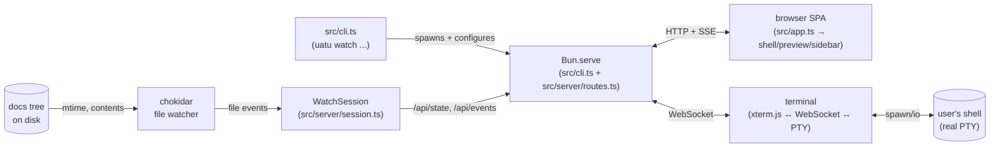
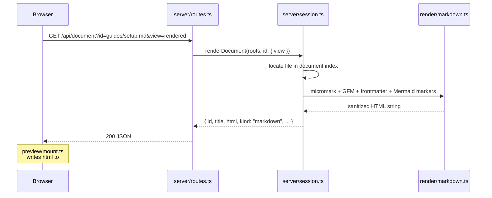
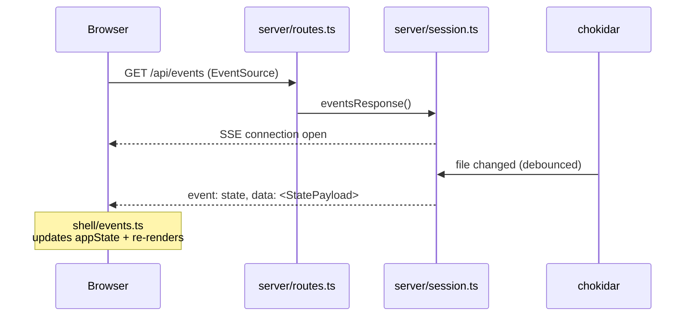
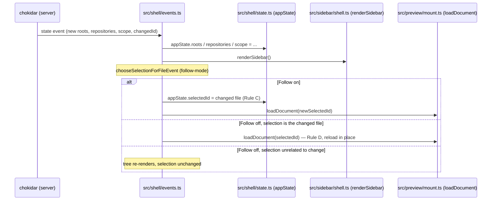
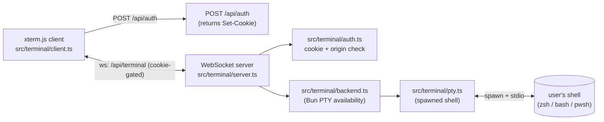

# Architecture

This document is the codebase-orientation guide for **uatu** (a.k.a. UatuCode). It's written for a new contributor — human or AI — who wants to know what the moving parts are, where to look for each one, and how a request or state change flows through the system.

For the user-facing pitch (features, install, usage), see [README.md](./README.md). For terse navigation cues during a Claude Code session, see [CLAUDE.md](./CLAUDE.md).

## What uatu is

`uatu` is a local Bun-served Progressive Web App that watches a directory of docs and source, previews Markdown and AsciiDoc with Mermaid diagrams, surfaces a review-burden score for code changes, and (where supported) hosts an embedded terminal in the same browser tab. It runs entirely on `localhost` — there is no cloud component — and ships as a single Bun-compiled binary or runs from source.

## The 30-second map



Four boundaries to keep in mind:

- **HTTP/SSE between server and SPA.** `/api/state` (initial snapshot), `/api/document` (rendered HTML for a path), `/api/document/diff` (git diff), `/api/events` (SSE feed of state updates), `/api/scope` (POST to pin to a single file), `/api/compare-target` (POST to switch the review-burden lens between `base` and `last-commit`).
- **Compare target.** The Change Overview measures review burden against the resolved review base by default (`base` — committed + worktree changes vs the merge base, the reviewer's view) but can switch to `last-commit` (staged + unstaged vs `HEAD`, plain-git's working view). Like `scope`, it is server-session state held in `session.ts` and shared across clients: a `POST /api/compare-target` recomputes `repositories` and rebroadcasts over SSE, and `/api/document/diff` resolves against the session's current target so per-file diffs stay coherent with the meter. `document/git-base-ref.ts` owns the single `applyCompareTarget` / `compareRefForTarget` mapping that both the meter and the diff consume; the burden readout is anchored with the precise resolved ref (`vs origin/main`, `vs HEAD`).
- **Chokidar between server and the filesystem.** The `WatchSession` debounces, applies the ignore policy, rebuilds the document index, and emits SSE events.
- **WebSocket between SPA and terminal subsystem.** Authenticated by a cookie set on `POST /api/auth`; multiplexed across multiple PTY panes by `terminal/server.ts`.
- **A single Bun binary.** No node, no separate frontend bundler — `Bun.serve` serves both the SPA and the API.

## Folder tour

`src/` is organized by feature. Three entrypoint files live at the root; everything else is in a folder named after its concern. Files are listed in each folder's `ls` — open the folder when you need a specific name.

```
src/
├── app.ts                SPA entry — DOM queries, init calls, top-level boot
├── cli.ts                CLI entry — flag parsing, port probing, Bun.serve
├── styles.d.ts           CSS module type declarations
├── index.html, styles.css, assets/   HTML shell + CSS + bundled assets
│                         (logo, PWA icons + manifest + sw.js,
│                         and `assets/fonts/HackNerdFontMono-Regular.woff2`
│                         — the default face for *every* monospace surface
│                         in the app, surfaced via the shared
│                         `--mono-font-family` CSS variable on `:root`)
│
├── shell/                App-wide chrome and the appState singleton: boot,
│                         SSE event handling, URL/history, follow-mode
│                         capability, connection chip, PWA registration
├── preview/              The right pane — every renderer that mounts HTML
│                         into #preview: rendered / source / diff views,
│                         layout chooser, mermaid, anchors, image/binary
│                         fallbacks, metadata card, code-block decorations
├── sidebar/              The left pane — sidebar shell, pane visibility/
│                         sizing, the @pierre/trees-backed Files tree,
│                         Change Overview, Git Log, Files-pane filter,
│                         Selection Inspector
├── terminal/             The full xterm + PTY subsystem: panel chrome,
│                         xterm client, WebSocket server, PTY backend,
│                         cookie/origin auth, persisted pane state
├── server/               HTTP server building blocks (Bun.serve itself is
│                         in cli.ts): the single-source-of-truth route
│                         table, the WatchSession + render dispatch, the
│                         port-probe helper
├── document/             Per-document data (not rendering): metadata
│                         parsing, diff fetcher, text/binary classifier,
│                         language detection, review-base resolver
├── render/               Source → HTML transformation: markdown
│                         (micromark + GFM + frontmatter), asciidoc
│                         (@asciidoctor/core), sanitization + mermaid markers
├── review/               Review-burden score data layer
├── ignore/               .gitignore + .uatu.json tree.exclude engine
├── watchdog/             Heartbeat-driven hang recovery — spawned sibling
│                         subprocess + forensic dump bundle
├── debug/                Observability — XDG-cache path resolution +
│                         event-counter metrics
├── pwa/                  PWA install affordance (manifest + SW asset refs)
└── shared/               Cross-cutting helpers: html escape, types,
                          license check, build version
```

Unit tests are colocated with their subjects (`foo.ts` and `foo.test.ts` sit in the same folder). E2E tests live in `tests/e2e/` under feature-named files (`mermaid.e2e.ts`, `sidebar.e2e.ts`, `document-tree.e2e.ts`, etc.); the Playwright `webServer` is `tests/e2e/server.ts`, not in `src/`.

## Request lifecycle

A representative path: the SPA needs the rendered HTML for `guides/setup.md`.



Failure paths:

- File no longer exists → Session throws → Routes returns 404 → `preview/mount.ts` shows the "no longer exists" empty state.
- File is binary → Session throws `"document is binary"` → Routes returns 415 → `preview/binary.ts` or `preview/image.ts` renders the appropriate fallback (image for `.png` / `.jpg` / etc., a "not viewable" notice otherwise).

The companion SSE stream:



The route table that wires both of these requests is declared exactly once, in `src/server/routes.ts` via `buildRoutes({ mode: "prod" | "e2e", ... })`. Both `src/cli.ts` (production) and `tests/e2e/server.ts` (the Playwright harness) call it.

## State lifecycle

The SPA's source of truth is `appState`, a module-level mutable singleton in `src/shell/state.ts`. The SSE handler in `src/shell/events.ts` is the only path that mutates `appState` from external events.



The four authoritative rules of the `follow-mode` capability — defined in `openspec/specs/follow-mode/spec.md` — are the only paths that change `appState.followEnabled` or `appState.selectedId`:

- **Rule A** (user clicks a tree row): selection moves to that file; follow turns off. Guarded by `TreeView.duringProgrammaticUpdate` so library-fired callbacks during mount or `resetPaths` are not mistaken for user input.
- **Rule B** (user clicks the Follow toggle): `followEnabled` flips. Turning on jumps to the newest-mtime file in the current session.
- **Rule C** (file event + follow on): selection moves to the changed file.
- **Rule D** (file event + follow off): selection unchanged; if the changed file equals the current selection, the preview reloads in place; otherwise just the tree refreshes.

## Terminal subsystem

The terminal panel is the only feature with a WebSocket transport.



The panel UI (~700 lines in `src/terminal/panel.ts`) handles dock position, split, fullscreen, focus, and message routing across multiple PTY panes. On Windows, `terminal/backend.ts` reports unavailable and the panel button is hidden — uatu doesn't degrade other features.

PTY lifetime follows tmux-detach semantics: a WebSocket disconnect (reload, tab close, browser quit, system sleep) detaches the session while the shell keeps running, and reconnecting with the same persisted `sessionId` reattaches to it — a bounded replay buffer repaints the screen. Only the confirmed pane close (close code 4001), a kill via the session inventory, or server shutdown terminates a shell.

Sessions are managed tmux-style: `GET /api/terminal/sessions` lists every live PTY (attached/detached, age, best-effort foreground-process label via a POSIX `ps` adapter), `DELETE /api/terminal/sessions/<id>` kills one, and the WS upgrade's `takeover=1` parameter moves an attached session between windows — the previous holder's pane parks with a "take back" action. The pane-spawn flow offers this inventory (attach / kill / new shell) whenever live sessions exist that the window isn't already showing.

App-defined WebSocket close codes: `4001` user-terminate (client→server: kill the PTY), `4409` sessionId in use (server→client: upgrade race lost), `4410` session taken (server→client: another window took this session over).

## Follow mode

uatu is a single-mode app. There is no Author vs. Review distinction; the only behavioral toggle is **Follow**, surfaced as a switch in the sidebar header. The full contract is specified in `openspec/specs/follow-mode/spec.md`; the four rules are summarized in the State lifecycle section above.

| Aspect | Behavior |
|---|---|
| Default `Follow` at boot | on at `/`; forced off when arriving via a direct document URL (e.g. `/guides/setup.md`) |
| `--no-follow` CLI flag | flips the default at `/` to off |
| User clicks a tree row | selection moves; follow turns off (Rule A) |
| User clicks the Follow switch | flips state; turning on jumps to the newest-mtime file (Rule B) |
| File changes on disk + follow on | selection moves to the changed file (Rule C) |
| File changes on disk + follow off | current file reloads in place if it's what changed; otherwise tree refreshes silently (Rule D) |
| Single-file CLI invocation (`uatu watch some-file.md`) | Follow switch disabled — nothing else to follow |
| Sidebar panes available | Change Overview, Files, Git Log, Selection Inspector — all always available; toggle via the per-pane visibility menu |

The `withProgrammaticUpdate(fn)` helper in `src/sidebar/tree-view.ts` is what makes Rule A reliable: it suppresses the `@pierre/trees` library's `onSelectionChange` callback during initial mount and `resetPaths`-driven refreshes so library-fired selections aren't mistaken for user clicks. That single helper is the root fix for the historical flake on `tests/e2e/preview-renderers.e2e.ts` (issue #45) and the `follow-mode auto-switch` test.

## How to extend

### Add a new sidebar pane

1. Add the pane's id + label to `ALL_PANE_DEFS` in `src/shell/state.ts`. The `PaneId` union widens automatically.
2. Add a `<section data-pane-id="your-id">…</section>` to `src/index.html` inside `.sidebar-panes`.
3. Add an entry in `src/sidebar/panes.ts` (`paneId → renderer`) and create the renderer in a new file under `src/sidebar/`.
4. Add a test in `src/sidebar/your-pane.test.ts` (colocated) and an e2e test in `tests/e2e/sidebar.e2e.ts` (or a new feature file if you're starting a separate concern).

### Support a new file kind

1. Update `src/document/classify.ts` to recognize the extension or content signature.
2. If the file type renders to HTML, add a renderer in `src/render/` (mirror the shape of `markdown.ts` or `asciidoc.ts`).
3. Update `src/server/session.ts`'s `renderDocument` to dispatch to your renderer.
4. If the file type has a custom preview shape (image, binary, etc.), add it under `src/preview/` and route it from `src/preview/mount.ts`'s `loadDocument`.
5. Cover the new path in `tests/e2e/preview-renderers.e2e.ts`.

### Add an HTTP route

1. Add the route to `src/server/routes.ts` inside the `buildRoutes(deps)` function. Use `deps` for anything the handler needs (the watch session, the metrics snapshot, e2e helpers, etc.) — do not reach into module-level state from inside the handler.
2. If the route is prod-only or e2e-only, place it inside the appropriate `mode === "prod"` / `mode === "e2e"` branch and add the required dep to the corresponding `ProdRouteDeps` / `E2ERouteDeps` shape.
3. Both `src/cli.ts` and `tests/e2e/server.ts` will pick up the new route automatically — they each `Bun.serve({ routes: buildRoutes(...) })`.

### Add an e2e test

1. Pick the right feature file under `tests/e2e/` (look at the existing file names — they mirror the `src/` folder taxonomy). If your test doesn't fit any existing file, create a new one named after the feature.
2. Import the shared setup: `import { standardBeforeEach } from "./fixtures";`.
3. The harness reset (`/__e2e/reset`) is in `tests/e2e/config.ts`; the workspace fixture lives at `testdata/watch-docs/`.

## Run and test

```bash
bun run dev               # local watch on testdata/watch-docs
bun test                  # unit + integration suite (~18s)
bun run test:e2e          # Playwright (~5min, workers: 1, serial)
bun run build             # compile single-file dist/uatu binary
bun run check:licenses    # audit npm dependencies
bun run bench:render      # informational render baseline
```

For tighter loops:

- `bun test src/sidebar/git-log.test.ts` — single file
- `bun x playwright test tests/e2e/mermaid.e2e.ts:127` — single e2e test
- `bun run dev --no-gitignore` — exposes gitignored files in the tree
- `bun run dev --no-follow` — boots with Follow disabled
