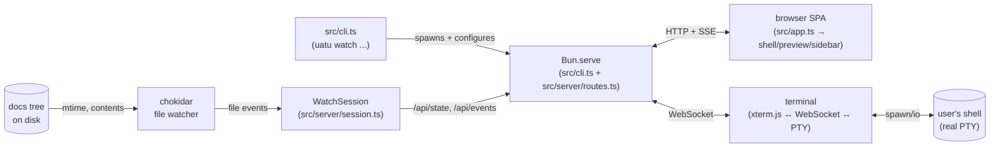
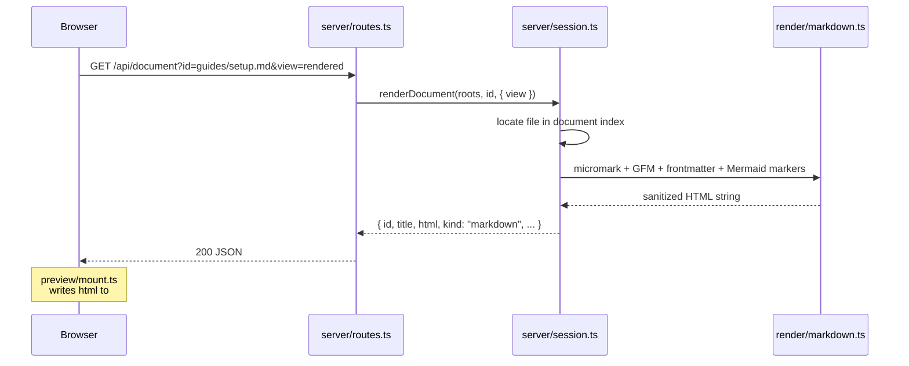
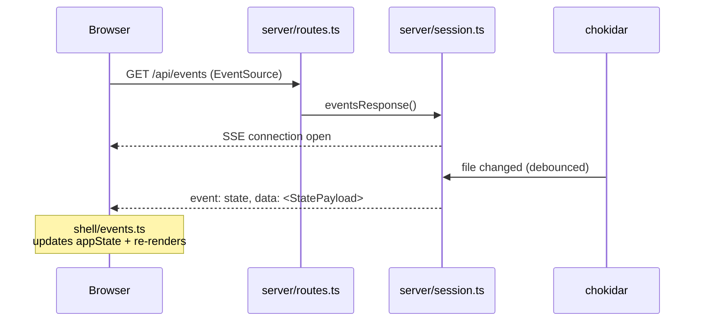
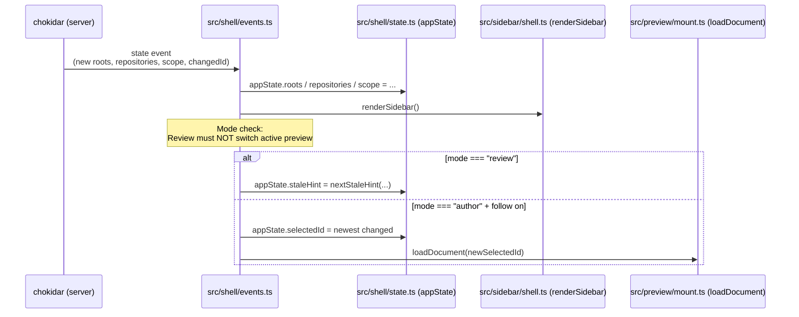
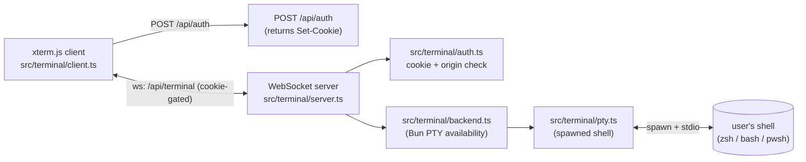

# Architecture

This document is the codebase-orientation guide for **uatu** (a.k.a. UatuCode). It's written for a new contributor — human or AI — who wants to know what the moving parts are, where to look for each one, and how a request or state change flows through the system.

For the user-facing pitch (features, install, usage), see [README.md](./README.md). For terse navigation cues during a Claude Code session, see [CLAUDE.md](./CLAUDE.md).

## What uatu is

`uatu` is a local Bun-served Progressive Web App that watches a directory of docs and source, previews Markdown and AsciiDoc with Mermaid diagrams, surfaces a review-burden score for code changes, and (where supported) hosts an embedded terminal in the same browser tab. It runs entirely on `localhost` — there is no cloud component — and ships as a single Bun-compiled binary or runs from source.

## The 30-second map



Four boundaries to keep in mind:

- **HTTP/SSE between server and SPA.** `/api/state` (initial snapshot), `/api/document` (rendered HTML for a path), `/api/document/diff` (git diff), `/api/events` (SSE feed of state updates), `/api/scope` (POST to pin to a single file).
- **Chokidar between server and the filesystem.** The `WatchSession` debounces, applies the ignore policy, rebuilds the document index, and emits SSE events.
- **WebSocket between SPA and terminal subsystem.** Authenticated by a cookie set on `POST /api/auth`; multiplexed across multiple PTY panes by `terminal/server.ts`.
- **A single Bun binary.** No node, no separate frontend bundler — `Bun.serve` serves both the SPA and the API.

## Folder tour

`src/` is organized by feature. Three entrypoint files live at the root; everything else is in a folder named after its concern.

```
src/
├── app.ts                  SPA entry — DOM queries, init calls, the
│                           selectionInspector singleton, top-level boot
│                           orchestration. ~190 lines.
├── cli.ts                  CLI entry — flag parsing, port probing,
│                           `Bun.serve({ routes: buildRoutes(...) })`,
│                           watch loop, child-process watchdog.
├── styles.d.ts             CSS module type declarations
├── index.html, styles.css, assets/  HTML shell + CSS + bundled images,
│                                    icons, manifest, service worker
│
├── shell/                  App-wide chrome and the appState singleton
│   ├── state.ts              `appState` + storage primitives + the
│   │                          PaneId / PreviewMode / FilesPaneFilter
│   │                          types
│   ├── boot.ts               `loadInitialState` — first /api/state
│   │                          fetch + URL-aware document selection
│   ├── events.ts             `connectEvents` — SSE → appState → re-render
│   ├── history.ts            push/replace selection, popstate, scroll-
│   │                          to-fragment, cssEscape
│   ├── url.ts                review-score / commit-preview URL resolvers
│   ├── connection.ts         status chip (live / reconnecting / connecting)
│   │                          + build badge
│   ├── pwa.ts                manifest links + service-worker registration
│   ├── mode.ts               Author ↔ Review transitions
│   ├── follow.ts             follow-mode toggle + click handler
│   ├── stale-hint.ts         pure state-machine (library)
│   ├── stale-hint-mount.ts   DOM glue for the hint banner
│   └── storage.ts            findDocumentBy* + view helpers
│
├── preview/                The right pane — every renderer that mounts
│                           HTML into #preview
│   ├── mount.ts              applyDocumentPayload, single/split rendering,
│   │                          the per-document payload cache, loadDocument
│   ├── header.ts             title chip, path, type chip, <base href>
│   ├── view-mode.ts          Source / Rendered / Diff radio chooser
│   ├── layout.ts             Single / Side-by-side / Stacked + split resizer
│   ├── diff.ts               git-diff view wired through @pierre/diffs
│   ├── diff-view.ts          the @pierre/diffs adapter
│   ├── anchors.ts            in-page (#heading) + cross-doc (.md / .adoc) clicks
│   ├── mermaid.ts            click handler that opens the fullscreen viewer
│   ├── mermaid-viewer.ts     the fullscreen pan/zoom modal
│   ├── code-block.ts         line-number gutter + per-block copy buttons +
│   │                          clipboard helpers
│   ├── metadata-card.ts      YAML/AsciiDoc frontmatter card
│   ├── image.ts              inline image preview for viewable extensions
│   ├── binary.ts             "not viewable" fallback
│   ├── empty.ts              empty / not-found preview state
│   └── commit-message.ts     commit-preview body renderer
│
├── sidebar/                The left pane — every renderer that mounts
│                           into the sidebar
│   ├── shell.ts              renderSidebar + collapse + width
│   ├── panes.ts              pane visibility, height, drag, panel menu
│   ├── tree-view.ts          @pierre/trees adapter (the Files pane)
│   ├── tree-config.ts        path-filter and reveal-on-load behavior
│   ├── tree-mount.ts         tree-view singleton + click → loadDocument
│   ├── change-overview.ts    Change Overview pane + click → score detail
│   ├── git-log.ts            Git Log pane + commit-link clicks
│   ├── files-filter.ts       All ↔ Changed chip
│   ├── score-explanation.ts  Mode-independent score-detail HTML builder
│   ├── selection-inspector.ts  inspector library (state machine)
│   ├── selection-inspector-mount.ts  DOM glue + control click handler
│   └── review-score-mount.ts  DOM mount for the score-detail preview
│
├── terminal/               The full xterm + PTY subsystem
│   ├── panel.ts              the 700-line panel chrome (visibility,
│   │                          dock, split, fullscreen, pane lifecycle)
│   ├── client.ts             xterm.js mount + key handling + clipboard
│   ├── server.ts             WebSocket server multiplexing PTY messages
│   ├── pty.ts                Bun.spawn + PTY wrapper
│   ├── backend.ts            availability detection (Bun PTY API)
│   ├── auth.ts               cookie + origin checks
│   ├── config.ts             font + sizing
│   ├── pane-state.ts         persisted panel layout state
│   └── clipboard.ts          terminal clipboard helpers
│
├── server/                 The HTTP server building blocks (note: the
│                           Bun.serve call itself lives in src/cli.ts)
│   ├── routes.ts             the single source of truth for the HTTP
│   │                          route table — `buildRoutes({ mode, ... })`
│   ├── session.ts            `createWatchSession`, `renderDocument`,
│   │                          `resolveWatchRoots`, scope, asset/static
│   │                          file resolution, navigation handler
│   └── port-probe.ts         find an open port (with TOCTOU mitigation)
│
├── document/               Per-document data (not rendering)
│   ├── metadata.ts           frontmatter / AsciiDoc header parser
│   ├── diff.ts               git-diff fetcher
│   ├── classify.ts           text vs binary, language detection
│   ├── languages.ts          extension → highlight.js language map
│   └── git-base-ref.ts       resolve "review base" (branch / merge-base)
│
├── render/                 Source → HTML (the transformation)
│   ├── markdown.ts           micromark + frontmatter + GFM + Mermaid markers
│   ├── asciidoc.ts           @asciidoctor/core wrapper
│   └── preview.ts            sanitization + Mermaid replacement
│
├── review/
│   └── load.ts               review-burden score data layer
│
├── ignore/
│   ├── engine.ts             `.gitignore` + `.uatu.json tree.exclude`
│   └── warning.ts            legacy `.uatuignore` deprecation warning
│
├── watchdog/                 Heartbeat-driven hang recovery
│   ├── main.ts                 spawned sibling subprocess
│   └── capture.ts              forensic dump bundle
│
├── debug/                    Observability
│   ├── cache.ts                XDG-cache path resolution
│   └── metrics.ts              event counters + 1Hz snapshot
│
├── pwa/                      (asset references; manifest + SW live in src/assets/)
│
└── shared/
    ├── html.ts                 escapeHtml + escapeHtmlAttribute (leaf
    │                            position to avoid circular imports)
    ├── types.ts                cross-cutting types (Mode, ViewMode, etc.)
    ├── license-check.ts        license audit
    └── version.ts              git build metadata
```

E2E tests live in `tests/e2e/` under feature-named files (`mermaid.e2e.ts`, `sidebar.e2e.ts`, `mode.e2e.ts`, etc.). The Playwright `webServer` is `tests/e2e/server.ts`, not in `src/`.

Unit tests are colocated with their subjects: `foo.ts` and `foo.test.ts` sit in the same folder.

## Request lifecycle

A representative path: the SPA needs the rendered HTML for `guides/setup.md`.



Failure paths:

- File no longer exists → Session throws → Routes returns 404 → `preview/mount.ts` shows the "no longer exists" empty state.
- File is binary → Session throws `"document is binary"` → Routes returns 415 → `preview/binary.ts` or `preview/image.ts` renders the appropriate fallback (image for `.png` / `.jpg` / etc., a "not viewable" notice otherwise).

The companion SSE stream:



The route table that wires both of these requests is declared exactly once, in `src/server/routes.ts` via `buildRoutes({ mode: "prod" | "e2e", ... })`. Both `src/cli.ts` (production) and `tests/e2e/server.ts` (the Playwright harness) call it.

## State lifecycle

The SPA's source of truth is `appState`, a module-level mutable singleton in `src/shell/state.ts`. The SSE handler in `src/shell/events.ts` is the only path that mutates `appState` from external events.



In Review mode, file-system events surface as a stale-content hint (`src/shell/stale-hint.ts`), never as a silent preview swap. The reviewer refreshes manually via the hint banner's action button.

## Terminal subsystem

The terminal panel is the only feature with a WebSocket transport.



The panel UI (~700 lines in `src/terminal/panel.ts`) handles dock position, split, fullscreen, focus, and message routing across multiple PTY panes. On Windows, `terminal/backend.ts` reports unavailable and the panel button is hidden — uatu doesn't degrade other features.

## Review vs Author modes

Mode is one of `author | review`, persisted in `localStorage` (`shell/state.ts`), with the CLI `--mode` flag overriding at boot. The mode transition logic lives in `src/shell/mode.ts`.

| Aspect | Author | Review |
|---|---|---|
| Default `Follow` | on (auto-switch to newest file) | off (forced) |
| File-system events switch the preview | yes (when `Follow` is on) | **no, ever** |
| Stale-content hint when the active file changes | never | yes — surfaces a banner |
| Files-pane filter default | `All` | `Changed` |
| Panes visible | Change Overview, Files | + Git Log, + Selection Inspector |
| Score-explanation preview | identical to Review | identical to Author |
| Sidebar headline label | "Forecast" | "Burden" |
| Visual cues | warmer chrome | cooler chrome (frame border, glyph) |

The "identical score-explanation" contract is enforced by `src/sidebar/score-explanation.ts` having no access to `appState.mode` or any Mode-aware label selector — and the test `score-explanation.test.ts` asserts that property by importing the function directly.

## How to extend

### Add a new sidebar pane

1. Add the pane's id + label to `ALL_PANE_DEFS` in `src/shell/state.ts`. The `PaneId` union widens automatically.
2. Add a `<section data-pane-id="your-id">…</section>` to `src/index.html` inside `.sidebar-panes`.
3. Add an entry in `src/sidebar/panes.ts` (`paneId → renderer`) and create the renderer in a new file under `src/sidebar/`.
4. Add a test in `src/sidebar/your-pane.test.ts` (colocated) and an e2e test in `tests/e2e/sidebar.e2e.ts` (or a new feature file if you're starting a separate concern).

### Support a new file kind

1. Update `src/document/classify.ts` to recognize the extension or content signature.
2. If the file type renders to HTML, add a renderer in `src/render/` (mirror the shape of `markdown.ts` or `asciidoc.ts`).
3. Update `src/server/session.ts`'s `renderDocument` to dispatch to your renderer.
4. If the file type has a custom preview shape (image, binary, etc.), add it under `src/preview/` and route it from `src/preview/mount.ts`'s `loadDocument`.
5. Cover the new path in `tests/e2e/preview-renderers.e2e.ts`.

### Add an HTTP route

1. Add the route to `src/server/routes.ts` inside the `buildRoutes(deps)` function. Use `deps` for anything the handler needs (the watch session, the metrics snapshot, e2e helpers, etc.) — do not reach into module-level state from inside the handler.
2. If the route is prod-only or e2e-only, place it inside the appropriate `mode === "prod"` / `mode === "e2e"` branch and add the required dep to the corresponding `ProdRouteDeps` / `E2ERouteDeps` shape.
3. Both `src/cli.ts` and `tests/e2e/server.ts` will pick up the new route automatically — they each `Bun.serve({ routes: buildRoutes(...) })`.

### Add an e2e test

1. Pick the right feature file under `tests/e2e/` (look at the existing file names — they mirror the `src/` folder taxonomy). If your test doesn't fit any existing file, create a new one named after the feature.
2. Import the shared setup: `import { standardBeforeEach } from "./fixtures";`.
3. The harness reset (`/__e2e/reset`) is in `tests/e2e/config.ts`; the workspace fixture lives at `testdata/watch-docs/`.

## Run and test

```bash
bun run dev               # local watch on testdata/watch-docs
bun test                  # unit + integration suite (~18s)
bun run test:e2e          # Playwright (~5min, workers: 1, serial)
bun run build             # compile single-file dist/uatu binary
bun run check:licenses    # audit npm dependencies
bun run bench:render      # informational render baseline
```

For tighter loops:

- `bun test src/sidebar/git-log.test.ts` — single file
- `bun x playwright test tests/e2e/mermaid.e2e.ts:127` — single e2e test
- `bun run dev --no-gitignore` — exposes gitignored files in the tree
- `bun run dev --mode review` — boot directly into Review mode
