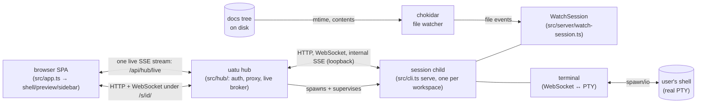
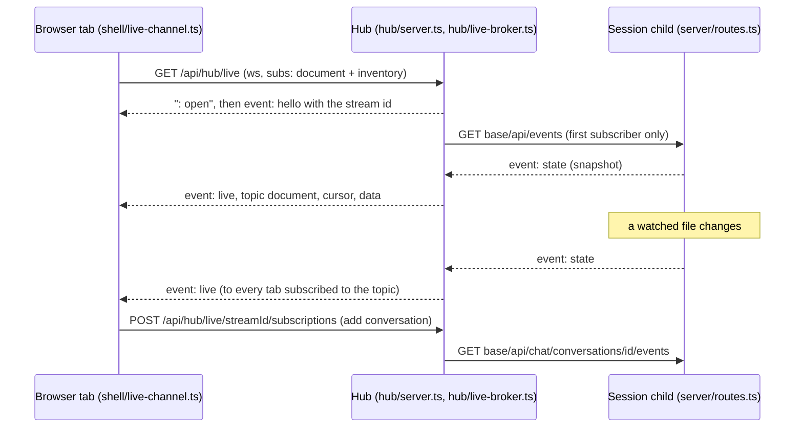
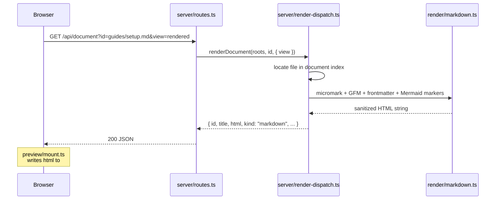
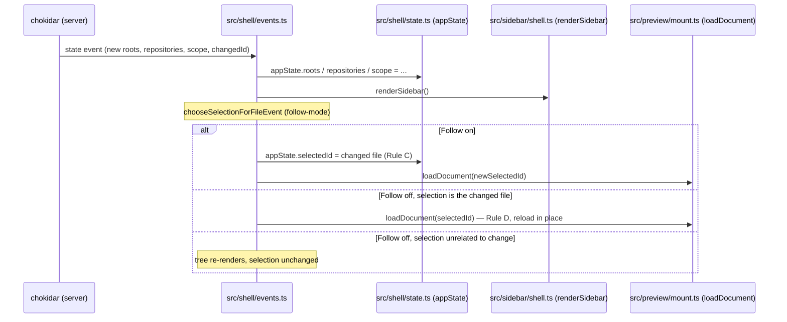
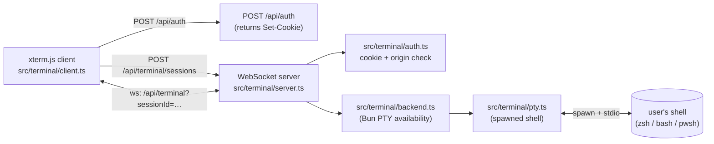

# Architecture

This document is the codebase-orientation guide for **uatu** (a.k.a. UatuCode). It's written for a new contributor — human or AI — who wants to know what the moving parts are, where to look for each one, and how a request or state change flows through the system.

For the user-facing pitch (features, install, usage), see [README.md](./README.md). For terse navigation cues during a Claude Code session, see [CLAUDE.md](./CLAUDE.md).

## What uatu is

`uatu` is a Bun-served Progressive Web App that watches a directory of docs and source, previews Markdown and AsciiDoc with Mermaid diagrams, surfaces the repository's change context (changed files, diffs, git log), and (where supported) hosts an embedded terminal in the same browser tab. It runs as a hub (`uatu hub`) on a machine you own: a login-gated daemon that runs one loopback-only session child per workspace and is the only server a browser talks to. There is no cloud component. It ships as a single Bun-compiled binary or runs from source.

## The 30-second map


```mermaid
flowchart LR
  SPA["browser SPA<br/>(src/app.ts → shell/preview/sidebar)"]
  Hub["uatu hub<br/>(src/hub/: auth, proxy, live broker)"]
  Child["session child<br/>(src/cli.ts serve, one per workspace)"]
  Session["WatchSession<br/>(src/server/watch-session.ts)"]
  WS["chokidar<br/>file watcher"]
  Term["terminal<br/>(WebSocket ↔ PTY)"]
  FS[("docs tree<br/>on disk")]
  Term_PTY[("user's shell<br/>(real PTY)")]

  Hub -- spawns + supervises --> Child
  SPA <-- "HTTP + WebSocket under /s/id/" --> Hub
  SPA <-- "one live SSE stream: /api/hub/live" --> Hub
  Hub <-- "HTTP, WebSocket, internal SSE (loopback)" --> Child
  Child --- Session
  Child --- Term
  FS -- mtime, contents --> WS
  WS -- file events --> Session
  Term <-- spawn/io --> Term_PTY
```

The boundaries to keep in mind:

- **The hub between browser and session child.** Browsers only talk to the hub. It authenticates them, then reverse-proxies HTTP and WebSockets under `/s/<id>/` to that workspace's loopback child and brokers the child's token (see [Base paths and the hub](#base-paths-and-the-hub)).
- **HTTP between the SPA and its session child.** Under the session's base path, `/api/state` supplies the initial snapshot, `/api/document` and `/api/document/diff` render one path, and `/api/search` sweeps content. Scope and compare target travel as validated request context on all related requests; there are no process-global mutation endpoints.
- **One live stream per page.** Pushed updates (document state, chat inventory, conversation events, other workspaces' activity) reach a page over a single `GET /api/hub/live` SSE connection to the hub. The child's own SSE routes are the internal hub↔child protocol (see [Live delivery](#live-delivery)).
- **Per-client watch context.** The Change Overview measures against `base` (merge-base reviewer view) or `last-commit` (`HEAD` working view). `src/shared/watch-context.ts` serializes the client's scope and compare target, and `server/watch-session.ts` selects the corresponding roots and cached repository snapshot independently for each request and each document subscription. Two clients can therefore browse different scopes and comparison lenses through the same child process.
- **Chokidar between the child and the filesystem.** The `WatchSession` debounces, applies the ignore policy, rebuilds the document index, and emits state events on the child's internal `/api/events` route.
- **WebSocket between SPA and terminal subsystem.** Authenticated by a cookie set on `POST /api/auth`; multiplexed across multiple PTY panes by `terminal/server.ts`.
- **A single Bun binary.** No node, no separate frontend bundler. The same binary runs the hub and every session child, and each child's `Bun.serve` serves the SPA and its API.

## Web Push delivery

The notification path runs independently of the page's brokered live stream:

```text
agent lifecycle --> ChatAdapter --> NotificationFeed
                                         |
                      /api/chat/notifications/events
                                         |
                         HubNotifications coordinator
                                         |
                        encrypted Web Push --> push worker
```

`chat/notifications.ts` tracks identified live occurrences and resolutions.
OpenCode's `notification-lifecycle.ts` correlates native step and compatibility
message records by assistant-message identity; unqualified idle/status frames
do not create completion alerts. Claude's provider attaches execution identity
and resolves cancellation/background state before emitting its notification
outcome. The adapter checks workspace membership, excludes child completion,
and routes child questions to their launching conversation.

`chat/notification-feed.ts` provides bounded replay and an atomic pending-request
snapshot/live handoff. Each lazy agent service owns a feed without starting its
runtime. `MultiAgentChatService` qualifies and merges occurrences. The internal
child route is declared by `server/routes.ts` and is refused through the browser
proxy.

`hub/notifications.ts` holds one notification upstream per interested running
workspace, independent of visible pages. `notification-store.ts` atomically
persists the VAPID keys, device enrollments, cursors, and event/device delivery
journal. Authorization is checked against the enrollment's current hub session
and workspace access before sending. Expiry, bounded retry, known interaction
resolution, and subscription removal are delivery concerns. `push-sender.ts`
uses the MIT-licensed Web Crypto implementation for encryption and VAPID signing.

Pushes wait while the user is looking at Uatu. `hub/presence.ts` defines the
signal and `LiveBroker` owns it: a hub user is *present* while at least one of
their `activity` feed sinks exists. Only a visible session page holds a live
stream subscribed to `activity`; hidden pages release theirs, and the dashboard
never asks for the topic. When the last sink goes, the user is *recent* for 30 s
(`PRESENCE_GRACE_MS`), then *away*. A new broker treats every user as recent for
its first 30 s, so pages reconnecting after a restart are counted first.
Presence is per user across devices. `startHubServer` hands the broker to
`HubNotifications.usePresence`, and a presence change runs a delivery pass.

`attempt()` decides once, before the first send:

| Category | present | recent | away |
|---|---|---|---|
| turn completed | discarded | waits | sent |
| needs answer | held (`heldAt`) | held | sent; a held one is released (`releasedAt`) first |

A held question can be released up to `NOTIFICATION_HOLD_LIMIT_MS` (60 min)
after the event, and its five-minute lifetime counts from the release. A held
delivery stays `pending`, so resolution, gap reconciliation, access loss, and
device or workspace removal discard it as they discard any unsent one. The
child keeps unanswered requests for that hour plus one delivery lifetime (a
question released at the limit still retries for five minutes), in both
`AgentNotificationTracker` and `NotificationFeed`'s pending snapshot, so a late
answer still announces its resolution and a gap snapshot still lists a held
question. The replay ring keeps its five-minute window.

While a page is open, `shell/attention-notice.ts` stands in for pushes about
other workspaces. It reads hub-nav's `activity` reports and raises a notice when
another workspace goes from not awaiting (held for at least 1.5 s, which rules
out the broker's placeholder for a workspace it has not read yet) to awaiting.
The page's first report per workspace is its baseline, and reconnects keep what
the page knew. Open goes to `/s/<ws>/?awaiting=1`. Chat asks its own workspace
through the internal `GET /api/chat/awaiting`, which returns the newest
unanswered request's conversation id or null, then continues as for
`?conversation=`, with the URL rewritten to that id. On null it shows the list
with an "already answered" note. The `activity` summary itself stays four
booleans.

The hub serves `pwa/push-worker.js` at origin scope. It handles push and clicks,
with no fetch handler or offline content cache. `notification-client.js` is a
shared browser module, bundled into the SPA and served directly to hub pages;
its declaration file supplies the TypeScript interface. Hosts inject URLs, and
workspace boot requires the proxy's explicit `uatu-hub` marker before using
`hubUrl()`. Legacy cleanup preserves active, waiting, and installing push workers.

The 192px and 512px Home Screen icons have opaque white backgrounds and keep
the complete mark inside the maskable safe circle. Regenerate them from the
canonical SVG with `bun run generate:pwa-icons`; use `--check` to validate the
checked-in pixels. `pwa/icons.ts` versions manifest and Apple touch-icon URLs,
and the static session manifest carries the same revision.

Notification URLs carry an agent-qualified `conversation` parameter (or the
notice's `awaiting=1`) through login and document history changes
(`carryNotificationTarget`). Chat opens that exact target or shows its
read error. A matching window is focused without navigating another workspace's
draft. A desktop window too narrow for the split uses a temporary Chat view
that the existing collapse control dismisses; it does not change the stored UI
mode.

## Desktop viewport on tablets

`shell/desktop-viewport.ts` owns the desktop work area's visible rectangle and
safe-area overlap. It measures at boot and on mode changes, then coalesces
visual-viewport resize/scroll and window resize events into animation frames.
The scalar viewport observer is shared with the touch terminal through
`shared/visual-viewport.ts`.

Wide desktop browser layouts fit one fixed shell to that rectangle. Sidebar,
preview, chat, and docked/fullscreen terminal therefore share the available
height, including small hardware-keyboard accessory bars. Safe-area padding
lives on that outer shell, so the desktop composer does not reserve the bottom
inset again. A bottom-docked terminal is temporarily capped while the viewport
is occluded, without changing its persisted size. Xterm refits through its
existing host ResizeObserver.

The narrow desktop layout remains a scrolling stack with a safe-area-aware
sticky preview header. Native macOS hosting retains its existing titlebar and
frost stacking contract. During pinch zoom, the desktop controller retains the
last normal-scale layout and lets the browser pan it. Switching to touch clears
the desktop measurements and hands sizing back to the touch chat/terminal
controllers; Chat clears its own obsolete overrides immediately on mode change.

Browser regressions inject safe areas and visual-viewport changes and assert
header/composer bounds in Chromium and WebKit. They do not reproduce iPadOS's
native glass or Magic Keyboard accessory UI. Those platform behaviors require
physical-device acceptance in addition to the browser checks.

## Folder tour

`src/` is organized by feature. Three entrypoint files live at the root; everything else is in a folder named after its concern. Files are listed in each folder's `ls` — open the folder when you need a specific name.

```
src/
├── app.ts                SPA entry — DOM queries, init calls, top-level boot
├── cli.ts                CLI entry — dispatches `uatu hub`, and hosts the
│                         session child the hub spawns (internal `serve`):
│                         port probing, Bun.serve assembly, watchdog spawn,
│                         signal handling
├── styles.d.ts           CSS module type declarations
├── index.html, styles.css, assets/   HTML shell + CSS + bundled assets
│                         (logo, PWA icons + manifest,
│                         and `assets/fonts/HackNerdFontMono-Regular.woff2`
│                         — the default face for *every* monospace surface
│                         in the app, surfaced via the shared
│                         `--mono-font-family` CSS variable on `:root`)
│
├── cli/                  CLI domain — argument parsing, usage text, and the
│                         refusal a user-shaped `serve` gets (parse.ts) and
│                         TTY startup output (output.ts);
│                         side-effect-free so the unit suite can import them
├── chat/                 The agent chat surface, shared across agents:
│                         seam types (provider.ts, types.ts), the adapter
│                         (queue/replay/receipts/recovery), the multi-agent
│                         registry + router (agents.ts — qualified
│                         conversation ids, per-agent status, merged
│                         inventory), client transport + validation, the
│                         timeline renderer, and the whole browser UI.
│                         Agent-specific code lives below the seam:
│                         chat/opencode/ (loopback server runtime that
│                         decides the spawned server's generation; v1/ and
│                         v2/ hold one provider + normalization mapper per
│                         OpenCode generation over a shared normalization
│                         core — see "OpenCode generations") and chat/claude/
│                         (probe-only runtime, per-conversation Claude
│                         Agent SDK sessions, native-transcript reader,
│                         model catalog (control-channel probe, manifest fallback), its own normalization)
├── shell/                App-wide chrome and the appState singleton: boot,
│                         the page's one live stream (live-channel.ts) and
│                         its lifecycle recovery (live.ts), document-state
│                         handling (events.ts), URL/history, follow-mode
│                         capability, connection chip, PWA registration
├── preview/              The right pane — every renderer that mounts HTML
│                         into #preview: rendered / source / diff views,
│                         layout chooser, mermaid, anchors, image/binary
│                         fallbacks, metadata card, code-block decorations
├── sidebar/              The left pane — sidebar shell, pane visibility/
│                         sizing, the @pierre/trees-backed Files tree,
│                         Change Overview, Git Log, Files-pane filter
├── terminal/             The full xterm + PTY subsystem: panel chrome,
│                         xterm client, WebSocket server, PTY backend,
│                         cookie/origin auth, persisted pane state
├── server/               HTTP server building blocks (Bun.serve itself is
│                         in cli.ts): routes.ts (single-source-of-truth
│                         route table + shared fetch fallback),
│                         watch-session.ts (live-reload engine), roots.ts
│                         (root resolution + scanning), render-dispatch.ts,
│                         static-files.ts, navigation.ts, port-probe.ts
├── document/             Document + repository git data (not rendering):
│                         metadata parsing, diff fetcher, text/binary
│                         classifier, language detection, compare-base
│                         resolver, and the repository-level git sweep
│                         (changed files, commit log, repo metadata)
├── render/               Source → HTML transformation: markdown
│                         (micromark + GFM + frontmatter), asciidoc
│                         (@asciidoctor/core), sanitization + mermaid markers
├── ignore/               .gitignore + `.uatu.json ignore` engine + the
│                         file's single config loader
├── hub/                  The self-hostable session hub (`uatu hub`): config,
│                         XDG state dir, workspace registry, the
│                         SessionBackend seam + local-process backend,
│                         HTTP/WS reverse proxy, the live broker
│                         (live-broker.ts, live-sse.ts), hub auth (users, signed
│                         cookie, rate limit, CSRF), dashboard pages, server
│                         assembly, process wiring
├── watchdog/             Heartbeat-driven hang recovery — spawned sibling
│                         subprocess + forensic dump bundle
├── debug/                Observability — XDG-cache path resolution +
│                         event-counter metrics
├── pwa/                  PWA assets, shared notification enrollment UI,
│                         and the hub's push-only service worker
└── shared/               Cross-cutting helpers: html escape, types,
                          license check, build version
```

Unit tests are colocated with their subjects (`foo.ts` and `foo.test.ts` sit in the same folder). E2E tests live in `tests/e2e/` under feature-named files (`mermaid.e2e.ts`, `sidebar.e2e.ts`, `document-tree.e2e.ts`, etc.); the Playwright `webServer` is `tests/e2e/server.ts`, not in `src/`.

### Outside `src/`: the desktop client

`desktop/macos/` holds **UatuCode Desktop**, a SwiftUI app whose windows are
pure hub clients: the app bundles no `uatu` binary, spawns no processes, and
supervises nothing. Each configured hub (`HubRoster.swift` — which may be
`http://localhost:<port>` for a hub the user runs on the same Mac) is
authenticated natively (`HubAPI.swift`): a JSON login yields a session id
held only in the Keychain, native API calls present it as `Authorization:
Bearer`, and the id is written into the WebView's cookie store as the
hub session cookie before navigation so web and native surfaces share one
server-side session. A 401 means the session is dead at the hub (expired or
revoked — revocation is server-side); the app silently re-logs-in once with
the Keychain password, then prompts. A sign-out observed in a web view
discards the hub's Keychain secrets. Sessions belong to hubs, so closing a
tab or quitting the app never stops anything.

The WebView is a `WKWebView` (`WebViewHost.swift`), not SwiftUI's `WebPage`:
`WebPage` has no `createWebViewWith` equivalent, so `window.open()` — how
xterm.js activates OSC 8 terminal hyperlinks — and `target="_blank"` anchors
would be silently dropped. The host's `WKUIDelegate` catches them and routes
the URL, and the window exposes Back/Forward (`⌘[`/`⌘]`, toolbar) over the
SPA's pushState history.

External `http(s)` links open by default in the **split browser**
(`BrowserSplit.swift` + `BrowserSplitView.swift`): a per-window resizable
right-hand pane with its own custom tab strip (native macOS tabs are
window-level and can't nest in a pane), per-tab back/forward/reload, an
editable address bar (URL or DuckDuckGo search), and an eject-to-browser
button. Tabs share a persistent `WKWebsiteDataStore` (logins survive
relaunch; open tabs don't). `⌘`-click, non-`http(s)` schemes, or the
"Open External Links in System Browser" menu toggle route to the system
instead (`ExternalLinkRouter`). Toggle the pane with `⌘⇧B`; `⌘W` closes the
focused browser tab, falling back to the window when the split lacks focus.

Nothing else crosses the boundary — the browser remains a first-class client,
and the desktop app rides the same release train (see
`.github/workflows/release.yml`, jobs `desktop-macos`/`update-tap`).

## Base paths and the hub

A session child is relocatable under a path prefix: `--base-path /s/uatu/`,
which the hub passes when it spawns a child, moves the entire HTTP surface — routes, assets, PWA scope, pushState
document URLs, the terminal cookie's `Path` — under the prefix, with `/` as
the byte-for-byte-unchanged default. Server-side, `buildRoutes` prefixes its
static keys and the fetch fallback 404s anything outside the prefix;
client-side, every server-relative URL flows through `appUrl()` in
`src/shared/app-url.ts`, which reads the `<meta name="uatu-base-path">` the
server injects into the shell (`relocateShellHtml` in
`server/navigation.ts`, which also rewrites the HTMLBundle's root-absolute
chunk references). A structural test (`shared/app-url-discipline.test.ts`)
fails any module that builds a root-relative `/api`/`/assets` URL outside
the helper.

The consumer of that relocatability is **the hub** (`uatu hub`, `src/hub/`):
a self-hostable daemon that keeps a workspace registry of absolute folder
paths (stable collision-suffixed slugs; folders are added through a
server-side directory browser or the API — there is no workspaces root;
`backend` field reserved for a future container/VM backend), starts one
loopback-bound session child per workspace through
the `SessionBackend` interface (`hub/backend.ts`: URL on stdout, held stdin
as orphan backstop, SIGTERM), and
reverse-proxies HTTP and WebSockets under `/s/<id>/` from a single
TLS-terminating, login-gated port (`hub/proxy.ts`, `hub/auth.ts`,
`hub/server.ts`). Authentication is a server-side session store in the hub's
state dir: login mints an opaque session id (recorded with user, issue time,
and a device label), browsers carry it in the session cookie, native
clients carry the same id as `Authorization: Bearer`, and both transports
resolve through one store lookup — so sign-out and the dashboard's
per-device revocation kill a session everywhere, immediately. The cookie
is `uatu_hub` at the scheme's default port and `uatu_hub_<port>` on any
other port (`hub/auth.ts`). Browsers scope cookies by host, so without the
suffix port-forwarded hubs on one host would share a jar. Login is
required on every interface, loopback included; there is no trusted local
mode. The hub is a trusted intermediary: it authenticates the client and
validates its Origin (bearer requests are exempt — they carry no ambient
credential), then forwards loopback-shaped `Host`/`Origin` headers and
brokers the child's session token server-side — children keep their
localhost security model unchanged and are never network-reachable. A few
session-path routes never reach the child at all: `/api/personal-state` and
`/api/activity-viewed` carry facts about the hub's authenticated user rather
than about the workspace, so the hub answers them itself, behind the same
Origin check as any other session-path write. Live
updates do not go through the proxy; [Live delivery](#live-delivery) covers
them.

The hub also owns Git worktrees: a linked checkout is a child workspace of
the main one it forks from, sharing its Git objects and repository
configuration. `src/hub/worktree-service.ts` composes the service — Git
probes and the coordinator (`worktree-git.ts`), non-force creation
(`worktree-create.ts`), credential-aware fetch (`worktree-fetch.ts`),
deletion preflight and the confirm-stop-fence-recheck-remove sequence
(`worktree-delete.ts`), the rename guard (`worktree-rename-guard.ts`), the
durable intent/provenance journal with restart recovery
(`worktree-journal.ts`), Git-backed reconciliation on open/activity/manual/
periodic cadence (`worktree-reconciler.ts`), and onboarding
(`worktree-registrar.ts`) — and answers every operation through one
session-authenticated JSON family, `worktree-api.ts` at
`/api/hub/worktrees` (`GET ?source=` inventory, `POST
/{fetch,create,open,preflight-delete,delete,register,forget}`), published
like any other hub route with no separate progress poll: each call answers
its own bounded outcome, and a safety refusal is an ordinary `{ok: false,
error}` response rather than a transport failure. `src/shell/worktree-dialog.ts`
is the one client for that family — a shadow-DOM dialog embedded both in
the in-workspace picker (`shell/hub-nav.ts`) and the hub dashboard
(`hub/pages.ts`) — and `shell/worktree-live.ts` refreshes an open
register list (the fork menu's `Register worktree…`, the checkouts Git lists
that Uatu has not registered) from the live stream's cursor-free `worktrees`
topic without touching the page's own document or conversation selection. Design rationale (safety
model, provenance, parent credential inheritance) is in
`openspec/changes/archive/2026-09-20-add-git-worktree-workspaces/design.md`.

Deletion's safety inspection (`inspectRemovalSafety` in `worktree-delete.ts`)
returns the first blocker in a fixed order — identity, Git lock, nested linked
worktree, Git operation markers, then submodules and nested repositories: the
checkout's own `<gitdir>/worktrees/<id>/modules` store, a `.git` at the root of
any untracked or ignored directory entry, and, from `git ls-files --stage` on
every inspection, populated gitlinks and any ancestor directory of a tracked
path or status entry — Git removes a repository nested in tracked content even
without force. A candidate holds a repository if it has a `.git` entry, or, as
a bare repository or administrative directory, a non-directory `HEAD` with
`objects/` and `refs/` directories or with a `commondir`/`gitdir` file; Git
lists an untracked bare repository's files one by one, so this is what keeps
its history from passing as ordinary untracked data. Those candidates are
de-duplicated in linear time, sorted (so the path a refusal names is
deterministic) and checked with at most 32 candidates in flight. The status and index listings run
with a 60-second timeout and the index with a 64 MiB output bound (the
runner's defaults are 10 seconds and 4 MiB). An unreadable status, index or
folder, an exceeded bound, or a path that did not decode as UTF-8 fails closed
as "could not be inspected". Tracked changes, untracked files and ignored files
are not blockers: they come back as a local-data description — per-category
counts and up to `WORKTREE_LOCAL_DATA_SAMPLE_LIMIT` (shared with the contract
parser) sorted checkout-relative samples — plus a SHA-256 fingerprint over a
domain tag, the checkout id and every `XY` status/path entry sorted by path.
Preflight publishes it as `localData`; a delete must echo the fingerprint as
`localDataFingerprint`, and one helper, `localDataRefusal`, re-verifies it at
all three checks under the fence (the fenced re-preflight, the post-stop
recheck, and the final probe immediately before Git), refusing a missing or
stale acknowledgement as `local-data` (a stale one with `retry: refresh`). Nothing is stored between preflight and
delete, and the journal is unchanged. Removal is `git worktree remove` without
force by default; `removalRequiresForce` adds a single `--force` only when the
final, fingerprint-matched data has tracked or untracked entries (Git deletes
ignored files without force), and `buildWorktreeRemoveArguments` refuses any
argument list with more than that one force (`-ff` counts as two), so a lock
is never overridden. The removal runs with its own ten-minute timeout, since
deleting a large ignored `node_modules/` can take far longer than a probe.

The session child is `uatu serve`, and it is no longer a user command. A
user-shaped invocation (`uatu serve`, the removed `watch` alias, a bare
`uatu <path>`) prints the hub bootstrap steps and exits non-zero
(`serveRemovedText` in `cli/parse.ts`). `serve` runs only for the hub's
spawn, whose `--exit-on-stdin-close` marks the supervisor contract, and for
source runs (`bun run src/cli.ts serve …`, detected from the script path in
`Bun.argv[1]`), which the repository's own tests use. `bun run dev` starts a
dev hub (`scripts/dev-hub.ts` with `dev/hub.json`). Operator documentation lives in
`docs/SELF-HOSTING.md`;
the design rationale (single-origin proxy over port-per-session, restart
semantics, trust model) in `openspec/changes/add-uatu-hub/design.md`.

## Live delivery

A page gets pushed updates over exactly one long-lived connection: `GET /api/hub/live`, a server-sent-events stream at the hub origin, authenticated by the hub session like any other hub request. Document state, the chat inventory, conversation events (a subagent transcript is a conversation too), and the activity of the user's other workspaces all ride it as typed envelopes. The wire contract, including frame order and bounds, is `src/shared/live-protocol.ts`. The reasoning is in `openspec/changes/hub-brokered-live-stream/design.md`.

The count is the point. Browsers allow six HTTP/1.1 connections per host, shared by every tab, and `Bun.serve` speaks only HTTP/1.1. When each pane held its own stream, two session tabs with chat open used up the budget and every later request stalled. On the hub side, Bun caps outbound `fetch` at 256 concurrent requests per process, and every proxied stream used to take one. Now a tab costs one connection whatever is open in it, and the hub's connections to a child follow what is watched, not how many tabs watch it.


```mermaid
sequenceDiagram
  participant Tab as Browser tab (shell/live-channel.ts)
  participant Hub as Hub (hub/server.ts, hub/live-broker.ts)
  participant Child as Session child (server/routes.ts)
  Tab->>Hub: GET /api/hub/live (ws, subs: document + inventory)
  Hub-->>Tab: ": open", then event: hello with the stream id
  Hub->>Child: GET base/api/events (first subscriber only)
  Child-->>Hub: event: state (snapshot)
  Hub-->>Tab: event: live, topic document, cursor, data
  Note over Child: a watched file changes
  Child-->>Hub: event: state
  Hub-->>Tab: event: live (to every tab subscribed to the topic)
  Tab->>Hub: POST /api/hub/live/streamId/subscriptions (add conversation)
  Hub->>Child: GET base/api/chat/conversations/id/events
```

- **The stream.** The response writes `: open` at once, then a `hello` event carrying an unguessable stream id, then `live` envelopes `{ ws, topic, key?, cursor, event }`. While idle it sends a `: keepalive` comment every 15 s. The query names the workspace (`ws`), opts into activity (`activity=1`), and lists the initial subscriptions with the cursor each one resumes from (`subs`).
- **Subscription changes.** Selecting a conversation or opening a subagent never opens a connection. The page posts `add` and `remove` operations to `POST /api/hub/live/<streamId>/subscriptions`, which the hub accepts only from the hub session that owns the stream, so one tab can't steer another's. An `add` for a key that is already subscribed replaces it; that is how a topic re-attaches after a resync.
- **Topics.** `document` is keyed by the watch context (compare target and scope) and carries the child's state snapshot. `inventory` is an invalidation tick that tells the chat client to re-read the merged inventory. `conversation` is keyed by the agent-qualified conversation id and carries one chat event. `activity` describes each workspace the user may access as `{ running, working, awaiting, finished }` — the first is the hub's own fact, the middle two the child's, and `finished` the hub's per-user composition; the hub validates it to that fixed shape before fan-out, so it can't carry content.
- **Cursors and signals.** Each topic has its own opaque cursor, and only `data` events advance it. A reconnect presents every retained cursor, so each topic resumes independently and a stale conversation cursor never forces a document resync. Besides `data`, a topic can receive `ready` (attached, any owed replay written), `resync` (the cursor can't be replayed: take a fresh snapshot, then add the subscription again), or `unavailable` (the upstream failed or the child exited, and the hub is retrying). All three are scoped to their topic and never end the stream.

**Fan-out at the hub.** `hub/live-broker.ts` holds one upstream subscription per (workspace, topic, key). The first interested client stream opens it and every later one shares it. The upstreams are the child's own SSE routes: `/api/events` for document state, `/api/chat/conversations/events` for the inventory, `/api/chat/conversations/<id>/events` for one conversation, and `/api/activity` for the workspace's working/awaiting summary (`hub/live-sse.ts` parses them). When the last subscriber leaves, the upstream lingers for 3 s (`LIVE_LINGER_MS`), so a reload or a quick A→B→A switch doesn't churn the child. After that the broker aborts it explicitly, which cancels the request at the child. Each upstream keeps a 256 KB replay buffer (`LIVE_REPLAY_BUFFER_BYTES`). A client cursor inside the buffer replays from the hub; one behind it falls back to the child's own replay, or its resync. An upstream failure sends `unavailable` to each subscriber, leaves every client stream open, and retries with capped backoff while anyone is still subscribed. The `activity` topic is computed per user: the hub merges its own session state (`running`) with each running child's `/api/activity` summary, which the broker subscribes to on its own account rather than on a client's (below). That summary stays two booleans, and `working` is the broader of them — a conversation counts while a turn is in flight *or* while the agent still holds live background work, so a workspace whose agent has backgrounded a command does not read as idle in someone else's switcher.

**`finished` is the hub's own fact.** The child cannot supply it: it is per user, and it is about not having looked. Beside the feeds the broker keeps three marks — the last value each workspace's shared activity upstream delivered, a stamp for the moment that value went from working to quiet, and a per-user stamp for the last acknowledged view of the workspace. A user's `finished` is the composition of those: running, not working, nothing awaiting, and the finish outranking that user's last view. The marks sit at the broker rather than in a feed because a feed is discarded when the user's last page closes, and "switched away, came back later" is exactly the case the fact exists for. The *observation* is the broker's for the same reason: it holds one `activity` attachment per running workspace (`activityWatches`), opened when the session starts and released when it stops, and a feed only reads what that has recorded. An upstream attached per feed, as one was, sees nothing while every page is closed — which is precisely the work the fact is about. The production hub arms watching when it constructs the broker (`watchActivityFromStart`, set by `hub/main.ts`), so every running workspace is watched from the moment the hub starts and every session started later from its start, whether or not any page ever connects: a client that starts a session and drives its chat through the proxy without opening a page still has its finishes recorded. The marks are restored first, so no watch can compose a value before them. Brokers built for tests keep a lazy default, armed by the first activity subscription of their lifetime and never disarmed, so the e2e harness and unit fixtures for other topics open no child stream nobody asked for. A transition is read only between two values the watch delivered, so a page opening onto an already-quiet workspace invents nothing, and `working → awaiting` is not a finish. A stop the hub observes, a return to working, or a workspace leaving the registry forgets the marks. A child that goes unreachable does not: its upstream reports `unavailable` on the first failure of any episode, including a single dropped stream the retry recovers from, so it is recorded as not running instead — nothing resurrects it as live, the marks survive, and the recovered stream's first value has no working predecessor to misread as a finish.

The marks outlive the hub process. `hub/activity-marks.ts` keeps `finishedAt` and `viewedAt` in `activity-marks.json` in the state dir, read once at startup and written back debounced and atomically (temp file, mode, rename) — `hub/personal-state.ts`'s shape and its failure behaviour with it: a missing, truncated or otherwise unreadable file starts the marks empty rather than refusing to serve, and a write that fails degrades them to memory-only instead of taking a live stream down. The last observed value is deliberately not among what is written: after a restart the hub has heard nothing, so the first frame it receives must have no predecessor and cannot be read as a finish. The stamp counter resumes above the highest stamp read back, which is what keeps "the finish outranks that user's last view" meaningful across the restart. A restart stops every session, and that is not the workspace being stopped — so a registered workspace that is merely not running keeps its marks, only a stop the hub actually watched clears them, and marks for a workspace the registry no longer names are dropped when the watches next reconcile. A hub upgrade during a long agent run is exactly when forgetting would be felt.

The clearing signal comes from the page that is looking: `POST /s/<id>/api/activity-viewed`, which the hub answers itself. `shell/hub-nav.ts` posts it when its own workspace reads finished and `chatSurfaceInView()` (`chat/surface-visibility.ts` — a side-effect-free module apart from the chat panel so the switcher does not load the panel's state and storage; read from the attributes on `<html>` so chat and the switcher agree by construction) says the chat is the surface in front — on the activity update that says so, or on the `uatu:chat-surface-active` event chat dispatches when the surface comes forward. An acknowledgement re-derives that one user's feed, on every device they have open; another user watching the same workspace still sees it finished.

**Child routes are internal.** The child's SSE routes are the hub↔child protocol, and the hub does not proxy them. A browser request for `/s/<id>/api/events` or either chat events route gets a non-cached error naming `/api/hub/live`. The child never learns the hub's address and holds no credential for it; the hub reaches the child through the endpoint and token it already brokers.

**One channel in the page.** `shell/live-channel.ts` owns the stream: capped-exponential reconnect, a generation per attempt so events from a superseded stream are dropped, per-topic cursors, and subscription changes. `shell/live.ts` holds that one channel for the page and runs the one lifecycle recovery. A `pageshow`, `visibilitychange`, or `online` wake-up reconnects the stream and runs the reconciliation each consumer registered, in one coalesced pass. A hide (`visibilitychange` to hidden, or `pagehide` whatever `persisted` says) only *suspends* the channel — socket closed, subscriptions and cursors kept, listeners still armed — because iOS fires an unpersisted `pagehide` for a home-screen page it then keeps alive; nothing disposes the channel from a lifecycle event. Each recovery task is bounded (the state fetch has a timeout, and the coalescer releases its in-flight slot after a ceiling) so one hung request cannot swallow every later wake-up. `requestManualRecovery()` is the user's escape hatch behind Chat's interruption-line Reconnect and the shell's connection indicator: the same recovery in place, then a reload if the channel does not confirm live within a bounded window. The consumers keep their own callbacks. `shell/events.ts` handles `document` and confirms the shell's connection indicator once the current generation has applied state. The chat client handles `inventory` and `conversation` and reports topic-scoped trouble as chat-surface status, never as shell status. `shell/hub-nav.ts` shows `activity` in the workspace switcher.

## Request lifecycle

A representative path: the SPA needs the rendered HTML for `guides/setup.md`.


```mermaid
sequenceDiagram
  participant Browser
  participant Routes as server/routes.ts
  participant Dispatch as server/render-dispatch.ts
  participant Render as render/markdown.ts
  Browser->>Routes: GET /api/document?id=guides/setup.md&view=rendered
  Routes->>Dispatch: renderDocument(roots, id, { view })
  Dispatch->>Dispatch: locate file in document index
  Dispatch->>Render: micromark + GFM + frontmatter + Mermaid markers
  Render-->>Dispatch: sanitized HTML string
  Dispatch-->>Routes: { id, title, html, kind: "markdown", ... }
  Routes-->>Browser: 200 JSON
  Note over Browser: preview/mount.ts<br/>writes html to #preview
```

Failure paths:

- File no longer exists → Session throws → Routes returns 404 → `preview/mount.ts` shows the "no longer exists" empty state.
- File is binary → Session throws `"document is binary"` → Routes returns 415 → `preview/binary.ts` or `preview/image.ts` renders the appropriate fallback (image for `.png` / `.jpg` / etc., a "not viewable" notice otherwise).
- Anything else (a read error such as `EMFILE` or `EACCES`, a renderer that throws) → Routes returns 500 (`documentErrorStatus` in `server/render-dispatch.ts`) → `preview/mount.ts` says the file couldn't be loaded and retries with backoff (`preview/load-retry.ts`), as it does when the request gets no answer. A 404 is not retried: the `document` topic re-fetches when the file comes back.

Pushed updates take a different path. The child emits state events on its internal `/api/events` route, and the hub fans them out to every subscribed page over `/api/hub/live` (see [Live delivery](#live-delivery)).

The route table that wires both of these requests is declared exactly once, in `src/server/routes.ts` via `buildRoutes({ mode: "prod" | "e2e", ... })`. Both `src/cli.ts` (production) and `tests/e2e/server.ts` (the Playwright harness) call it.

## State lifecycle

The SPA's source of truth is `appState`, a module-level mutable singleton in `src/shell/state.ts`. The `document` topic consumer in `src/shell/events.ts` is the only path that mutates `appState` from pushed events.

State is deliberately split into four lifetimes:

| Lifetime | Examples | Owner / storage |
|---|---|---|
| Child session | watched roots, file index, repository snapshots, live PTYs | `server/watch-session.ts` and `terminal/server.ts`; ends when the child stops |
| Client watch context | scope and compare target used by state, search, navigation, and diff requests and by the `document` topic's key | explicit URL/query context from `shell/watch-context.ts`; never mutates another client |
| Personal workspace state | selected document, Follow, preview mode, compare target, Files filter, last-active PTY id | Hub store keyed by authenticated user + stable workspace id in `hub/personal-state.ts`; local Hub uses identity `local` |
| Client presentation | sidebar and preview geometry, terminal dock/splits/pane attachments, transient visibility | base-path-namespaced browser local/session storage in `shell/presentation-storage.ts`; native macOS window/split geometry remains in `UserDefaults` |

Boot loads child state and personal state together. Explicit document or commit URLs win; otherwise semantic personal state resumes; child defaults are last. Semantic owner mutators PATCH fields through `shell/personal-state.ts`. Presentation state never enters the Hub store, and another browser restores semantics without inheriting this browser's dimensions or pane arrangement. A stale document or PTY reference is cleared independently after the current document index or terminal inventory proves it absent.

Every `appState` field has exactly one owning module: direct assignment (`appState.<field> = …`) is allowed only inside the owner, and every other module mutates through the owner's exported mutator (`setSelectedId()`, `setFilesPaneFilter()`, …). Mutators for persisted preferences own the localStorage write, so assignment and persistence can't drift apart. The contract is enforced by `src/shell/state-ownership.test.ts`, which scans `src/` for out-of-owner assignments.

| Field | Owner |
|---|---|
| `selectedId`, `previewMode` | `shell/selection.ts` |
| `followEnabled` | `shell/follow.ts` (the four follow-mode rules) |
| `roots`, `repositories`, `scope`, `unscopedFingerprint` | `shell/events.ts` (`applyServerSnapshot`, module-private; boot enters through `adoptBootSnapshot`, which also records the snapshot's freshness so an older live frame is refused) |
| `viewMode`, `wrap` | `preview/view-mode.ts` |
| `viewLayout`, `splitRatio` | `preview/layout.ts` |
| `diffStyle` | `preview/diff.ts` |
| `panes` | `sidebar/panes.ts` |
| `filesPaneFilter` | `sidebar/files-filter.ts` |
| `gitLogLimit` | `sidebar/git-log.ts` |
| `compareTarget` | `sidebar/change-overview.ts` (`adoptCompareTarget`) |


```mermaid
sequenceDiagram
  participant Watcher as chokidar (server)
  participant SSE as src/shell/events.ts
  participant State as src/shell/state.ts (appState)
  participant Sidebar as src/sidebar/shell.ts (renderSidebar)
  participant Preview as src/preview/mount.ts (loadDocument)

  Watcher->>SSE: state event (new roots, repositories, scope, changedId)
  SSE->>State: appState.roots / repositories / scope = ...
  SSE->>Sidebar: renderSidebar()
  Note over SSE: chooseSelectionForFileEvent (follow-mode)
  alt Follow on
    SSE->>State: appState.selectedId = changed file (Rule C)
    SSE->>Preview: loadDocument(newSelectedId)
  else Follow off, selection is the changed file
    SSE->>Preview: loadDocument(selectedId) — Rule D, reload in place
  else Follow off, selection unrelated to change
    Note over SSE: tree re-renders, selection unchanged
  end
```

The four authoritative rules of the `follow-mode` capability — defined in `openspec/specs/follow-mode/spec.md` — are the only paths that change `appState.followEnabled` or `appState.selectedId`:

- **Rule A** (user clicks a tree row): selection moves to that file; follow turns off. Guarded by `TreeView.duringProgrammaticUpdate` so library-fired callbacks during mount or `resetPaths` are not mistaken for user input.
- **Rule B** (user clicks the Follow toggle): `followEnabled` flips. Turning on jumps to the newest-mtime file in the current session.
- **Rule C** (file event + follow on): selection moves to the changed file.
- **Rule D** (file event + follow off): selection unchanged; if the changed file equals the current selection, the preview reloads in place; otherwise just the tree refreshes.

## Chat surface

The chat surface speaks one timeline model for every agent (`src/chat/types.ts`); each agent's provider normalizes its own wire format into it below the seam (`src/chat/provider.ts`). The kinds a conversation can hold:

| Item kind | What it is | Where it shows |
|---|---|---|
| `user_message`, `assistant_message` | The conversation. An `assistant_message` with empty markdown is a usage carrier (`usage:<id>`, one API call's occupancy), never a bubble. Claude Code streams text into a `message:stream:<api-message-id>:<block>` item that the completed block replaces. | Timeline |
| `reasoning` | The model's thinking, or recalled context when `label` is set ("Recalled from memory") | Activity row, groups |
| `tool`, `command`, `file_change` | What the agent did. A running tool carries `elapsedMs` from the agent's progress heartbeat; a shell tool's command is its subject. | Activity rows, groups |
| `permission`, `question` | Interactions the user must answer. A `question` with `source` is a tool-driven dialog or an MCP elicitation, answered through the same operations. The persistent-approval sentence on a permission card is the owning agent's own (`ChatAgent.permissionScopeNote`). | Cards |
| `task_progress` | The agent's todo list, one presentation updated in place | Pinned track |
| `background_task` | A task the agent runs in the background, updated in place from start to settling. Running ones are listed above the composer with a stop control and open for inspection; settled ones are rows. A `foreground` one is the run a typed command launched, listed with the subagents only. | Composer list, drill-down, timeline |
| `context_report` | The agent's own statement of window occupancy (total, max, categories, plan utilization). Data for the readout, never a row; the readout uses whichever of a report or a usage carrier is newest. | Context meter |
| `compaction` | Where the agent compacted its context, with before/after figures | Timeline marker |
| `turn_status`, `notice` | A turn's outcome; warnings and errors. A `notice.code` (`rate-limit-*`, `refusal-fallback`) drives the composer's badge. | Timeline, composer |

Conversation status is `idle`, `sending`, `running`, `completed`, `interrupted`, `failed`, plus four named states: `retrying` and `compacting` are live-turn states (the composer offers Cancel, a new prompt is held), `background` means no turn is running but the agent still holds live background work (prompting is possible), and `scheduled` means nothing runs but the agent's session holds future turns it scheduled for itself (prompting is possible; the composer lists the wakeups with a release). `isLiveConversationStatus()` in `types.ts` is the one rule for which statuses are live.

A Claude Code conversation's session lifetime (`src/chat/claude/provider.ts`) follows the work, not the first result: the SDK session is retired on a turn's result only when no accepted prompt is pending, no unprompted follow-up is in flight, and the background set (`background_tasks_changed`, ambient tasks excluded) is empty. While the set is non-empty the conversation reports `background`. When a backgrounded task settles the CLI starts a follow-up turn by itself (see the D9 spike in the change's design notes); the provider reports that turn as running and completed like any other. A set that empties with no follow-up returns the conversation to idle after a short grace window. Scheduled wakeups from `ScheduleWakeup`, `CronCreate`, and `/loop` hold the session the same way. The SDK sends no stream message for them, so the provider registers a `Stop` hook and level-sets the session's wakeups from its `session_crons`. The hook fires before the turn's `result`, so the set is current when retirement is decided. A result with wakeups pending and no background work reports `scheduled`. With both, `background` wins. A fired wakeup's turn reaches the host only as a `UserPromptSubmit` hook, with no `user` message on the stream, so the provider mints that turn's opening `user_message` itself, with `origin: "wakeup"`. It attributes the turn by the hook's `source`, or by the prompt matching a pending wakeup while no accepted prompt is outstanding. A cron missing from the next `Stop` fired if a turn was attributed to it. Otherwise the agent cancelled it. Resuming a session makes the CLI rebuild its `CronCreate` crons from the transcript, while a `ScheduleWakeup` never outlives its process. So when the stream ends or the workspace shuts down, a pending `ScheduleWakeup` is marked lost and a `CronCreate` cron paused. The provider tells them apart by the `CronCreate` result's `id` and the `ScheduleWakeup` call's prompt. The provider enforces a cancel itself, because the SDK has no call that deletes a cron. Cancelled ids live per conversation in its durable state, never hold a session, and have their fires answered with `decision: "block"` at the `UserPromptSubmit` hook. The `init`, `informational`, and `result` frames a blocked fire produces are swallowed. The per-wakeup cancel is `POST /api/chat/conversations/:id/wakeups/:wakeupId/cancel`. Release, `POST /api/chat/conversations/:id/release`, cancels every wakeup and retires the session. A conversation opened without a live session lists its paused crons, derived from the transcript by `transcriptCrons()` in `src/chat/claude/transcript.ts`: `CronCreate` results minus `CronDelete`d ids, fired or lapsed one-shots, and crons past the 7-day expiry. Nothing starts a session to keep a schedule running. Conversation titles follow the transcript's own entries: a user rename (`custom-title`) outranks Claude Code's generated title (`ai-title`), which outranks the first prompt.

A subagent run is a conversation in its own right (`sub:<parentSessionId>:<agentId>`), reached as a child of its launcher through the shared drill-down, and it is live while it runs. The query asks Claude Code to forward subagent text and thinking (`forwardSubagentText`), and the provider routes every frame tagged `parent_tool_use_id` to that run's child rather than to the parent: normalized untagged, with the child's *own* event memory, which is what keeps the item ids (`message:<uuid>`, `tool:<toolUseId>`) identical to the ones the stored `agent-<id>.jsonl` replays — so a projection filled from the file and then fed live frames upserts the same rows instead of doubling them. The run is known from its start edge, before the CLI has written a line of its transcript, because an agent task's `task_id` *is* its agent id. The parent keeps only the launching row and its attribution.

Claude Code also forks agent runs that no Agent call launched: a skill the model runs as a fork of itself (`/code-review` is the one seen doing so), and the run a typed command such as `/code-review` starts. Which CLI is speaking decides what Uatu sees of them. Uatu drives the `claude` its runtime discovers on `PATH` (`chat/claude/runtime.ts`; the provider hands it to the SDK as `pathToClaudeCodeExecutable`), not the CLI bundled in the SDK package, and the two differ in exactly this area: the bundled one (2.1.261 when the change's spike ran) named a skill fork only in its ending tool result and did not expand a typed command at all, while the one on `PATH` (2.1.280 when probed) announces both with a `task_started` at their start — so a probe run with the SDK's defaults observes a different CLI from the one users have. That CLI marks both runs `ambient: true`, the flag it also puts on housekeeping, and `startsAgentRun` treats an ambient `local_agent` task as a run all the same: a census of 141 recorded runs found every run without a launching Agent call to be a fork or a typed command, and no housekeeping run under `subagents/` at all, so hiding ambient agent runs hid only work the user had started. Other ambient tasks (a monitor, a watcher) are still housekeeping. The flag keeps its one real meaning, that the run is not background work: an ambient run is remembered apart from the background set (`memory.ambientRuns`), so it never reaches the `background` status or the composer's list. A forked skill's start edge carries its Skill tool use as `tool_use_id` and its agent id as `task_id`, so the child opens then, the Skill row gains its `childConversationId` at that moment, and the fork's tagged frames route live exactly as a subagent's do; the subagents track names it from its launching row (`Skill · <name>`) and opens it from the start.

The provider still buffers, for a CLI that names a fork only when it ends, as the bundled one did. There a fork's frames stream under the Skill tool use from the first moment with no id to open, and minting a provisional one would mean renaming the conversation a drill-down had subscribed to. A tagged frame whose run is not yet known is therefore held against its tool use (`forkBuffers`, bounded both in waiting tool uses and in frames per tool use, with stream deltas never held — the complete frame that follows says the same thing) and still falls through to the parent's normalizer, which is what keeps the fork's tool activity visible in the timeline while it runs. When a start edge or a result carrying `status: "forked"` with an `agentId` finally names the run, the child opens running, the buffer replays into it in arrival order through the same normalizer and the same child memory as a live frame would use, and anything later routes straight through — so the transcript is *complete* the first moment it can be read, rather than starting at the end. Until then the subagents track names the fork from its launching row, carrying the latest tool activity in the parent timeline as its progress note (attributed positionally, because nothing in a tool row says which run produced it), and offers it as an open button only once the run is named. A fork named at its start leaves the parent no such activity to borrow: its rows are in its own transcript.

The run a typed command starts has no launching step at all: its `task_started` names no tool use, and none of its work streams — the review reaches the stream only as the command's output, when it ends. Its child is still opened at the start edge, keyed in the provider's run map by `task:<taskId>` (`runKey`) instead of a tool use id, a shape no tool use id takes, so no tagged frame can be routed to it by accident. With no Skill row to speak for the run, the normalizer gives it a row of its own: a `background_task` item with `foreground: true` and the child id, running from the start edge to the notification. The subagents track lists that row, named by the command, and opens it; the composer's background list and the timeline's settled-task rows skip it, because the run belongs to the turn that ran it rather than to background work, and the command's output is the timeline's record of it. A run that has not reported its end by the command's result never will, so the result (or the session ending) settles it as stopped; and since the store keeps no record of the row, the adapter carries its live copy into a snapshot, so a page opening mid-command still lists the run. The output itself arrives as an `assistant` frame whose model is `<synthetic>` and which carries a top-level `local_command_source`. It renders as the message it is, but it is no model turn: it sets no conversation model and no usage figure, since its zeroed usage, as a carrier, would read as an empty context window. On reopen the store's only record of that output is a `system` record with `subtype: "local_command"`, which the transcript reader admits beside the compaction boundary; its `<local-command-stdout>` content renders under the same `message:<uuid>` id the live frame used, so the live row and the reopened one are the same row.

Running background work is inspectable, not merely stoppable. The query asks for model-written progress summaries (`agentProgressSummaries`, ~30 s per running agent task — a small fork whose cost buys a line that says what the agent is doing), and the task's row carries what the CLI's edges and the launching tool result report about it: subagent type, prompt, cumulative tokens and tool uses, output file, child id. Selecting a running row opens `chat/task-inspection.ts` in the drill-down chrome. An agent task shows a header strip — progress note, elapsed clock, usage, Stop — over its live child transcript. A shell task, which reports no progress at all, shows the same strip over an output pane fed by `GET /api/chat/conversations/:id/tasks/:taskId/output`: a bounded tail re-read every couple of seconds while the task runs, following the end only while the reader is at it. The client names only the task id — the child reads solely the path the agent itself reported for that task, and refuses anything that does not resolve to `…/tasks/<taskId>.output`.

A run that streams nothing is followed from its transcript on disk. Claude Code writes every forked run's `agent-<id>.jsonl` as the run works (it appears within about a second and a half and grows with each record), and a `sub:` child's snapshot is already read from that file, so following it needs no new server path. While a drill-down is open on a run that is still running and whose stream has carried no record or text for about two seconds, `SilentRunFollower` (`chat/task-inspection.ts`) re-reads the child's snapshot every couple of seconds, and `refreshFromSnapshot` (`chat/projection.ts`) folds each page into the open projection in place: the page's items win where both hold one, older items the reader paged in stay, a page older than what the live stream has already applied is refused, and an identical read repaints nothing. A live record puts the clock back to a full quiet period — a status change does not, since it is not the run speaking — so a run that streams never trips it; one rule covers the typed command, which never streams, and is a harmless fallback for any run whose stream stalls. The settle needs care, because a silent run's last records (its closing thought, then the review itself) reach an open view only through a read made after it. A run that settles after speaking on its stream ends the follow, since its last word came that way; one that settles silent gets a read at once and one more a refresh period later, a bounded guard against a transcript flushed just behind the announcement. After that a settled run is never polled, and a hidden page defers a read rather than spending it. Tailing the file in the provider and emitting its records as events would be more machinery for a view only an open drill-down needs, with no gain over a snapshot that already dedupes by item id.

What each agent's SDK declares that the timeline does not handle is recorded, not guessed: `bun run coverage:agents` (`scripts/agent-coverage.ts`) reads the installed SDKs' declaration files and runs every message type, block or part type, and tool name through the normalizers above and `describeToolDetail` (`src/chat/tool-detail.ts`), writing `docs/agents/<agent>.md` and a local SVG badge. The normalizers report what they skip so the probe can observe it: an unrecognized event (`chat.event.unrecognized.<type>`, a Claude system subtype as `system.<subtype>`) and an unread content block or part inside a recognized event (`skippedBlocks`, counted as `chat.block.unrecognized.<type>`). The hand-kept inputs are the annotations modules `src/chat/claude/sdk-coverage.ts` and `src/chat/opencode/sdk-coverage.ts` (ignore reasons, behavior-missing flags, Claude tool wire names). `scripts/agent-coverage.test.ts` fails when the committed report is stale.

### OpenCode generations

OpenCode 1.x and 2.x have different server APIs, and a workspace has whichever one its `opencode` on `PATH` is. `src/chat/opencode/opencode-service.ts` spawns `opencode serve` the same way for both (loopback, random port, one password under both `OPENCODE_PASSWORD` and `OPENCODE_SERVER_PASSWORD`) and decides the generation from the readiness answer, never from `--version` text or the binary's path: each probe cycle asks `GET /api/info` (2.x: `{ version, pid, urls }`) and then `GET /global/health` (1.x: `{ healthy, version }`), and the first well-formed body decides. A 2.x server answers every path it does not know — including the 1.x health path — with its web UI's HTML page and a 200, which is why a successful status alone is never readiness. The decision is fixed for that server's lifetime and carried on `OpenCodeConnection.generation`; `openCodeAgentRuntime` in `src/chat/service.ts` picks the provider from it, and a restart decides again, so a replaced binary is served by its own generation without a workspace restart. The reported version is bare semver for both (`1.18.31`, `2.0.13`), so the generation is legible from the status object without a new field.

The two stacks live under `src/chat/opencode/v1/` (`@opencode-ai/sdk`'s `/v2` client — the 1.x SDK's second client, nothing to do with OpenCode 2) and `src/chat/opencode/v2/` (`@opencode/client`, all routes under `/api/…`, events on `/api/event`). They share a normalization core at `src/chat/opencode/normalization.ts`: 2.x's session event vocabulary is 1.18's `session.next.*` generation with the `next.` segment dropped, so the text/reasoning/tool/step/shell/revert/compaction state machines are one implementation keyed by the 2.x names, and each generation contributes a mapper for what it alone has — 1.x its cumulative `message.*` records and `question.*` family, 2.x its `session.execution.*` turn lifecycle, `session.usage.updated`, `form.*` (presented as structured questions, one per field), and `session.message.content.updated` restatements. Every 2.x call is scoped with `location: { directory }`, and events carrying another directory's `location` are dropped before mapping.

**Developing against both generations on one machine.** Homebrew cannot hold both (`anomalyco/tap/opencode-v2` conflicts with `opencode`: both install a binary named `opencode`), but the formula only unpacks a zip, and 2.x honours `XDG_*` for every path it writes. Keep 2.x off `PATH` and give it a private home:

```sh
mkdir -p ~/.local/opt/opencode-v2/bin
curl -fsSL https://opencode.ai/files/bin/2.0.13/opencode-darwin-arm64.zip -o /tmp/oc2.zip   # the URL the tap's opencode-v2.rb points at
unzip -o /tmp/oc2.zip -d ~/.local/opt/opencode-v2/bin/real
cat > ~/.local/opt/opencode-v2/bin/opencode <<'WRAPPER'
#!/bin/sh
V2=$HOME/.local/opt/opencode-v2
export XDG_DATA_HOME=$V2/xdg/data XDG_STATE_HOME=$V2/xdg/state XDG_CACHE_HOME=$V2/xdg/cache
exec "$V2/bin/real/opencode" "$@"
WRAPPER
chmod +x ~/.local/opt/opencode-v2/bin/opencode
```

The isolation is not optional: with default paths 2.x opens `~/.local/share/opencode/opencode.db` — the 1.x database — and applies migrations 1.x does not have. Config (`~/.config/opencode/opencode.json`) is shared by design. Credentials are not: run `opencode auth login` inside the wrapper (2.x keeps them in its own database and imports a `<data>/auth.json` only on its first run); do not copy an OAuth entry that both generations would then refresh. 2.x also ships free public models (`opencode/*-free`) that need no login, which is what the integration test runs on.

Then `PATH=~/.local/opt/opencode-v2/bin:$PATH bun run dev` serves the dev hub with 2.x, and the real-OpenCode integration test takes both binaries at once, each in its own temporary home:

```sh
UATU_REAL_OPENCODE=1 \
UATU_REAL_OPENCODE_V1=$(which opencode) \
UATU_REAL_OPENCODE_V2=~/.local/opt/opencode-v2/bin/real/opencode \
bun test src/chat/opencode/real-opencode.integration.test.ts
```

## Terminal subsystem

The terminal panel is the only feature with a WebSocket transport.


```mermaid
flowchart LR
  Client["xterm.js client<br/>src/terminal/client.ts"]
  Cookie["POST /api/auth<br/>(returns Set-Cookie)"]
  Server["WebSocket server<br/>src/terminal/server.ts"]
  Auth["src/terminal/auth.ts<br/>cookie + origin check"]
  Backend["src/terminal/backend.ts<br/>(Bun PTY availability)"]
  PTY["src/terminal/pty.ts<br/>(spawned shell)"]
  Shell[("user's shell<br/>(zsh / bash / pwsh)")]

  Client -- POST /api/auth --> Cookie
  Client -- "POST /api/terminal/sessions" --> Server
  Client <-- "ws: /api/terminal?sessionId=…" --> Server
  Server --> Auth
  Server --> Backend
  Backend --> PTY
  PTY <-- spawn + stdio --> Shell
```

The panel UI (`src/terminal/panel.ts`) handles dock position, split, fullscreen, focus, page-lifecycle release/resume, and message routing across multiple PTY panes. On Windows, `terminal/backend.ts` reports unavailable and the panel button is hidden — uatu doesn't degrade other features.

Auth is deliberately Host-relative: the origin gate compares the `Origin` header against the request's `Host` (hostname pinned to loopback names), and the auth cookie is named `uatu_term_<host-port>`, so port-mapped access (container publishes, SSH forwards) and multi-instance fleets work with zero configuration. The rationale — including which parts of this design would survive a hosted multi-tenant deployment and which are deliberate localhost scaffolding — is recorded in the `fix-terminal-auth-port-mapping` change's `design.md` (decision D4).

PTY lifetime follows tmux-detach semantics, but PTYs are server-owned resources rather than side effects of WebSocket upgrade. Authenticated `POST /api/terminal/sessions` creates a resource and returns its id. A WebSocket may only attach to an existing id; malformed, unknown, attached, and explicit-takeover cases remain distinct. Disconnecting detaches while the shell keeps running. Only confirmed pane close (close code 4001), inventory deletion, shell exit, or child shutdown terminates it.

After upgrade, the client opens xterm, fits it, and sends `attach-ready` with actual dimensions. Until then the server ignores input and does not transfer ownership. Each PTY feeds a bounded `@xterm/headless` model while attached or detached. At readiness the server resizes the PTY/model, serializes coherent normal/alternate-buffer state plus a small private-mode ledger, sends that reconstruction first, then forwards buffered and live output. This replaces arbitrary byte-tail replay and preserves raw-mode TUI state across fresh clients and different viewport sizes. Takeover is transactional: the previous holder receives 4410 only after the replacement is ready; an early failed claimant leaves it attached.

Sessions are managed tmux-style: `GET /api/terminal/sessions` lists every live PTY (attached/detached, age, dimensions, best-effort foreground-process label via a POSIX `ps` adapter), and `DELETE /api/terminal/sessions/<id>` kills one. The picker lists resources not already shown in the window and requires explicit attach, takeover, kill, or new-shell actions. Local pane ids/layout are separate from server PTY ids. The personal last-active id is highlighted but never auto-attached on a new client; actual pane attachments remain base-path-namespaced per-window presentation state.

App-defined WebSocket close codes: `4001` user-terminate (client→server: kill the PTY), `4409` sessionId in use (server→client: upgrade race lost), `4410` session taken (server→client: another window took this session over).

**Pane lifecycle on the client** (`terminal/client.ts`, `terminal/recovery.ts`, `terminal/lifecycle.ts`). A pane's presentation — visibility, pane records, layout, all workspace-scoped in browser storage — is separate from its transport, and the mount tells five things apart that a bare socket close conflates: page departure, a failed attach, the loss of an established connection, a confirmed shell exit, and an explicit user close. On `pagehide` (either `persisted` value) the panel *releases* every pane: a plain `1000` close the child processes at once, so the PTY is free for whichever document comes next — this one restored from the history cache, or a fresh one reading the same records — while nothing is persisted, because leaving a page is not hiding the terminal. The return (`pageshow`, or a foreground return on platforms that resume without one) *resumes* each released pane once; an ordinary background tab releases nothing. Attachment is decided by terminal reconstruction readiness, never by the browser socket's `open`: through the hub the browser side opens before the child has been asked, so a socket that opens and then closes is an attach failure, not an exit. Failures run one bounded recovery per restore, resume, connection loss, or user Retry — a five-second budget, delays from 100 ms doubling to a one-second cap, every inventory read and readiness wait bounded by what is left — reconciling against `GET /api/terminal/sessions`, which also answers the upgrade gate's origin question (the read asserts the page's address in `X-Uatu-Page-Origin`, since a same-origin GET carries no `Origin`): detached → ordinary attach again; occupied → keep waiting for the departing holder, then park on an explicit *Take over*; absent from a successful read, or an explicit exit frame → *Shell ended* with *New shell*; inventory unreadable or the socket silent → *Retry*; 401/403 → the paste-token form or the origin notice. Nothing automatic ever sends `takeover=1`: the mount's takeover flag is consumed by the attempt that uses it, and only the parked cards' actions re-arm it. Every socket callback, timer, inventory read and reconstruction callback carries the attach cycle's generation and is ignored once a teardown, hide, close, suspend, or takeover has advanced it. The pane keeps its last screen under a *Reconnecting…* note while it recovers; a retry's reconstruction resets the terminal before it paints. Restoration never takes keyboard focus.

**Hub bridge teardown** (`hub/proxy.ts`). The browser and child handshakes of a proxied terminal socket are independent, so the bridge can end from either side at any point. Ending is one idempotent step: whichever side closes first records the close, the other side is closed with the same (sendable) code so `4001` and `4410` keep their meaning across the hub, queued browser input is dropped, a child `open` arriving after the browser has left is closed again rather than becoming a holder, a failed browser upgrade releases the child connection it had started, and a browser that attaches after the child already refused is closed with the refusal instead of waiting on nothing. The bridge never creates, kills, or transfers a PTY; the child's own ownership rules do that, and the client's readiness-aware recovery above is what turns a refusal into an occupied/ended/retry verdict.

Clipboard crosses the client/server boundary in two directions, both ending at `navigator.clipboard` — which is the **host** clipboard even when the uatu server runs in a container, because the browser is on the host. Paste reads it and forwards down the PTY (`clipboard.ts` shortcut handlers). Copy has two paths: xterm-owned selections go through the Windows-Terminal-parity shortcuts, while mouse-mode TUIs (Claude Code, opencode) emit OSC 52 up the PTY, which `client.ts` bridges via `term.parser.registerOscHandler(52, …)` → `createOsc52Handler` in `clipboard.ts`. The bridge is write-only by construction (read queries get no response — no exfiltration path), caps decoded payloads at 100 KB, and reports every accepted write through a pane-scoped toast in `panel.ts` so clipboard poisoning is always visible — the notify behavior is fixed, not configurable. A gestureless `writeText` rejection (Firefox/Safari) promotes the toast to its Copy-button form, which performs the write inside the click.

> **Upgrade hazard.** The terminal is constructed with `allowProposedApi: true`
> because the search addon's decoration options are still proposed API in xterm
> 6 — calling them without it throws rather than degrading. Proposed APIs can
> shift across xterm minors, so read their changelog when bumping the dependency.

## Follow mode

uatu is a single-mode app. There is no Author vs. Review distinction; the only behavioral toggle is **Follow**, surfaced as a switch in the sidebar header. The full contract is specified in `openspec/specs/follow-mode/spec.md`; the four rules are summarized in the State lifecycle section above.

| Aspect | Behavior |
|---|---|
| Default `Follow` at boot | on at `/`; forced off when arriving via a direct document URL (e.g. `/guides/setup.md`) |
| `--no-follow` child flag | flips the default at `/` to off (source runs only; the hub never passes it) |
| User clicks a tree row | selection moves; follow turns off (Rule A) |
| User clicks the Follow switch | flips state; turning on jumps to the newest-mtime file (Rule B) |
| File changes on disk + follow on | selection moves to the changed file (Rule C) |
| File changes on disk + follow off | current file reloads in place if it's what changed; otherwise tree refreshes silently (Rule D) |
| Single-file root (a source run such as `bun run src/cli.ts serve some-file.md`; hub workspaces are folders) | Follow switch disabled — nothing else to follow |
| Sidebar panes available | Change Overview, Search, Files, Git Log, Usage — all always available; toggle via the per-pane visibility menu. Fresh clients start with Change Overview and Files visible (Git Log, Search, and Usage hidden); stored arrangements always win. Usage is chat-fed (`src/chat/usage-pane.ts` paints it; the sidebar owns the chrome) |

The `withProgrammaticUpdate(fn)` helper in `src/sidebar/tree-view.ts` is what makes Rule A reliable: it suppresses the `@pierre/trees` library's `onSelectionChange` callback during initial mount and `resetPaths`-driven refreshes so library-fired selections aren't mistaken for user clicks. That single helper is the root fix for the historical flake on `tests/e2e/preview-renderers.e2e.ts` (issue #45) and the `follow-mode auto-switch` test.

## Find and the active surface

⌘F is owned by the page, not the host. No engine — not Chrome, not
`WKWebView.find` — can scope native find to a subtree, so a browser's ⌘F
matches the tree, the git log, and the terminal scrollback alongside the
document you were reading. Owning find is the only way to scope it, and it
closes the desktop gap for free, since WKWebView ships no find bar at all.

Routing is one line: **⌘F searches the active surface.**

| Active surface | What ⌘F searches | Mechanism |
|---|---|---|
| `preview` | the current view's visible text | `find/` — text-node index + CSS Custom Highlight API |
| `terminal` | the focused pane's scrollback | `@xterm/addon-search` |
| `browser` | the split browser's page | native, in the macOS wrapper |

`appState.activeSurface` is owned by `src/find/active-surface.ts` and is
**deliberately not derived from `document.activeElement`**. Clicking a file in
the tree leaves focus inside `@pierre/trees`' shadow root, so a literal focus
rule would search the sidebar when the user has just declared interest in a
document. Sidebar interaction therefore resolves to `preview` — directing the
sidebar is an act about the document it is directing.

The surface is written only by pointer and focus listeners, which is what makes
follow mode inert: a file event (Rules C/D) changes the selection and the
preview, but cannot move focus or relocate the user's working context. There is
no code path from the watcher to the setter, and
`find/active-surface.test.ts` asserts that structurally.

The flat text the matcher sees keeps inline elements contiguous — that is what
lets a query match across the `<span>`s syntax highlighting inserts — but breaks
at block boundaries: `<p>foo</p><p>bar</p>` indexes as `foo\nbar`, never
`foobar`, so a hit is never reported for text the reader does not see as one
phrase. The separator is backed by no text node, and `locateSpan` refuses spans
that cross the gap, so a regular expression cannot sneak across it either.

One find bar serves both page surfaces via a pluggable engine (`find/engine.ts`);
the xterm search addon happens to take the same three options and report the
same index/total pair the preview matcher does. Highlighting never mutates the
preview — it paints `Range`s through `CSS.highlights`, so rendered output,
mermaid diagrams, anchors, and code-block decorations are untouched by
searching. Because the preview is replaced wholesale on live reload, the
preview engine holds no DOM references across a swap and re-indexes on a scoped
`childList` observer.

### Project search (⇧⌘F)

⌘F is scoped to a surface; **⇧⌘F is not**. That asymmetry is deliberate and
matches VS Code: the tree is not a surface you can be "in", so project search
means the same thing pressed from the document, the terminal, or anywhere else.

The corpus costs almost nothing to assemble. `getSession().getRoots()` already
holds every watched document, ignore-filtered (`.gitignore` + `.uatu.json`),
binary-classified, and kept current by the watcher — so `/api/search` reads that
list and matches. There is no index to invalidate and no second walker whose
ignore rules could drift from the tree's. Passing `allRoots=1` swaps in
`getUnscopedRoots()`, which is the escape hatch for a scope narrowed so far that
search would otherwise look broken.

Results stream as NDJSON rather than arriving in one batch: on a docs tree the
difference is invisible, but pointed at a repository it is the difference
between a pane that fills and one that hangs. The sweep is bounded on three
axes — minimum query length, a total match cap, and a per-document time budget
so a slow pattern costs one skipped file instead of the sweep.

Both budgets are checked *between* match attempts, never during one, because a
single `RegExp.exec` is not interruptible from JavaScript. The honest bound is
therefore "deadline plus one attempt". Measured on Bun's JavaScriptCore, runaway
backtracking plateaus around 460 ms per attempt rather than growing without
limit, so that overshoot is bounded in practice — but by the engine, not by us.

Running the sweep in a terminable worker would make the bound ours, and was
built and reverted: `bun build --compile` does not embed the worker module, so
the guarantee held from source and silently fell back in the shipped binary. A
guarantee that only applies in development is worse than a weaker one that
applies everywhere. Every bound that trips is disclosed in the pane; a silently truncated
list would read as "that is everywhere it appears", which is the wrong
conclusion for a reviewer to draw.

Activating a result routes through follow-mode Rule A — it is a user
navigation — then reveals the match with `find/reveal.ts`, which reuses the find
bar's own text index and highlight registry rather than growing a second
painting path. The awkwardness worth knowing about: the corpus is **source**
text while the reading surface is often **rendered**, and matches inside link
syntax, heading markers, or code fences exist in the file but not in the
rendered DOM. So the result lands in whatever view the reader is already using
and falls back to Source only when the match cannot be found there — Source
being where the searched text always exists.

## How to extend

### Add a new sidebar pane

1. Add the pane's id + label to `ALL_PANE_DEFS` in `src/shell/state.ts`. The `PaneId` union widens automatically.
2. Add a `<section data-pane-id="your-id">…</section>` to `src/index.html` inside `.sidebar-panes`.
3. Add an entry in `src/sidebar/panes.ts` (`paneId → renderer`) and create the renderer in a new file under `src/sidebar/`.
4. Add a test in `src/sidebar/your-pane.test.ts` (colocated) and an e2e test in `tests/e2e/sidebar.e2e.ts` (or a new feature file if you're starting a separate concern).

### Support a new file kind

1. Update `src/document/classify.ts` to recognize the extension or content signature.
2. If the file type renders to HTML, add a renderer in `src/render/` (mirror the shape of `markdown.ts` or `asciidoc.ts`).
3. Update `src/server/render-dispatch.ts`'s `renderDocument` to dispatch to your renderer.
4. If the file type has a custom preview shape (image, binary, etc.), add it under `src/preview/` and route it from `src/preview/mount.ts`'s `loadDocument`.
5. Cover the new path in `tests/e2e/preview-renderers.e2e.ts`.

### Add an HTTP route

1. Add the route to `src/server/routes.ts` inside the `buildRoutes(deps)` function. Use `deps` for anything the handler needs (the watch session, the metrics snapshot, e2e helpers, etc.) — do not reach into module-level state from inside the handler.
2. If the route is prod-only or e2e-only, place it inside the appropriate `mode === "prod"` / `mode === "e2e"` branch and add the required dep to the corresponding `ProdRouteDeps` / `E2ERouteDeps` shape.
3. Both `src/cli.ts` and `tests/e2e/server.ts` will pick up the new route automatically — they each `Bun.serve({ routes: buildRoutes(...) })`.

### Break the client/server API contract

Two separate revision families live in `src/shared/version.ts`; bump the
one that matches what actually broke.

1. **Bundled web client vs. its own server** — if a change renames/reshapes
   state-payload fields or endpoint semantics the shipped SPA depends on,
   bump `BUNDLED_WEB_REVISION` in the same change. The client-freshness
   handshake (`src/shell/freshness.ts`) compares the server's
   `build.bundledWebRevision` (riding every state payload) against the
   client's embedded value, next to the version/commit comparison that
   catches every build mismatch anyway. The revision only adds intent —
   "this break was known" — and forces the stale PWA bundle to reload.
2. **The public wire contract** — if the break is visible to independent
   clients (anything documented in `api/openapi.yaml` / `api/streaming.yaml`),
   bump `HUB_API_REVISION` and/or `WORKSPACE_API_REVISION` for the affected
   domain instead, mirror the pair in `api/contract.json` and the OpenAPI
   `x-uatu-revisions` block, and add a changelog entry to `api/CHANGELOG.md`
   with migration guidance, headed `Unreleased` until the release that ships
   it — CI's compatibility gate (`scripts/api-contract/compatibility.ts`)
   rejects breaking contract diffs that arrive without the bump and the
   guidance.
   A product or bundled-web change alone is NOT a public API break; the
   families move independently.

### Add an e2e test

1. Pick the right feature file under `tests/e2e/` (look at the existing file names — they mirror the `src/` folder taxonomy). If your test doesn't fit any existing file, create a new one named after the feature.
2. Import the shared setup: `import { standardBeforeEach } from "./fixtures";`.
3. The harness reset (`/__e2e/reset`) is in `tests/e2e/config.ts`; the workspace fixture lives at `testdata/watch-docs/`.

## Run and test

```bash
bun run dev               # dev hub on :4702 with testdata/watch-docs (user dev / dev)
bun test                  # unit + integration suite (~18s)
bun run test:e2e          # Playwright (~5min, workers: 1, serial)
bun run build             # compile single-file dist/uatu binary
bun run check:licenses    # audit npm dependencies
bun run bench:render      # informational render baseline
```

For tighter loops:

- `bun test src/sidebar/git-log.test.ts` — single file
- `bun x playwright test tests/e2e/mermaid.e2e.ts:127` — single e2e test
- `bun run dev --no-open` — start the dev hub without opening a browser
