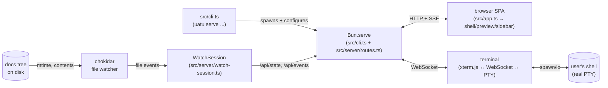
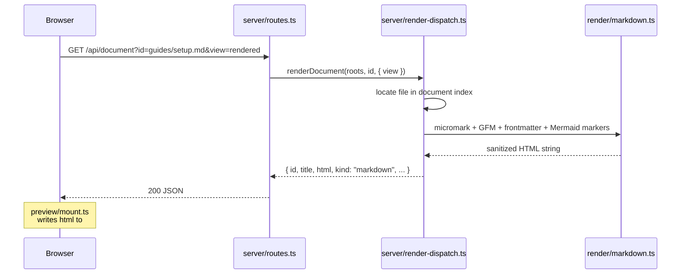
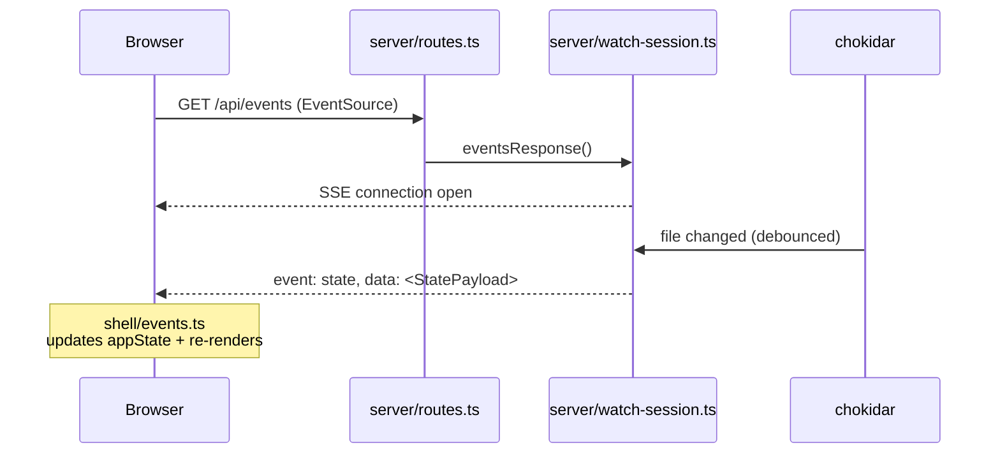
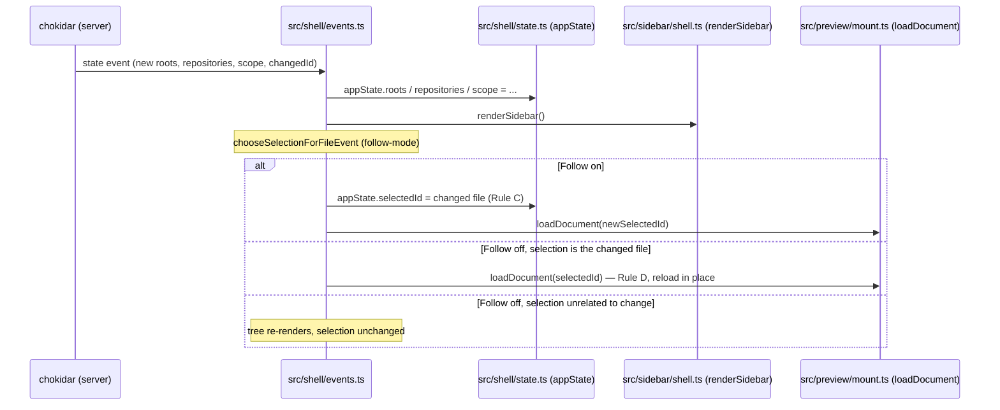
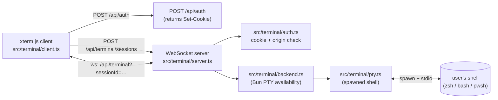

# Architecture

This document is the codebase-orientation guide for **uatu** (a.k.a. UatuCode). It's written for a new contributor — human or AI — who wants to know what the moving parts are, where to look for each one, and how a request or state change flows through the system.

For the user-facing pitch (features, install, usage), see [README.md](./README.md). For terse navigation cues during a Claude Code session, see [CLAUDE.md](./CLAUDE.md).

## What uatu is

`uatu` is a local Bun-served Progressive Web App that watches a directory of docs and source, previews Markdown and AsciiDoc with Mermaid diagrams, surfaces a review-burden score for code changes, and (where supported) hosts an embedded terminal in the same browser tab. It runs entirely on `localhost` — there is no cloud component — and ships as a single Bun-compiled binary or runs from source.

## The 30-second map


```mermaid
flowchart LR
  CLI["src/cli.ts<br/>(uatu serve ...)"]
  WS["chokidar<br/>file watcher"]
  Server["Bun.serve<br/>(src/cli.ts + src/server/routes.ts)"]
  Session["WatchSession<br/>(src/server/watch-session.ts)"]
  SPA["browser SPA<br/>(src/app.ts → shell/preview/sidebar)"]
  Term["terminal<br/>(xterm.js ↔ WebSocket ↔ PTY)"]
  FS[("docs tree<br/>on disk")]
  Term_PTY[("user's shell<br/>(real PTY)")]

  CLI -- spawns + configures --> Server
  WS -- file events --> Session
  FS -- mtime, contents --> WS
  Server <-- HTTP + SSE --> SPA
  Server <-- WebSocket --> Term
  Term <-- spawn/io --> Term_PTY
  Session -- /api/state, /api/events --> Server
```

Four boundaries to keep in mind:

- **HTTP/SSE between server and SPA.** `/api/state` supplies the initial snapshot, `/api/document` and `/api/document/diff` render one path, `/api/search` sweeps content, and `/api/events` streams updates. Scope and compare target travel as validated request context on all related requests; there are no process-global mutation endpoints.
- **Per-client watch context.** The Change Overview measures against `base` (merge-base review view) or `last-commit` (`HEAD` working view). `src/shared/watch-context.ts` serializes the client's scope and compare target, and `server/watch-session.ts` selects the corresponding roots and cached repository snapshot independently for each request and SSE subscriber. Two clients can therefore browse different scopes and comparison lenses through the same child process.
- **Chokidar between server and the filesystem.** The `WatchSession` debounces, applies the ignore policy, rebuilds the document index, and emits SSE events.
- **WebSocket between SPA and terminal subsystem.** Authenticated by a cookie set on `POST /api/auth`; multiplexed across multiple PTY panes by `terminal/server.ts`.
- **A single Bun binary.** No node, no separate frontend bundler — `Bun.serve` serves both the SPA and the API.

## Folder tour

`src/` is organized by feature. Three entrypoint files live at the root; everything else is in a folder named after its concern. Files are listed in each folder's `ls` — open the folder when you need a specific name.

```
src/
├── app.ts                SPA entry — DOM queries, init calls, top-level boot
├── cli.ts                CLI entry — process wiring: port probing, Bun.serve
│                         assembly, watchdog spawn, signal handling
├── styles.d.ts           CSS module type declarations
├── index.html, styles.css, assets/   HTML shell + CSS + bundled assets
│                         (logo, PWA icons + manifest,
│                         and `assets/fonts/HackNerdFontMono-Regular.woff2`
│                         — the default face for *every* monospace surface
│                         in the app, surfaced via the shared
│                         `--mono-font-family` CSS variable on `:root`)
│
├── cli/                  CLI domain — argument parsing + usage text
│                         (parse.ts) and TTY startup output (output.ts);
│                         side-effect-free so the unit suite can import them
├── shell/                App-wide chrome and the appState singleton: boot,
│                         SSE event handling, URL/history, follow-mode
│                         capability, connection chip, PWA registration
├── preview/              The right pane — every renderer that mounts HTML
│                         into #preview: rendered / source / diff views,
│                         layout chooser, mermaid, anchors, image/binary
│                         fallbacks, metadata card, code-block decorations
├── sidebar/              The left pane — sidebar shell, pane visibility/
│                         sizing, the @pierre/trees-backed Files tree,
│                         Change Overview, Git Log, Files-pane filter
├── terminal/             The full xterm + PTY subsystem: panel chrome,
│                         xterm client, WebSocket server, PTY backend,
│                         cookie/origin auth, persisted pane state
├── server/               HTTP server building blocks (Bun.serve itself is
│                         in cli.ts): routes.ts (single-source-of-truth
│                         route table + shared fetch fallback),
│                         watch-session.ts (live-reload engine), roots.ts
│                         (root resolution + scanning), render-dispatch.ts,
│                         static-files.ts, navigation.ts, port-probe.ts
├── document/             Per-document data (not rendering): metadata
│                         parsing, diff fetcher, text/binary classifier,
│                         language detection, review-base resolver
├── render/               Source → HTML transformation: markdown
│                         (micromark + GFM + frontmatter), asciidoc
│                         (@asciidoctor/core), sanitization + mermaid markers
├── review/               Review-burden score data layer
├── ignore/               .gitignore + .uatu.json tree.exclude engine
├── hub/                  The self-hostable session hub (`uatu hub`): config,
│                         XDG state dir, workspace registry, the
│                         SessionBackend seam + local-process backend,
│                         HTTP/SSE/WS reverse proxy, hub auth (users, signed
│                         cookie, rate limit, CSRF), dashboard pages, server
│                         assembly, process wiring
├── watchdog/             Heartbeat-driven hang recovery — spawned sibling
│                         subprocess + forensic dump bundle
├── debug/                Observability — XDG-cache path resolution +
│                         event-counter metrics
├── pwa/                  PWA install affordance (manifest + SW asset refs)
└── shared/               Cross-cutting helpers: html escape, types,
                          license check, build version
```

Unit tests are colocated with their subjects (`foo.ts` and `foo.test.ts` sit in the same folder). E2E tests live in `tests/e2e/` under feature-named files (`mermaid.e2e.ts`, `sidebar.e2e.ts`, `document-tree.e2e.ts`, etc.); the Playwright `webServer` is `tests/e2e/server.ts`, not in `src/`.

### Outside `src/`: the desktop wrapper

`desktop/macos/` holds **UatuCode Desktop**, a SwiftUI app whose windows are
hub clients. At launch the app spawns a single bundled `uatu hub --local
--port 0 --exit-on-stdin-close` (`LocalHub.swift`) — a trusted loopback hub
with no login — and every window/tab is a `WKWebView` pointed at a hub page:
the local hub's dashboard, a workspace session at `/s/<id>/`, or a configured
remote hub (`HubRoster.swift`, `HubAPI.swift`; credentials in the Keychain,
the `uatu_hub` cookie owned natively and injected into the WebView's cookie
store before navigation). Windows own no processes; sessions belong to the
hub, so closing a tab leaves its session running and quitting the app
confirms first when local sessions have live terminal shells (remote
sessions are unaffected by quit). The wrapper↔CLI contract is deliberately
thin:

- **URL on stdout** — with a piped (non-TTY) stdout the CLI prints exactly one
  line, the hub's base URL; the app parses that.
- **SIGTERM** — clean quit path; the hub stops its session children and exits.
- **`--exit-on-stdin-close`** — crash backstop; the app holds the hub's stdin
  pipe for its whole life, so if the app dies without running handlers the
  hub sees EOF and shuts down (children included) instead of running
  orphaned.

The WebView is a `WKWebView` (`WebViewHost.swift`), not SwiftUI's `WebPage`:
`WebPage` has no `createWebViewWith` equivalent, so `window.open()` — how
xterm.js activates OSC 8 terminal hyperlinks — and `target="_blank"` anchors
would be silently dropped. The host's `WKUIDelegate` catches them and routes
the URL, and the window exposes Back/Forward (`⌘[`/`⌘]`, toolbar) over the
SPA's pushState history.

External `http(s)` links open by default in the **split browser**
(`BrowserSplit.swift` + `BrowserSplitView.swift`): a per-window resizable
right-hand pane with its own custom tab strip (native macOS tabs are
window-level and can't nest in a pane), per-tab back/forward/reload, an
editable address bar (URL or DuckDuckGo search), and an eject-to-browser
button. Tabs share a persistent `WKWebsiteDataStore` (logins survive
relaunch; open tabs don't). `⌘`-click, non-`http(s)` schemes, or the
"Open External Links in System Browser" menu toggle route to the system
instead (`ExternalLinkRouter`). Toggle the pane with `⌘⇧B`; `⌘W` closes the
focused browser tab, falling back to the window when the split lacks focus.

Nothing else crosses the boundary — the browser remains a first-class client,
and the desktop app rides the same release train (see
`.github/workflows/release.yml`, jobs `desktop-macos`/`update-tap`).

## Base paths and the hub

A serve session is relocatable under a path prefix: `uatu serve --base-path
/s/uatu/` moves the entire HTTP surface — routes, assets, PWA scope, pushState
document URLs, the terminal cookie's `Path` — under the prefix, with `/` as
the byte-for-byte-unchanged default. Server-side, `buildRoutes` prefixes its
static keys and the fetch fallback 404s anything outside the prefix;
client-side, every server-relative URL flows through `appUrl()` in
`src/shared/app-url.ts`, which reads the `<meta name="uatu-base-path">` the
server injects into the shell (`relocateShellHtml` in
`server/navigation.ts`, which also rewrites the HTMLBundle's root-absolute
chunk references). A structural test (`shared/app-url-discipline.test.ts`)
fails any module that builds a root-relative `/api`/`/assets` URL outside
the helper.

The consumer of that relocatability is **the hub** (`uatu hub`, `src/hub/`):
a self-hostable daemon that keeps a workspace registry of absolute folder
paths (stable collision-suffixed slugs; folders are added through a
server-side directory browser or the API — there is no workspaces root;
`backend` field reserved for a future container/VM backend), starts one
loopback-bound `uatu serve` child per workspace through
the `SessionBackend` interface (`hub/backend.ts` — the desktop wrapper's
spawn contract: URL on stdout, held stdin as orphan backstop, SIGTERM), and
reverse-proxies HTTP, SSE, and WebSockets under `/s/<id>/` from a single
TLS-terminating, login-gated port (`hub/proxy.ts`, `hub/auth.ts`,
`hub/server.ts`). The hub is a trusted intermediary: it authenticates the
browser and validates its Origin, then forwards loopback-shaped
`Host`/`Origin` headers and brokers the child's session token server-side —
children keep their localhost security model unchanged and are never
network-reachable. `uatu hub --local` is the same daemon in trusted
single-user mode — loopback-only, no config file, no login routes — which is
how the desktop app supervises its sessions. Operator documentation lives in
`docs/SELF-HOSTING.md`;
the design rationale (single-origin proxy over port-per-session, restart
semantics, trust model) in `openspec/changes/add-uatu-hub/design.md`.

## Request lifecycle

A representative path: the SPA needs the rendered HTML for `guides/setup.md`.


```mermaid
sequenceDiagram
  participant Browser
  participant Routes as server/routes.ts
  participant Dispatch as server/render-dispatch.ts
  participant Render as render/markdown.ts
  Browser->>Routes: GET /api/document?id=guides/setup.md&view=rendered
  Routes->>Dispatch: renderDocument(roots, id, { view })
  Dispatch->>Dispatch: locate file in document index
  Dispatch->>Render: micromark + GFM + frontmatter + Mermaid markers
  Render-->>Dispatch: sanitized HTML string
  Dispatch-->>Routes: { id, title, html, kind: "markdown", ... }
  Routes-->>Browser: 200 JSON
  Note over Browser: preview/mount.ts<br/>writes html to #preview
```

Failure paths:

- File no longer exists → Session throws → Routes returns 404 → `preview/mount.ts` shows the "no longer exists" empty state.
- File is binary → Session throws `"document is binary"` → Routes returns 415 → `preview/binary.ts` or `preview/image.ts` renders the appropriate fallback (image for `.png` / `.jpg` / etc., a "not viewable" notice otherwise).

The companion SSE stream:


```mermaid
sequenceDiagram
  participant Browser
  participant Routes as server/routes.ts
  participant Session as server/watch-session.ts
  participant Watcher as chokidar
  Browser->>Routes: GET /api/events (EventSource)
  Routes->>Session: eventsResponse()
  Session-->>Browser: SSE connection open
  Watcher->>Session: file changed (debounced)
  Session-->>Browser: event: state, data: <StatePayload>
  Note over Browser: shell/events.ts<br/>updates appState + re-renders
```

The route table that wires both of these requests is declared exactly once, in `src/server/routes.ts` via `buildRoutes({ mode: "prod" | "e2e", ... })`. Both `src/cli.ts` (production) and `tests/e2e/server.ts` (the Playwright harness) call it.

## State lifecycle

The SPA's source of truth is `appState`, a module-level mutable singleton in `src/shell/state.ts`. The SSE handler in `src/shell/events.ts` is the only path that mutates `appState` from external events.

State is deliberately split into four lifetimes:

| Lifetime | Examples | Owner / storage |
|---|---|---|
| Child session | watched roots, file index, repository snapshots, live PTYs | `server/watch-session.ts` and `terminal/server.ts`; ends when the child stops |
| Client watch context | scope and compare target used by state, SSE, search, navigation, and diff requests | explicit URL/query context from `shell/watch-context.ts`; never mutates another client |
| Personal workspace state | selected document, Follow, preview mode, compare target, Files filter, last-active PTY id | Hub store keyed by authenticated user + stable workspace id in `hub/personal-state.ts`; local Hub uses identity `local` |
| Client presentation | sidebar and preview geometry, terminal dock/splits/pane attachments, transient visibility | base-path-namespaced browser local/session storage in `shell/presentation-storage.ts`; native macOS window/split geometry remains in `UserDefaults` |

Boot loads child state and personal state together. Explicit document, commit, or review URLs win; otherwise semantic personal state resumes; child defaults are last. Semantic owner mutators PATCH fields through `shell/personal-state.ts`. Presentation state never enters the Hub store, and another browser restores semantics without inheriting this browser's dimensions or pane arrangement. A stale document or PTY reference is cleared independently after the current document index or terminal inventory proves it absent.

Every `appState` field has exactly one owning module: direct assignment (`appState.<field> = …`) is allowed only inside the owner, and every other module mutates through the owner's exported mutator (`setSelectedId()`, `setFilesPaneFilter()`, …). Mutators for persisted preferences own the localStorage write, so assignment and persistence can't drift apart. The contract is enforced by `src/shell/state-ownership.test.ts`, which scans `src/` for out-of-owner assignments.

| Field | Owner |
|---|---|
| `selectedId`, `previewMode` | `shell/selection.ts` |
| `followEnabled` | `shell/follow.ts` (the four follow-mode rules) |
| `roots`, `repositories`, `scope`, `unscopedFingerprint` | `shell/events.ts` (`applyServerSnapshot`) |
| `staleHint` | `shell/stale-hint-mount.ts` |
| `viewMode`, `wrap` | `preview/view-mode.ts` |
| `viewLayout`, `splitRatio` | `preview/layout.ts` |
| `diffStyle` | `preview/diff.ts` |
| `panes` | `sidebar/panes.ts` |
| `filesPaneFilter` | `sidebar/files-filter.ts` |
| `gitLogLimit` | `sidebar/git-log.ts` |
| `compareTarget` | `sidebar/change-overview.ts` (`adoptCompareTarget`) |


```mermaid
sequenceDiagram
  participant Watcher as chokidar (server)
  participant SSE as src/shell/events.ts
  participant State as src/shell/state.ts (appState)
  participant Sidebar as src/sidebar/shell.ts (renderSidebar)
  participant Preview as src/preview/mount.ts (loadDocument)

  Watcher->>SSE: state event (new roots, repositories, scope, changedId)
  SSE->>State: appState.roots / repositories / scope = ...
  SSE->>Sidebar: renderSidebar()
  Note over SSE: chooseSelectionForFileEvent (follow-mode)
  alt Follow on
    SSE->>State: appState.selectedId = changed file (Rule C)
    SSE->>Preview: loadDocument(newSelectedId)
  else Follow off, selection is the changed file
    SSE->>Preview: loadDocument(selectedId) — Rule D, reload in place
  else Follow off, selection unrelated to change
    Note over SSE: tree re-renders, selection unchanged
  end
```

The four authoritative rules of the `follow-mode` capability — defined in `openspec/specs/follow-mode/spec.md` — are the only paths that change `appState.followEnabled` or `appState.selectedId`:

- **Rule A** (user clicks a tree row): selection moves to that file; follow turns off. Guarded by `TreeView.duringProgrammaticUpdate` so library-fired callbacks during mount or `resetPaths` are not mistaken for user input.
- **Rule B** (user clicks the Follow toggle): `followEnabled` flips. Turning on jumps to the newest-mtime file in the current session.
- **Rule C** (file event + follow on): selection moves to the changed file.
- **Rule D** (file event + follow off): selection unchanged; if the changed file equals the current selection, the preview reloads in place; otherwise just the tree refreshes.

## Terminal subsystem

The terminal panel is the only feature with a WebSocket transport.


```mermaid
flowchart LR
  Client["xterm.js client<br/>src/terminal/client.ts"]
  Cookie["POST /api/auth<br/>(returns Set-Cookie)"]
  Server["WebSocket server<br/>src/terminal/server.ts"]
  Auth["src/terminal/auth.ts<br/>cookie + origin check"]
  Backend["src/terminal/backend.ts<br/>(Bun PTY availability)"]
  PTY["src/terminal/pty.ts<br/>(spawned shell)"]
  Shell[("user's shell<br/>(zsh / bash / pwsh)")]

  Client -- POST /api/auth --> Cookie
  Client -- "POST /api/terminal/sessions" --> Server
  Client <-- "ws: /api/terminal?sessionId=…" --> Server
  Server --> Auth
  Server --> Backend
  Backend --> PTY
  PTY <-- spawn + stdio --> Shell
```

The panel UI (~700 lines in `src/terminal/panel.ts`) handles dock position, split, fullscreen, focus, and message routing across multiple PTY panes. On Windows, `terminal/backend.ts` reports unavailable and the panel button is hidden — uatu doesn't degrade other features.

Auth is deliberately Host-relative: the origin gate compares the `Origin` header against the request's `Host` (hostname pinned to loopback names), and the auth cookie is named `uatu_term_<host-port>`, so port-mapped access (container publishes, SSH forwards) and multi-instance fleets work with zero configuration. The rationale — including which parts of this design would survive a hosted multi-tenant deployment and which are deliberate localhost scaffolding — is recorded in the `fix-terminal-auth-port-mapping` change's `design.md` (decision D4).

PTY lifetime follows tmux-detach semantics, but PTYs are server-owned resources rather than side effects of WebSocket upgrade. Authenticated `POST /api/terminal/sessions` creates a resource and returns its id. A WebSocket may only attach to an existing id; malformed, unknown, attached, and explicit-takeover cases remain distinct. Disconnecting detaches while the shell keeps running. Only confirmed pane close (close code 4001), inventory deletion, shell exit, or child shutdown terminates it.

After upgrade, the client opens xterm, fits it, and sends `attach-ready` with actual dimensions. Until then the server ignores input and does not transfer ownership. Each PTY feeds a bounded `@xterm/headless` model while attached or detached. At readiness the server resizes the PTY/model, serializes coherent normal/alternate-buffer state plus a small private-mode ledger, sends that reconstruction first, then forwards buffered and live output. This replaces arbitrary byte-tail replay and preserves raw-mode TUI state across fresh clients and different viewport sizes. Takeover is transactional: the previous holder receives 4410 only after the replacement is ready; an early failed claimant leaves it attached.

Sessions are managed tmux-style: `GET /api/terminal/sessions` lists every live PTY (attached/detached, age, dimensions, best-effort foreground-process label via a POSIX `ps` adapter), and `DELETE /api/terminal/sessions/<id>` kills one. The picker lists resources not already shown in the window and requires explicit attach, takeover, kill, or new-shell actions. Local pane ids/layout are separate from server PTY ids. The personal last-active id is highlighted but never auto-attached on a new client; actual pane attachments remain base-path-namespaced per-window presentation state.

App-defined WebSocket close codes: `4001` user-terminate (client→server: kill the PTY), `4409` sessionId in use (server→client: upgrade race lost), `4410` session taken (server→client: another window took this session over).

Clipboard crosses the client/server boundary in two directions, both ending at `navigator.clipboard` — which is the **host** clipboard even when the uatu server runs in a container, because the browser is on the host. Paste reads it and forwards down the PTY (`clipboard.ts` shortcut handlers). Copy has two paths: xterm-owned selections go through the Windows-Terminal-parity shortcuts, while mouse-mode TUIs (Claude Code, opencode) emit OSC 52 up the PTY, which `client.ts` bridges via `term.parser.registerOscHandler(52, …)` → `createOsc52Handler` in `clipboard.ts`. The bridge is write-only by construction (read queries get no response — no exfiltration path), caps decoded payloads at 100 KB, and reports every accepted write through a pane-scoped toast in `panel.ts` so clipboard poisoning is always visible. Policy comes from `.uatu.json terminal.clipboard` (`notify` default / `confirm` / `silent` / `off`) and flows to the client through `/api/state.terminalConfig` like the font overrides. A gestureless `writeText` rejection (Firefox/Safari) promotes the toast to its Copy-button form, which performs the write inside the click.

> **Upgrade hazard.** The terminal is constructed with `allowProposedApi: true`
> because the search addon's decoration options are still proposed API in xterm
> 6 — calling them without it throws rather than degrading. Proposed APIs can
> shift across xterm minors, so read their changelog when bumping the dependency.

## Follow mode

uatu is a single-mode app. There is no Author vs. Review distinction; the only behavioral toggle is **Follow**, surfaced as a switch in the sidebar header. The full contract is specified in `openspec/specs/follow-mode/spec.md`; the four rules are summarized in the State lifecycle section above.

| Aspect | Behavior |
|---|---|
| Default `Follow` at boot | on at `/`; forced off when arriving via a direct document URL (e.g. `/guides/setup.md`) |
| `--no-follow` CLI flag | flips the default at `/` to off |
| User clicks a tree row | selection moves; follow turns off (Rule A) |
| User clicks the Follow switch | flips state; turning on jumps to the newest-mtime file (Rule B) |
| File changes on disk + follow on | selection moves to the changed file (Rule C) |
| File changes on disk + follow off | current file reloads in place if it's what changed; otherwise tree refreshes silently (Rule D) |
| Single-file CLI invocation (`uatu serve some-file.md`) | Follow switch disabled — nothing else to follow |
| Sidebar panes available | Change Overview, Files, Git Log — all always available; toggle via the per-pane visibility menu. Fresh clients start with Change Overview and Files visible (Git Log and Search hidden); stored arrangements always win |

The `withProgrammaticUpdate(fn)` helper in `src/sidebar/tree-view.ts` is what makes Rule A reliable: it suppresses the `@pierre/trees` library's `onSelectionChange` callback during initial mount and `resetPaths`-driven refreshes so library-fired selections aren't mistaken for user clicks. That single helper is the root fix for the historical flake on `tests/e2e/preview-renderers.e2e.ts` (issue #45) and the `follow-mode auto-switch` test.

## Find and the active surface

⌘F is owned by the page, not the host. No engine — not Chrome, not
`WKWebView.find` — can scope native find to a subtree, so a browser's ⌘F
matches the tree, the git log, and the terminal scrollback alongside the
document you were reading. Owning find is the only way to scope it, and it
closes the desktop gap for free, since WKWebView ships no find bar at all.

Routing is one line: **⌘F searches the active surface.**

| Active surface | What ⌘F searches | Mechanism |
|---|---|---|
| `preview` | the current view's visible text | `find/` — text-node index + CSS Custom Highlight API |
| `terminal` | the focused pane's scrollback | `@xterm/addon-search` |
| `browser` | the split browser's page | native, in the macOS wrapper |

`appState.activeSurface` is owned by `src/find/active-surface.ts` and is
**deliberately not derived from `document.activeElement`**. Clicking a file in
the tree leaves focus inside `@pierre/trees`' shadow root, so a literal focus
rule would search the sidebar when the user has just declared interest in a
document. Sidebar interaction therefore resolves to `preview` — directing the
sidebar is an act about the document it is directing.

The surface is written only by pointer and focus listeners, which is what makes
follow mode inert: a file event (Rules C/D) changes the selection and the
preview, but cannot move focus or relocate the user's working context. There is
no code path from the watcher to the setter, and
`find/active-surface.test.ts` asserts that structurally.

The flat text the matcher sees keeps inline elements contiguous — that is what
lets a query match across the `<span>`s syntax highlighting inserts — but breaks
at block boundaries: `<p>foo</p><p>bar</p>` indexes as `foo\nbar`, never
`foobar`, so a hit is never reported for text the reader does not see as one
phrase. The separator is backed by no text node, and `locateSpan` refuses spans
that cross the gap, so a regular expression cannot sneak across it either.

One find bar serves both page surfaces via a pluggable engine (`find/engine.ts`);
the xterm search addon happens to take the same three options and report the
same index/total pair the preview matcher does. Highlighting never mutates the
preview — it paints `Range`s through `CSS.highlights`, so rendered output,
mermaid diagrams, anchors, and code-block decorations are untouched by
searching. Because the preview is replaced wholesale on live reload, the
preview engine holds no DOM references across a swap and re-indexes on a scoped
`childList` observer.

### Project search (⇧⌘F)

⌘F is scoped to a surface; **⇧⌘F is not**. That asymmetry is deliberate and
matches VS Code: the tree is not a surface you can be "in", so project search
means the same thing pressed from the document, the terminal, or anywhere else.

The corpus costs almost nothing to assemble. `getSession().getRoots()` already
holds every watched document, ignore-filtered (`.gitignore` + `.uatu.json`),
binary-classified, and kept current by the watcher — so `/api/search` reads that
list and matches. There is no index to invalidate and no second walker whose
ignore rules could drift from the tree's. Passing `allRoots=1` swaps in
`getUnscopedRoots()`, which is the escape hatch for a scope narrowed so far that
search would otherwise look broken.

Results stream as NDJSON rather than arriving in one batch: on a docs tree the
difference is invisible, but pointed at a repository it is the difference
between a pane that fills and one that hangs. The sweep is bounded on three
axes — minimum query length, a total match cap, and a per-document time budget
so a slow pattern costs one skipped file instead of the sweep.

Both budgets are checked *between* match attempts, never during one, because a
single `RegExp.exec` is not interruptible from JavaScript. The honest bound is
therefore "deadline plus one attempt". Measured on Bun's JavaScriptCore, runaway
backtracking plateaus around 460 ms per attempt rather than growing without
limit, so that overshoot is bounded in practice — but by the engine, not by us.

Running the sweep in a terminable worker would make the bound ours, and was
built and reverted: `bun build --compile` does not embed the worker module, so
the guarantee held from source and silently fell back in the shipped binary. A
guarantee that only applies in development is worse than a weaker one that
applies everywhere. Every bound that trips is disclosed in the pane; a silently truncated
list would read as "that is everywhere it appears", which is the wrong
conclusion for a reviewer to draw.

Activating a result routes through follow-mode Rule A — it is a user
navigation — then reveals the match with `find/reveal.ts`, which reuses the find
bar's own text index and highlight registry rather than growing a second
painting path. The awkwardness worth knowing about: the corpus is **source**
text while the reading surface is often **rendered**, and matches inside link
syntax, heading markers, or code fences exist in the file but not in the
rendered DOM. So the result lands in whatever view the reader is already using
and falls back to Source only when the match cannot be found there — Source
being where the searched text always exists.

## How to extend

### Add a new sidebar pane

1. Add the pane's id + label to `ALL_PANE_DEFS` in `src/shell/state.ts`. The `PaneId` union widens automatically.
2. Add a `<section data-pane-id="your-id">…</section>` to `src/index.html` inside `.sidebar-panes`.
3. Add an entry in `src/sidebar/panes.ts` (`paneId → renderer`) and create the renderer in a new file under `src/sidebar/`.
4. Add a test in `src/sidebar/your-pane.test.ts` (colocated) and an e2e test in `tests/e2e/sidebar.e2e.ts` (or a new feature file if you're starting a separate concern).

### Support a new file kind

1. Update `src/document/classify.ts` to recognize the extension or content signature.
2. If the file type renders to HTML, add a renderer in `src/render/` (mirror the shape of `markdown.ts` or `asciidoc.ts`).
3. Update `src/server/render-dispatch.ts`'s `renderDocument` to dispatch to your renderer.
4. If the file type has a custom preview shape (image, binary, etc.), add it under `src/preview/` and route it from `src/preview/mount.ts`'s `loadDocument`.
5. Cover the new path in `tests/e2e/preview-renderers.e2e.ts`.

### Add an HTTP route

1. Add the route to `src/server/routes.ts` inside the `buildRoutes(deps)` function. Use `deps` for anything the handler needs (the watch session, the metrics snapshot, e2e helpers, etc.) — do not reach into module-level state from inside the handler.
2. If the route is prod-only or e2e-only, place it inside the appropriate `mode === "prod"` / `mode === "e2e"` branch and add the required dep to the corresponding `ProdRouteDeps` / `E2ERouteDeps` shape.
3. Both `src/cli.ts` and `tests/e2e/server.ts` will pick up the new route automatically — they each `Bun.serve({ routes: buildRoutes(...) })`.

### Add an e2e test

1. Pick the right feature file under `tests/e2e/` (look at the existing file names — they mirror the `src/` folder taxonomy). If your test doesn't fit any existing file, create a new one named after the feature.
2. Import the shared setup: `import { standardBeforeEach } from "./fixtures";`.
3. The harness reset (`/__e2e/reset`) is in `tests/e2e/config.ts`; the workspace fixture lives at `testdata/watch-docs/`.

## Run and test

```bash
bun run dev               # local watch on testdata/watch-docs
bun test                  # unit + integration suite (~18s)
bun run test:e2e          # Playwright (~5min, workers: 1, serial)
bun run build             # compile single-file dist/uatu binary
bun run check:licenses    # audit npm dependencies
bun run bench:render      # informational render baseline
```

For tighter loops:

- `bun test src/sidebar/git-log.test.ts` — single file
- `bun x playwright test tests/e2e/mermaid.e2e.ts:127` — single e2e test
- `bun run dev --no-gitignore` — exposes gitignored files in the tree
- `bun run dev --no-follow` — boots with Follow disabled
