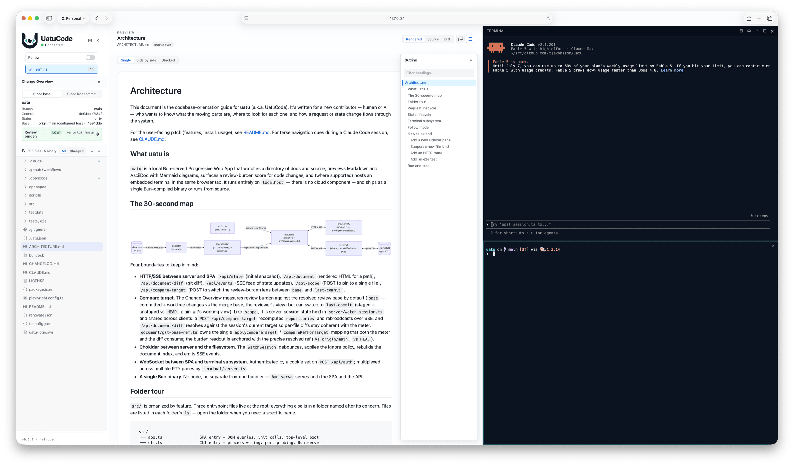

<p align="center">
  
</p>

<h1 align="center">UatuCode</h1>

<p align="center">
  <strong>Codebase Watcher</strong><br/>
  <em>I observe. I follow. I render.</em>
</p>

<p align="center">
  <a href="https://github.com/tjakobsson/uatu/actions/workflows/ci.yml"></a>
  <a href="./LICENSE"></a>
  <a href="https://bun.sh"></a>
  <a href="https://playwright.dev"></a>
</p>

<p align="center">
  
</p>

---

`uatu` is a local watch UI for following what an AI coding agent is doing in
a codebase. Point it at a directory, open the browser UI it prints, and it
keeps a pleasant preview in sync with changing files. Flip the **Follow**
switch on to jump to whichever file just changed; flip it off and click a
file to stay there — the file you're viewing still reloads in place when it
changes on disk. Today it's a live preview and file browser; over time it
grows toward a companion for onboarding, peer review, and self-assessment of
cognitive debt.

## Features

- Markdown / AsciiDoc rendering with unified metadata cards for frontmatter and AsciiDoc header attributes
- Mermaid diagrams (fenced and `[source,mermaid]`) with a fullscreen pan/zoom viewer
- Syntax highlighting for source files, plus per-file copy-to-clipboard on every code block
- Cross-document `.md`/`.adoc` link navigation; live reload over SSE
- **Rendered / Source / Diff** view chooser per document; Diff renders only the active file's changes against the resolved review base via [`@pierre/diffs`](https://diffs.com/)
- **Follow switch** for the agent-collab workflow — on = auto-jump to the latest changed file, off = stay on the file you're reading (it still reloads in place when it changes on disk)
- Side-by-side / stacked split layouts for Source + Rendered
- Whole-repo browsing with `.uatu.json tree.exclude` and `.gitignore` filtering on top of built-in defaults
- Sidebar with Change Overview, Files, Git Log, and a Selection Inspector that produces `@path#L<a>-<b>` references — toggle individual panes from the per-pane menu
- Review burden meter based on git diff size, file spread, and configurable path scoring
- Git preflight by default (`--force` to bypass for non-git folders); single-file or multi-root scope
- Embedded terminal panel (real PTY via Bun) toggled with `Ctrl+`` — dark theme, Nerd Font detection, dock to bottom or right, split for two concurrent PTYs
- Installable as a PWA so TUI editor shortcuts (`Cmd+W`, `Cmd+T`, `Cmd+L`, `Cmd+R`) reach the embedded terminal

## Install

Requires **Bun ≥ 1.3.5** (for the built-in PTY API; older Bun degrades the
terminal feature gracefully).

```bash
bun install
bun run src/cli.ts serve testdata/watch-docs   # run from source
bun run build && ./dist/uatu serve .            # standalone binary
bun link                                        # expose `uatu` on PATH
```

Windows is pending Bun's upstream PTY work — the terminal stays hidden there;
everything else works.

## Usage

```bash
uatu [serve] [PATH...] [--force] [--no-open] [--no-follow] [--no-gitignore] [--port <PORT>] [--debug]
```

`serve` is the default command — `uatu docs` and `uatu serve docs` are
equivalent, and a bare `uatu` serves the current directory. `uatu watch`
remains as a deprecated alias for one release and prints a warning.

```bash
uatu serve .
uatu serve docs notes --no-open
uatu serve . --no-follow
uatu serve README.md                        # single-file scope
uatu serve ~/Downloads/docs --force         # non-git, slow indexing
```

To scope a session to a single file, pass that file's path directly:
`uatu serve README.md`. The Follow switch is then disabled because there's
nothing else to follow.

The server binds to `127.0.0.1:4711` by default and scans upward if the port
is taken; pass `--port 0` for an ephemeral port. **Breaking from earlier
versions:** the default changed from 4312 to 4711 to keep PWA install
identity stable across launches. Pass `--port 4312` to keep old behavior.

## Configuration: `.uatu.json`

Optional repo-root file. All sections are independent and validation errors
are surfaced in Change Overview rather than aborting the watch session.

```json
{
  "tree": {
    "exclude": ["bun.lock", "*.log", "!debug.log"],
    "respectGitignore": true
  },
  "mono": {
    "fontFamily": "JetBrains Mono, monospace"
  },
  "terminal": {
    "fontFamily": "Berkeley Mono, monospace",
    "fontSize": 14,
    "clipboard": "notify"
  },
  "review": {
    "baseRef": "origin/main",
    "thresholds": { "medium": 35, "high": 70 },
    "riskAreas":    [{ "label": "Auth",  "paths": ["src/auth/**"],            "score": 25, "perFile":  2, "max": 35 }],
    "supportAreas": [{ "label": "Tests", "paths": ["**/*.test.ts","tests/**"], "score": -10, "perFile": -1, "maxDiscount": 15 }],
    "ignoreAreas":  [{ "label": "Generated", "paths": ["dist/**","**/*.generated.ts"] }]
  }
}
```

Every monospace surface in the app — rendered Markdown code blocks,
AsciiDoc code blocks, the source view, the diff view, the terminal —
defaults to the bundled **Hack Nerd Font Mono** so prompt icons
(powerline, devicons, git status, FontAwesome, Material Design, etc.)
render correctly out of the box in every browser, including Safari
and the installed PWA, which hide locally-installed fonts from web
pages. `mono.fontFamily` overrides the default everywhere at once;
`terminal.fontFamily` further narrows the override to the terminal
panel only (so you can keep the body of the app in one face and the
terminal in another).

The review base is resolved in order: configured `review.baseRef` →
`origin/HEAD` → `origin/main` → `origin/master` → `main` → `master`, then
falls back to staged + unstaged worktree changes against `HEAD`.

Files at or above 1 MB render without syntax highlighting to keep the
browser responsive. Binary files appear with VS Code-style icons and route
to a "preview unavailable" view. Git status (added / modified / deleted /
renamed / untracked) is surfaced as ambient row annotations on the tree.

## Security posture of the terminal

The terminal endpoint accepts shell input, so it ships with a stricter
envelope than the rest of uatu:

- **Localhost binding only** — server binds `127.0.0.1`, never `0.0.0.0`
- **Per-server token** — 32-byte token minted at startup, required for the WS upgrade. Restarting rotates it; the URL with the token lands in stdout and may persist in logs — treat as a short-lived credential
- **Origin allowlist** — rejects upgrade unless the `Origin` hostname is `127.0.0.1` or `localhost` AND its port matches the request's `Host` header. Matching against `Host` (not the listen port) means port-mapped setups — a container publishing 4711→4712, an SSH forward — work with zero configuration, while pages served from any *other* localhost port stay blocked. One documented failure mode: a reverse proxy that rewrites the `Host` header makes the browser's `Origin` mismatch it, and the terminal refuses the connection — the pane then shows an explicit "blocked for this address" notice (the `GET /api/auth` probe answers 403: valid credentials, rejected origin) rather than a misleading re-auth prompt
- **HttpOnly cookie** — `?t=<token>` mints a `uatu_term_<port>` HttpOnly + SameSite=Strict cookie (named for the port the browser used, so several uatu instances on different ports hold independent credentials) so PWA launches re-auth without pasting; rotates with the in-memory token
- **Write-only OSC 52 clipboard bridge** — TUIs that own the mouse (Claude Code, opencode) copy selections by emitting OSC 52 up the PTY; uatu bridges the sequence to the browser's clipboard, which is the *host* clipboard even when the uatu server runs in a container. Read queries (`ESC ] 52 ; c ; ?`) are never answered, so nothing in the terminal can read your clipboard; decoded payloads are capped at 100 KB. `terminal.clipboard` in `.uatu.json` picks the policy: `notify` (default — write + a "Copied N characters" toast, so a hostile escape sequence can't poison your clipboard silently), `confirm` (a toast with a Copy button; nothing is written without a click), `silent`, or `off`. On browsers that require a user gesture for clipboard writes (Firefox, Safari), a blocked write degrades to the Copy-button toast instead of being lost

**Safari 17+** blocks page-accessible Nerd Fonts (anti-fingerprinting), so
terminal prompts using Powerline glyphs show TOFU squares there. Chrome /
Edge / Brave or "Add to Dock" works around it.

## Watchdog and freeze recovery

`uatu serve` runs a sibling watchdog subprocess by default. If the parent's
1Hz heartbeat stops advancing for `--watchdog-timeout=<ms>` (default 30 000)
worth of consecutive watchdog checks — for example because the JS event loop
is wedged on a native fsevents deadlock — the watchdog captures a forensic
dump and force-kills the parent
(see [issue #40](https://github.com/tjakobsson/uatu/issues/40)). Staleness is
counted in watchdog checks rather than wall-clock time, so a laptop sleeping
past the timeout does not trigger a false kill on wake.

```bash
uatu serve --debug                  # also writes 1Hz NDJSON metrics (or UATU_DEBUG=1)
uatu serve --watchdog-timeout=60000
uatu serve --no-watchdog            # escape hatch
```

Diagnostic files live under `$XDG_CACHE_HOME/uatu/` (or `~/.cache/uatu/`):
heartbeat, snapshot, optional debug ring-buffer, and forensic dumps on
freeze. With `--debug`, `GET /debug/metrics` returns the live counters.

> **Privacy note:** forensic dumps include absolute repo paths from `lsof`
> (macOS) or `/proc/<pid>/fd/` (Linux). Review before sharing.

## Validation

```bash
bun test                # unit + integration
bun run check:licenses  # license audit
bun run build           # standalone build
bun run test:e2e        # Playwright
bun run bench:render    # informational render baseline
```

## For contributors

A folder-by-folder tour of the codebase, request and state lifecycles, the
terminal subsystem diagram, and "how to extend X" recipes live in
[ARCHITECTURE.md](./ARCHITECTURE.md). [CLAUDE.md](./CLAUDE.md) is the terse
quick-reference for Claude Code sessions.

## Repository workflow

This repo uses [OpenSpec](./openspec) for change-driven work: branch, create
a change under `openspec/changes/<name>/` (proposal, design, spec, tasks),
implement, merge, archive under `openspec/changes/archive/`. Current product
behavior lives in `openspec/specs/`.

GitHub Actions runs `bun test`, license audit, build, and Playwright on
every PR. Renovate keeps npm packages and GitHub Actions versions current.
Claude Code reviews every non-draft pull request and responds to `@claude`
mentions.
