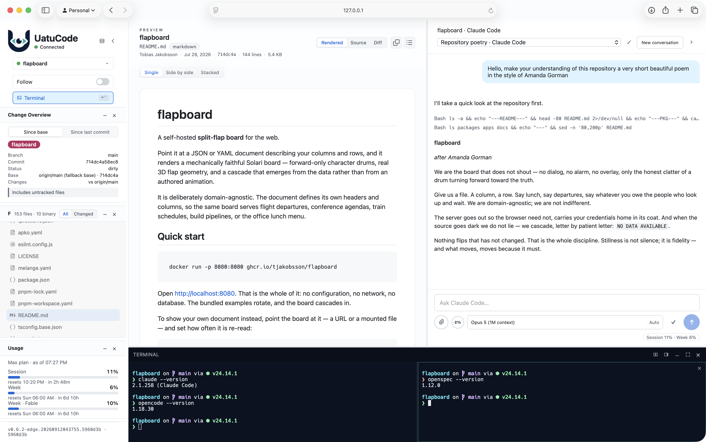

<p align="center">
  
</p>

<h1 align="center">UatuCode</h1>

<p align="center">
  <strong>Codebase Watcher</strong><br/>
  <em>I observe. I follow. I render.</em>
</p>

<p align="center">
  <a href="https://github.com/tjakobsson/uatu/actions/workflows/ci.yml"></a>
  <a href="https://scorecard.dev/viewer/?uri=github.com/tjakobsson/uatu"></a>
  <a href="./LICENSE"></a>
  <a href="https://bun.sh"></a>
  <a href="https://playwright.dev"></a>
</p>

<p align="center">
  
</p>

---

`uatu` is a watch UI for following what an AI coding agent is doing in a
codebase. Run the hub, add a folder from its dashboard, and uatu keeps a
preview in sync with the files as they change. Flip the **Follow**
switch on to jump to whichever file just changed; flip it off and click a
file to stay there — the file you're viewing still reloads in place when it
changes on disk. Today it's a live preview and file browser; over time it
grows toward a companion for onboarding, peer review, and self-assessment of
cognitive debt.

## Features

- Markdown / AsciiDoc rendering with unified metadata cards for frontmatter and AsciiDoc header attributes
- Mermaid diagrams (fenced and `[source,mermaid]`) with a fullscreen pan/zoom viewer
- Syntax highlighting for source files, plus per-file copy-to-clipboard on every code block
- Cross-document `.md`/`.adoc` link navigation; live reload over one server-sent-events stream per tab, however many panes are open
- **Rendered / Source / Diff** view chooser per document; Diff renders only the active file's changes against the resolved compare base via [`@pierre/diffs`](https://diffs.com/)
- **Follow switch** for the agent-collab workflow — on = auto-jump to the latest changed file, off = stay on the file you're reading (it still reloads in place when it changes on disk)
- Side-by-side / stacked split layouts for Source + Rendered
- Whole-repo browsing with `.uatu.json ignore.exclude` and `.gitignore` filtering on top of built-in defaults
- Sidebar with Change Overview, Files, and Git Log — toggle individual panes from the per-pane menu
- Git-aware workspaces: adding a folder outside a repository offers `git init`
- Embedded terminal panel (real PTY via Bun) toggled with `Ctrl+`` — dark theme, Nerd Font detection, dock to bottom or right, split for two concurrent PTYs
- Workspace-scoped [Chat](./docs/CHAT.md) with your own OpenCode and Claude Code — resumable history, streamed Markdown and tool activity, permissions, questions, plan approvals, task progress, cancellation, and safe file navigation
- Installable as a PWA so TUI editor shortcuts (`Cmd+W`, `Cmd+T`, `Cmd+L`, `Cmd+R`) reach the embedded terminal

## Install

### Homebrew (macOS and Linux)

```bash
brew install tjakobsson/tap/uatu
brew upgrade uatu        # stay current
```

### UatuCode Desktop (macOS)

A native macOS app that connects to hubs: add a hub (a remote box, or
`http://localhost:4700` for one on your own machine), sign in once, and
every window is a native view onto that hub's dashboard and sessions.
Requires macOS 26 or later.

```bash
brew install tjakobsson/tap/uatu-desktop
```

The app is a client, not a server — it runs no sessions of its own, so
quitting it never stops anything. Desktop source lives in
[`desktop/macos/`](desktop/macos/).

### Edge channel (nightly)

Want the bleeding edge instead? Builds of `main` — the CLI for every
platform, plus a signed desktop app — are published nightly (when `main`
has changed) to the rolling
[`edge` prerelease](https://github.com/tjakobsson/uatu/releases/tag/edge):

```bash
brew install tjakobsson/tap/uatu-edge                 # CLI (macOS and Linux)
brew install --cask tjakobsson/tap/uatu-desktop@edge  # desktop app
brew upgrade              # follows the nightly channel
```

Edge is exactly what's merged — expect occasional rough edges. Each
channel conflicts with its stable sibling, so switch back with
`brew uninstall uatu-edge && brew install tjakobsson/tap/uatu` (and
likewise `brew uninstall --cask uatu-desktop@edge && brew install --cask
tjakobsson/tap/uatu-desktop`).

### Manual download

Grab the archive for your platform from the
[latest release](https://github.com/tjakobsson/uatu/releases/latest) —
`uatu-darwin-arm64.zip`, `uatu-darwin-x64.zip`, `uatu-linux-x64.tar.gz`,
or `uatu-linux-arm64.tar.gz` — extract the single `uatu` binary, and put
it on your `PATH`.

**macOS note:** binaries downloaded through a browser are quarantined and
Gatekeeper will refuse to run them (the binaries are not notarized). Either
approve the binary under System Settings → Privacy & Security, or clear the
quarantine flag:

```bash
xattr -d com.apple.quarantine ./uatu
```

Downloads via `curl` or Homebrew never set the quarantine flag and run
as-is.

Every release ships a `SHA256SUMS` file, and all archives carry GitHub
build-provenance attestations:

```bash
gh attestation verify uatu-darwin-arm64.zip --repo tjakobsson/uatu
```

### From source

Requires **Bun ≥ 1.3.5** (for the built-in PTY API; older Bun degrades the
terminal feature gracefully).

```bash
bun install
bun run dev                        # dev hub on testdata/watch-docs (see dev/README.md)
bun run build && ./dist/uatu hub   # standalone binary
bun link                           # expose `uatu` on PATH
```

Windows is pending Bun's upstream PTY work — the terminal stays hidden there;
everything else works. Release binaries are darwin/linux only for now.

## Usage

uatu runs as a hub. `uatu hub` starts a daemon that serves a login-gated
dashboard on one port, runs one session per workspace folder, and serves
each session under `<host>/s/<workspace-id>/`. Run it on your own machine or
on one you own elsewhere. Every session has the full app (live preview,
change overview, detachable terminals, chat), in any browser, in an iPad
that installs the hub as a PWA, or in UatuCode Desktop.

To start a hub on your own machine, hash a password first. The command reads
it from stdin, never from its arguments; run it bare to type the password at a
prompt instead:

```bash
printf '%s' 'a-password' | uatu hub hash-password   # prints an $argon2id$… hash
```

Save the hash as a user in `~/.config/uatu/hub.json`:

```json
{ "users": [{ "name": "you", "passwordHash": "$argon2id$…" }] }
```

Then run the hub and open the URL it prints (`http://127.0.0.1:4700/` by
default):

```bash
uatu hub
```

Sign in and choose **Add Folder** to pick any folder on the machine, or clone
a repository into one. Each folder becomes a workspace with a stable URL.

```text
uatu hub [--config <PATH>] [--port <PORT>] [--exit-on-stdin-close]
uatu hub hash-password
```

Login is required on every interface, localhost included. A hub started
without a configured user prints these steps and exits. Sessions are
server-side records, so signing out, or revoking a device from the
dashboard's Devices pane, ends that session at once for every client holding
it. Terminal sessions detach and reattach across connectivity blips: a shell,
or an agent running in it, keeps working while your train is in a tunnel.

[docs/SELF-HOSTING.md](./docs/SELF-HOSTING.md) is the full guide. It covers
the trust model (hub users share the daemon's OS user, with no isolation
between them), the config reference, certificates (mkcert, `tailscale cert`,
`tailscale serve`), and systemd and launchd service definitions.

**`uatu serve` is gone.** It was deprecated in v0.5.0 and is now removed,
along with the `watch` alias and the bare `uatu <path>` form. Each of them
prints the steps above and exits with an error. Add the folder to a hub
instead.

## Configuration: `.uatu.json`

Optional repo-root file carrying content-scoping facts about the
repository — a single `ignore` block. Validation errors are surfaced in
Change Overview rather than aborting the watch session.

```json
{
  "ignore": {
    "exclude": ["bun.lock", "*.log", "!debug.log"],
    "respectGitignore": true
  }
}
```

Every monospace surface in the app — rendered Markdown code blocks,
AsciiDoc code blocks, the source view, the diff view, the terminal —
uses the bundled **Hack Nerd Font Mono** so prompt icons (powerline,
devicons, git status, FontAwesome, Material Design, etc.) render
correctly out of the box in every browser, including Safari and the
installed PWA, which hide locally-installed fonts from web pages.

The compare base is resolved automatically in order: `origin/HEAD` →
`origin/main` → `origin/master` → `main` → `master`, then falls back to
staged + unstaged worktree changes against `HEAD`.

Files at or above 1 MB render without syntax highlighting to keep the
browser responsive. Binary files appear with VS Code-style icons and route
to a "preview unavailable" view. Git status (added / modified / deleted /
renamed / untracked) is surfaced as ambient row annotations on the tree.

## Security posture of the terminal

The terminal endpoint accepts shell input, so it gets a stricter envelope
than the rest of uatu:

- **Loopback-only children.** Each workspace's session child binds `127.0.0.1`, never `0.0.0.0`, and nothing on the network can reach it. Remote access always ends at the hub's authenticated HTTPS listener.
- **Per-session token.** Each child mints a 32-byte token at startup, and the terminal's WebSocket upgrade requires it. The hub reads the token from the child's startup output and attaches it to proxied requests itself, so it never reaches a browser. Restarting the workspace rotates it.
- **Origin checks at both hops.** The hub compares the browser's `Origin` with the `Host` it receives and refuses a mismatch, so a reverse proxy in front of it must pass `Host` through unchanged (see [SELF-HOSTING](./docs/SELF-HOSTING.md)). It then forwards loopback-shaped `Host` and `Origin` headers, and the child's own allowlist (`127.0.0.1` or `localhost` on the port the request arrived at) holds unchanged.
- **Write-only OSC 52 clipboard bridge.** TUIs that own the mouse (Claude Code, opencode) copy selections by emitting OSC 52 up the PTY. uatu bridges the sequence to the browser's clipboard, which is the clipboard of the machine running the browser, not the hub. Read queries (`ESC ] 52 ; c ; ?`) are never answered, so nothing in the terminal can read your clipboard, and decoded payloads are capped at 100 KB. Every accepted write shows a "Copied N characters" toast, so a hostile escape sequence can't poison your clipboard silently. On browsers that require a user gesture for clipboard writes (Firefox, Safari), a blocked write turns into a Copy-button toast instead of being lost.

**Safari 17+** blocks page-accessible Nerd Fonts (anti-fingerprinting), so
terminal prompts using Powerline glyphs show TOFU squares there. Chrome /
Edge / Brave or "Add to Dock" works around it.

## Watchdog and freeze recovery

Every session child runs a sibling watchdog subprocess. If the child's 1Hz
heartbeat stops advancing for 30 seconds' worth of consecutive watchdog
checks, for example because the JS event loop is wedged on a native fsevents
deadlock, the watchdog captures a forensic dump and force-kills the child
(see [issue #40](https://github.com/tjakobsson/uatu/issues/40)). Staleness is
counted in watchdog checks rather than wall-clock time, so a laptop sleeping
past the timeout does not trigger a false kill on wake.

The hub builds its children's command lines itself, so these settings reach
sessions through the hub's environment:

```bash
UATU_DEBUG=1 uatu hub                      # also write 1Hz NDJSON metrics for every session
UATU_HEARTBEAT_TIMEOUT_MS=60000 uatu hub   # staleness threshold (default 30000)
```

Diagnostic files live under `$XDG_CACHE_HOME/uatu/` (or `~/.cache/uatu/`):
heartbeat, snapshot, optional debug ring-buffer, and forensic dumps on
freeze. With `UATU_DEBUG` set, `GET /s/<workspace-id>/debug/metrics` returns
a session's live counters.

### Chat startup

Chat history and inventory reads have a 30-second client deadline. Cold agent
history and catalog reads allow the configured startup timeout plus 35 seconds
for transport (65 seconds with the default startup setting). A failed read
offers **Retry read**, which preserves the draft and issues only read requests.
Conversation selection cancels obsolete reads. History can load while optional
model, mode, and command catalogs are still pending.

History reuse stays in memory, with an estimated 32 MiB and eight-conversation
limit per provider. Claude verifies native file identity, timestamps, size, and
normalization inputs before reusing parsed history. OpenCode's current API has
no revision covering both history stores, so it shares concurrent reads and
reconciles later reads against both stores. Changed older-page cursors require
a fresh snapshot. No cache files are written to the workspace.

Chat starts OpenCode lazily, waits for it to answer at all, then waits a
shorter slice for it to report healthy. A cold OpenCode start on a slow
filesystem can exceed the 30-second default. Widen it on the hub, which
passes its environment to every session:

```bash
UATU_OPENCODE_STARTUP_TIMEOUT_MS=60000 uatu hub
```

An empty, non-numeric, or non-positive value is ignored and the default
stands — a typo here must not stop documents from being served. When startup
does fail, the Chat surface reports which phase failed and offers a
**Diagnostics** block (resolved executable, shadowed candidates on `PATH`,
version, probed endpoint, elapsed time, probe count, last probe outcome, and
OpenCode's own stdout/stderr) plus a **Retry** that recovers a fixed
environment without restarting the workspace. The ephemeral OpenCode server
password never appears in that block.

> **Privacy note:** forensic dumps include absolute repo paths from `lsof`
> (macOS) or `/proc/<pid>/fd/` (Linux). Review before sharing.

## For contributors

Development setup, validation, pull-request conventions, and the OpenSpec
workflow are documented in [CONTRIBUTING.md](./CONTRIBUTING.md). A
folder-by-folder tour of the runtime and its extension points lives in
[ARCHITECTURE.md](./ARCHITECTURE.md).
