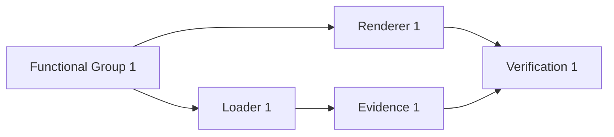
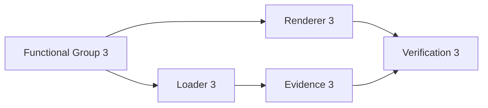
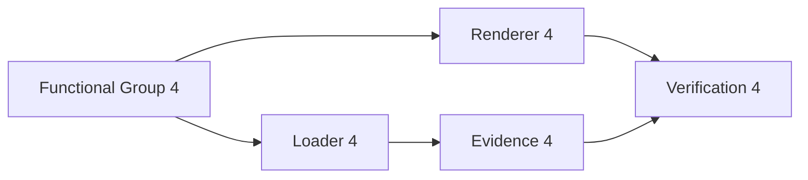
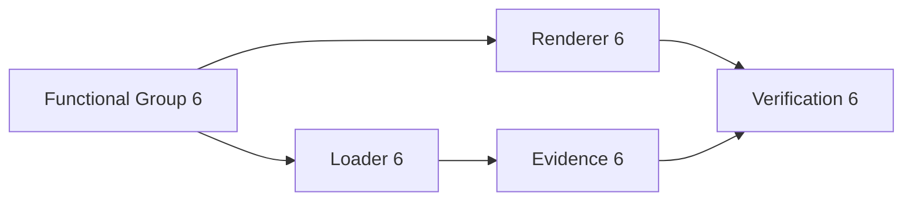
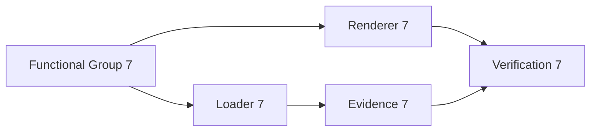
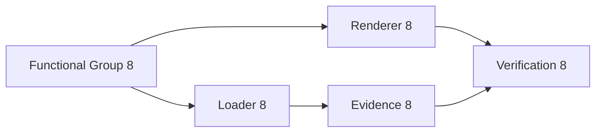
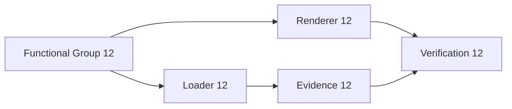
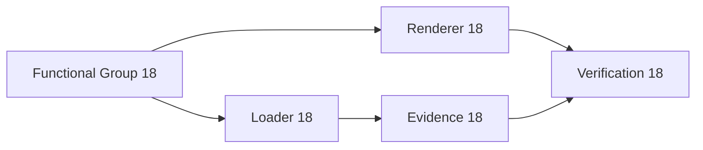
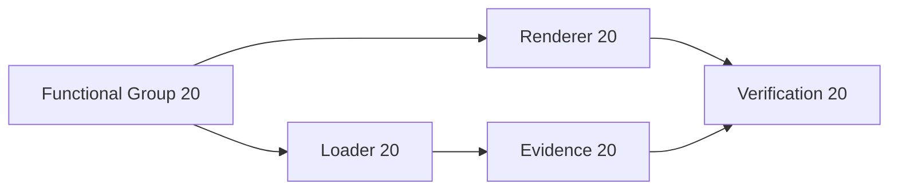

# Engineering Model Repository Design Benchmark

This committed fixture mirrors the size and shape of a generated architecture document: health snapshots, reference-heavy tables, repeated functional groups, Mermaid listings, code listings, and traceability appendices. The content is synthetic and deterministic so benchmark workload changes are visible in diffs.

## Document Health Snapshot

| ID | Name | Responsibility | Evidence |
| --- | --- | --- | --- |
| VIEW-001 | Architecture View 1 | Generated benchmark view with stable responsibility and evidence rows for local render measurement. | coverage=5; gaps=0; confidence=high |
| VIEW-002 | Architecture View 2 | Generated benchmark view with stable responsibility and evidence rows for local render measurement. | coverage=6; gaps=1; confidence=medium |
| VIEW-003 | Architecture View 3 | Generated benchmark view with stable responsibility and evidence rows for local render measurement. | coverage=7; gaps=2; confidence=medium |
| VIEW-004 | Architecture View 4 | Generated benchmark view with stable responsibility and evidence rows for local render measurement. | coverage=8; gaps=3; confidence=high |
| VIEW-005 | Architecture View 5 | Generated benchmark view with stable responsibility and evidence rows for local render measurement. | coverage=9; gaps=0; confidence=medium |
| VIEW-006 | Architecture View 6 | Generated benchmark view with stable responsibility and evidence rows for local render measurement. | coverage=10; gaps=1; confidence=medium |
| VIEW-007 | Architecture View 7 | Generated benchmark view with stable responsibility and evidence rows for local render measurement. | coverage=11; gaps=2; confidence=high |
| VIEW-008 | Architecture View 8 | Generated benchmark view with stable responsibility and evidence rows for local render measurement. | coverage=5; gaps=3; confidence=medium |
| VIEW-009 | Architecture View 9 | Generated benchmark view with stable responsibility and evidence rows for local render measurement. | coverage=6; gaps=0; confidence=medium |
| VIEW-010 | Architecture View 10 | Generated benchmark view with stable responsibility and evidence rows for local render measurement. | coverage=7; gaps=1; confidence=high |
| VIEW-011 | Architecture View 11 | Generated benchmark view with stable responsibility and evidence rows for local render measurement. | coverage=8; gaps=2; confidence=medium |
| VIEW-012 | Architecture View 12 | Generated benchmark view with stable responsibility and evidence rows for local render measurement. | coverage=9; gaps=3; confidence=medium |
| VIEW-013 | Architecture View 13 | Generated benchmark view with stable responsibility and evidence rows for local render measurement. | coverage=10; gaps=0; confidence=high |
| VIEW-014 | Architecture View 14 | Generated benchmark view with stable responsibility and evidence rows for local render measurement. | coverage=11; gaps=1; confidence=medium |
| VIEW-015 | Architecture View 15 | Generated benchmark view with stable responsibility and evidence rows for local render measurement. | coverage=5; gaps=2; confidence=medium |
| VIEW-016 | Architecture View 16 | Generated benchmark view with stable responsibility and evidence rows for local render measurement. | coverage=6; gaps=3; confidence=high |
| VIEW-017 | Architecture View 17 | Generated benchmark view with stable responsibility and evidence rows for local render measurement. | coverage=7; gaps=0; confidence=medium |
| VIEW-018 | Architecture View 18 | Generated benchmark view with stable responsibility and evidence rows for local render measurement. | coverage=8; gaps=1; confidence=medium |
| VIEW-019 | Architecture View 19 | Generated benchmark view with stable responsibility and evidence rows for local render measurement. | coverage=9; gaps=2; confidence=high |
| VIEW-020 | Architecture View 20 | Generated benchmark view with stable responsibility and evidence rows for local render measurement. | coverage=10; gaps=3; confidence=medium |
| VIEW-021 | Architecture View 21 | Generated benchmark view with stable responsibility and evidence rows for local render measurement. | coverage=11; gaps=0; confidence=medium |
| VIEW-022 | Architecture View 22 | Generated benchmark view with stable responsibility and evidence rows for local render measurement. | coverage=5; gaps=1; confidence=high |
| VIEW-023 | Architecture View 23 | Generated benchmark view with stable responsibility and evidence rows for local render measurement. | coverage=6; gaps=2; confidence=medium |
| VIEW-024 | Architecture View 24 | Generated benchmark view with stable responsibility and evidence rows for local render measurement. | coverage=7; gaps=3; confidence=medium |

## Terms and Definitions

| ID | Name | Responsibility | Evidence |
| --- | --- | --- | --- |
| TERM-001 | Term 1 | A generated architecture term used to exercise cross-reference-like text, table rendering, and sanitizer behavior. | Referenced by functional groups 1 and 1. |
| TERM-002 | Term 2 | A generated architecture term used to exercise cross-reference-like text, table rendering, and sanitizer behavior. | Referenced by functional groups 4 and 8. |
| TERM-003 | Term 3 | A generated architecture term used to exercise cross-reference-like text, table rendering, and sanitizer behavior. | Referenced by functional groups 7 and 15. |
| TERM-004 | Term 4 | A generated architecture term used to exercise cross-reference-like text, table rendering, and sanitizer behavior. | Referenced by functional groups 10 and 22. |
| TERM-005 | Term 5 | A generated architecture term used to exercise cross-reference-like text, table rendering, and sanitizer behavior. | Referenced by functional groups 13 and 29. |
| TERM-006 | Term 6 | A generated architecture term used to exercise cross-reference-like text, table rendering, and sanitizer behavior. | Referenced by functional groups 16 and 36. |
| TERM-007 | Term 7 | A generated architecture term used to exercise cross-reference-like text, table rendering, and sanitizer behavior. | Referenced by functional groups 19 and 3. |
| TERM-008 | Term 8 | A generated architecture term used to exercise cross-reference-like text, table rendering, and sanitizer behavior. | Referenced by functional groups 22 and 10. |
| TERM-009 | Term 9 | A generated architecture term used to exercise cross-reference-like text, table rendering, and sanitizer behavior. | Referenced by functional groups 25 and 17. |
| TERM-010 | Term 10 | A generated architecture term used to exercise cross-reference-like text, table rendering, and sanitizer behavior. | Referenced by functional groups 28 and 24. |
| TERM-011 | Term 11 | A generated architecture term used to exercise cross-reference-like text, table rendering, and sanitizer behavior. | Referenced by functional groups 31 and 31. |
| TERM-012 | Term 12 | A generated architecture term used to exercise cross-reference-like text, table rendering, and sanitizer behavior. | Referenced by functional groups 34 and 38. |
| TERM-013 | Term 13 | A generated architecture term used to exercise cross-reference-like text, table rendering, and sanitizer behavior. | Referenced by functional groups 37 and 5. |
| TERM-014 | Term 14 | A generated architecture term used to exercise cross-reference-like text, table rendering, and sanitizer behavior. | Referenced by functional groups 40 and 12. |
| TERM-015 | Term 15 | A generated architecture term used to exercise cross-reference-like text, table rendering, and sanitizer behavior. | Referenced by functional groups 3 and 19. |
| TERM-016 | Term 16 | A generated architecture term used to exercise cross-reference-like text, table rendering, and sanitizer behavior. | Referenced by functional groups 6 and 26. |
| TERM-017 | Term 17 | A generated architecture term used to exercise cross-reference-like text, table rendering, and sanitizer behavior. | Referenced by functional groups 9 and 33. |
| TERM-018 | Term 18 | A generated architecture term used to exercise cross-reference-like text, table rendering, and sanitizer behavior. | Referenced by functional groups 12 and 40. |
| TERM-019 | Term 19 | A generated architecture term used to exercise cross-reference-like text, table rendering, and sanitizer behavior. | Referenced by functional groups 15 and 7. |
| TERM-020 | Term 20 | A generated architecture term used to exercise cross-reference-like text, table rendering, and sanitizer behavior. | Referenced by functional groups 18 and 14. |
| TERM-021 | Term 21 | A generated architecture term used to exercise cross-reference-like text, table rendering, and sanitizer behavior. | Referenced by functional groups 21 and 21. |
| TERM-022 | Term 22 | A generated architecture term used to exercise cross-reference-like text, table rendering, and sanitizer behavior. | Referenced by functional groups 24 and 28. |
| TERM-023 | Term 23 | A generated architecture term used to exercise cross-reference-like text, table rendering, and sanitizer behavior. | Referenced by functional groups 27 and 35. |
| TERM-024 | Term 24 | A generated architecture term used to exercise cross-reference-like text, table rendering, and sanitizer behavior. | Referenced by functional groups 30 and 2. |
| TERM-025 | Term 25 | A generated architecture term used to exercise cross-reference-like text, table rendering, and sanitizer behavior. | Referenced by functional groups 33 and 9. |
| TERM-026 | Term 26 | A generated architecture term used to exercise cross-reference-like text, table rendering, and sanitizer behavior. | Referenced by functional groups 36 and 16. |
| TERM-027 | Term 27 | A generated architecture term used to exercise cross-reference-like text, table rendering, and sanitizer behavior. | Referenced by functional groups 39 and 23. |
| TERM-028 | Term 28 | A generated architecture term used to exercise cross-reference-like text, table rendering, and sanitizer behavior. | Referenced by functional groups 2 and 30. |
| TERM-029 | Term 29 | A generated architecture term used to exercise cross-reference-like text, table rendering, and sanitizer behavior. | Referenced by functional groups 5 and 37. |
| TERM-030 | Term 30 | A generated architecture term used to exercise cross-reference-like text, table rendering, and sanitizer behavior. | Referenced by functional groups 8 and 4. |
| TERM-031 | Term 31 | A generated architecture term used to exercise cross-reference-like text, table rendering, and sanitizer behavior. | Referenced by functional groups 11 and 11. |
| TERM-032 | Term 32 | A generated architecture term used to exercise cross-reference-like text, table rendering, and sanitizer behavior. | Referenced by functional groups 14 and 18. |
| TERM-033 | Term 33 | A generated architecture term used to exercise cross-reference-like text, table rendering, and sanitizer behavior. | Referenced by functional groups 17 and 25. |
| TERM-034 | Term 34 | A generated architecture term used to exercise cross-reference-like text, table rendering, and sanitizer behavior. | Referenced by functional groups 20 and 32. |
| TERM-035 | Term 35 | A generated architecture term used to exercise cross-reference-like text, table rendering, and sanitizer behavior. | Referenced by functional groups 23 and 39. |
| TERM-036 | Term 36 | A generated architecture term used to exercise cross-reference-like text, table rendering, and sanitizer behavior. | Referenced by functional groups 26 and 6. |
| TERM-037 | Term 37 | A generated architecture term used to exercise cross-reference-like text, table rendering, and sanitizer behavior. | Referenced by functional groups 29 and 13. |
| TERM-038 | Term 38 | A generated architecture term used to exercise cross-reference-like text, table rendering, and sanitizer behavior. | Referenced by functional groups 32 and 20. |
| TERM-039 | Term 39 | A generated architecture term used to exercise cross-reference-like text, table rendering, and sanitizer behavior. | Referenced by functional groups 35 and 27. |
| TERM-040 | Term 40 | A generated architecture term used to exercise cross-reference-like text, table rendering, and sanitizer behavior. | Referenced by functional groups 38 and 34. |
| TERM-041 | Term 41 | A generated architecture term used to exercise cross-reference-like text, table rendering, and sanitizer behavior. | Referenced by functional groups 1 and 1. |
| TERM-042 | Term 42 | A generated architecture term used to exercise cross-reference-like text, table rendering, and sanitizer behavior. | Referenced by functional groups 4 and 8. |
| TERM-043 | Term 43 | A generated architecture term used to exercise cross-reference-like text, table rendering, and sanitizer behavior. | Referenced by functional groups 7 and 15. |
| TERM-044 | Term 44 | A generated architecture term used to exercise cross-reference-like text, table rendering, and sanitizer behavior. | Referenced by functional groups 10 and 22. |
| TERM-045 | Term 45 | A generated architecture term used to exercise cross-reference-like text, table rendering, and sanitizer behavior. | Referenced by functional groups 13 and 29. |
| TERM-046 | Term 46 | A generated architecture term used to exercise cross-reference-like text, table rendering, and sanitizer behavior. | Referenced by functional groups 16 and 36. |
| TERM-047 | Term 47 | A generated architecture term used to exercise cross-reference-like text, table rendering, and sanitizer behavior. | Referenced by functional groups 19 and 3. |
| TERM-048 | Term 48 | A generated architecture term used to exercise cross-reference-like text, table rendering, and sanitizer behavior. | Referenced by functional groups 22 and 10. |
| TERM-049 | Term 49 | A generated architecture term used to exercise cross-reference-like text, table rendering, and sanitizer behavior. | Referenced by functional groups 25 and 17. |
| TERM-050 | Term 50 | A generated architecture term used to exercise cross-reference-like text, table rendering, and sanitizer behavior. | Referenced by functional groups 28 and 24. |
| TERM-051 | Term 51 | A generated architecture term used to exercise cross-reference-like text, table rendering, and sanitizer behavior. | Referenced by functional groups 31 and 31. |
| TERM-052 | Term 52 | A generated architecture term used to exercise cross-reference-like text, table rendering, and sanitizer behavior. | Referenced by functional groups 34 and 38. |
| TERM-053 | Term 53 | A generated architecture term used to exercise cross-reference-like text, table rendering, and sanitizer behavior. | Referenced by functional groups 37 and 5. |
| TERM-054 | Term 54 | A generated architecture term used to exercise cross-reference-like text, table rendering, and sanitizer behavior. | Referenced by functional groups 40 and 12. |
| TERM-055 | Term 55 | A generated architecture term used to exercise cross-reference-like text, table rendering, and sanitizer behavior. | Referenced by functional groups 3 and 19. |
| TERM-056 | Term 56 | A generated architecture term used to exercise cross-reference-like text, table rendering, and sanitizer behavior. | Referenced by functional groups 6 and 26. |
| TERM-057 | Term 57 | A generated architecture term used to exercise cross-reference-like text, table rendering, and sanitizer behavior. | Referenced by functional groups 9 and 33. |
| TERM-058 | Term 58 | A generated architecture term used to exercise cross-reference-like text, table rendering, and sanitizer behavior. | Referenced by functional groups 12 and 40. |
| TERM-059 | Term 59 | A generated architecture term used to exercise cross-reference-like text, table rendering, and sanitizer behavior. | Referenced by functional groups 15 and 7. |
| TERM-060 | Term 60 | A generated architecture term used to exercise cross-reference-like text, table rendering, and sanitizer behavior. | Referenced by functional groups 18 and 14. |
| TERM-061 | Term 61 | A generated architecture term used to exercise cross-reference-like text, table rendering, and sanitizer behavior. | Referenced by functional groups 21 and 21. |
| TERM-062 | Term 62 | A generated architecture term used to exercise cross-reference-like text, table rendering, and sanitizer behavior. | Referenced by functional groups 24 and 28. |
| TERM-063 | Term 63 | A generated architecture term used to exercise cross-reference-like text, table rendering, and sanitizer behavior. | Referenced by functional groups 27 and 35. |
| TERM-064 | Term 64 | A generated architecture term used to exercise cross-reference-like text, table rendering, and sanitizer behavior. | Referenced by functional groups 30 and 2. |
| TERM-065 | Term 65 | A generated architecture term used to exercise cross-reference-like text, table rendering, and sanitizer behavior. | Referenced by functional groups 33 and 9. |
| TERM-066 | Term 66 | A generated architecture term used to exercise cross-reference-like text, table rendering, and sanitizer behavior. | Referenced by functional groups 36 and 16. |
| TERM-067 | Term 67 | A generated architecture term used to exercise cross-reference-like text, table rendering, and sanitizer behavior. | Referenced by functional groups 39 and 23. |
| TERM-068 | Term 68 | A generated architecture term used to exercise cross-reference-like text, table rendering, and sanitizer behavior. | Referenced by functional groups 2 and 30. |
| TERM-069 | Term 69 | A generated architecture term used to exercise cross-reference-like text, table rendering, and sanitizer behavior. | Referenced by functional groups 5 and 37. |
| TERM-070 | Term 70 | A generated architecture term used to exercise cross-reference-like text, table rendering, and sanitizer behavior. | Referenced by functional groups 8 and 4. |
| TERM-071 | Term 71 | A generated architecture term used to exercise cross-reference-like text, table rendering, and sanitizer behavior. | Referenced by functional groups 11 and 11. |
| TERM-072 | Term 72 | A generated architecture term used to exercise cross-reference-like text, table rendering, and sanitizer behavior. | Referenced by functional groups 14 and 18. |
| TERM-073 | Term 73 | A generated architecture term used to exercise cross-reference-like text, table rendering, and sanitizer behavior. | Referenced by functional groups 17 and 25. |
| TERM-074 | Term 74 | A generated architecture term used to exercise cross-reference-like text, table rendering, and sanitizer behavior. | Referenced by functional groups 20 and 32. |
| TERM-075 | Term 75 | A generated architecture term used to exercise cross-reference-like text, table rendering, and sanitizer behavior. | Referenced by functional groups 23 and 39. |
| TERM-076 | Term 76 | A generated architecture term used to exercise cross-reference-like text, table rendering, and sanitizer behavior. | Referenced by functional groups 26 and 6. |
| TERM-077 | Term 77 | A generated architecture term used to exercise cross-reference-like text, table rendering, and sanitizer behavior. | Referenced by functional groups 29 and 13. |
| TERM-078 | Term 78 | A generated architecture term used to exercise cross-reference-like text, table rendering, and sanitizer behavior. | Referenced by functional groups 32 and 20. |
| TERM-079 | Term 79 | A generated architecture term used to exercise cross-reference-like text, table rendering, and sanitizer behavior. | Referenced by functional groups 35 and 27. |
| TERM-080 | Term 80 | A generated architecture term used to exercise cross-reference-like text, table rendering, and sanitizer behavior. | Referenced by functional groups 38 and 34. |
| TERM-081 | Term 81 | A generated architecture term used to exercise cross-reference-like text, table rendering, and sanitizer behavior. | Referenced by functional groups 1 and 1. |
| TERM-082 | Term 82 | A generated architecture term used to exercise cross-reference-like text, table rendering, and sanitizer behavior. | Referenced by functional groups 4 and 8. |
| TERM-083 | Term 83 | A generated architecture term used to exercise cross-reference-like text, table rendering, and sanitizer behavior. | Referenced by functional groups 7 and 15. |
| TERM-084 | Term 84 | A generated architecture term used to exercise cross-reference-like text, table rendering, and sanitizer behavior. | Referenced by functional groups 10 and 22. |
| TERM-085 | Term 85 | A generated architecture term used to exercise cross-reference-like text, table rendering, and sanitizer behavior. | Referenced by functional groups 13 and 29. |
| TERM-086 | Term 86 | A generated architecture term used to exercise cross-reference-like text, table rendering, and sanitizer behavior. | Referenced by functional groups 16 and 36. |
| TERM-087 | Term 87 | A generated architecture term used to exercise cross-reference-like text, table rendering, and sanitizer behavior. | Referenced by functional groups 19 and 3. |
| TERM-088 | Term 88 | A generated architecture term used to exercise cross-reference-like text, table rendering, and sanitizer behavior. | Referenced by functional groups 22 and 10. |
| TERM-089 | Term 89 | A generated architecture term used to exercise cross-reference-like text, table rendering, and sanitizer behavior. | Referenced by functional groups 25 and 17. |
| TERM-090 | Term 90 | A generated architecture term used to exercise cross-reference-like text, table rendering, and sanitizer behavior. | Referenced by functional groups 28 and 24. |
| TERM-091 | Term 91 | A generated architecture term used to exercise cross-reference-like text, table rendering, and sanitizer behavior. | Referenced by functional groups 31 and 31. |
| TERM-092 | Term 92 | A generated architecture term used to exercise cross-reference-like text, table rendering, and sanitizer behavior. | Referenced by functional groups 34 and 38. |
| TERM-093 | Term 93 | A generated architecture term used to exercise cross-reference-like text, table rendering, and sanitizer behavior. | Referenced by functional groups 37 and 5. |
| TERM-094 | Term 94 | A generated architecture term used to exercise cross-reference-like text, table rendering, and sanitizer behavior. | Referenced by functional groups 40 and 12. |
| TERM-095 | Term 95 | A generated architecture term used to exercise cross-reference-like text, table rendering, and sanitizer behavior. | Referenced by functional groups 3 and 19. |
| TERM-096 | Term 96 | A generated architecture term used to exercise cross-reference-like text, table rendering, and sanitizer behavior. | Referenced by functional groups 6 and 26. |
| TERM-097 | Term 97 | A generated architecture term used to exercise cross-reference-like text, table rendering, and sanitizer behavior. | Referenced by functional groups 9 and 33. |
| TERM-098 | Term 98 | A generated architecture term used to exercise cross-reference-like text, table rendering, and sanitizer behavior. | Referenced by functional groups 12 and 40. |
| TERM-099 | Term 99 | A generated architecture term used to exercise cross-reference-like text, table rendering, and sanitizer behavior. | Referenced by functional groups 15 and 7. |
| TERM-100 | Term 100 | A generated architecture term used to exercise cross-reference-like text, table rendering, and sanitizer behavior. | Referenced by functional groups 18 and 14. |
| TERM-101 | Term 101 | A generated architecture term used to exercise cross-reference-like text, table rendering, and sanitizer behavior. | Referenced by functional groups 21 and 21. |
| TERM-102 | Term 102 | A generated architecture term used to exercise cross-reference-like text, table rendering, and sanitizer behavior. | Referenced by functional groups 24 and 28. |
| TERM-103 | Term 103 | A generated architecture term used to exercise cross-reference-like text, table rendering, and sanitizer behavior. | Referenced by functional groups 27 and 35. |
| TERM-104 | Term 104 | A generated architecture term used to exercise cross-reference-like text, table rendering, and sanitizer behavior. | Referenced by functional groups 30 and 2. |
| TERM-105 | Term 105 | A generated architecture term used to exercise cross-reference-like text, table rendering, and sanitizer behavior. | Referenced by functional groups 33 and 9. |
| TERM-106 | Term 106 | A generated architecture term used to exercise cross-reference-like text, table rendering, and sanitizer behavior. | Referenced by functional groups 36 and 16. |
| TERM-107 | Term 107 | A generated architecture term used to exercise cross-reference-like text, table rendering, and sanitizer behavior. | Referenced by functional groups 39 and 23. |
| TERM-108 | Term 108 | A generated architecture term used to exercise cross-reference-like text, table rendering, and sanitizer behavior. | Referenced by functional groups 2 and 30. |
| TERM-109 | Term 109 | A generated architecture term used to exercise cross-reference-like text, table rendering, and sanitizer behavior. | Referenced by functional groups 5 and 37. |
| TERM-110 | Term 110 | A generated architecture term used to exercise cross-reference-like text, table rendering, and sanitizer behavior. | Referenced by functional groups 8 and 4. |
| TERM-111 | Term 111 | A generated architecture term used to exercise cross-reference-like text, table rendering, and sanitizer behavior. | Referenced by functional groups 11 and 11. |
| TERM-112 | Term 112 | A generated architecture term used to exercise cross-reference-like text, table rendering, and sanitizer behavior. | Referenced by functional groups 14 and 18. |
| TERM-113 | Term 113 | A generated architecture term used to exercise cross-reference-like text, table rendering, and sanitizer behavior. | Referenced by functional groups 17 and 25. |
| TERM-114 | Term 114 | A generated architecture term used to exercise cross-reference-like text, table rendering, and sanitizer behavior. | Referenced by functional groups 20 and 32. |
| TERM-115 | Term 115 | A generated architecture term used to exercise cross-reference-like text, table rendering, and sanitizer behavior. | Referenced by functional groups 23 and 39. |
| TERM-116 | Term 116 | A generated architecture term used to exercise cross-reference-like text, table rendering, and sanitizer behavior. | Referenced by functional groups 26 and 6. |
| TERM-117 | Term 117 | A generated architecture term used to exercise cross-reference-like text, table rendering, and sanitizer behavior. | Referenced by functional groups 29 and 13. |
| TERM-118 | Term 118 | A generated architecture term used to exercise cross-reference-like text, table rendering, and sanitizer behavior. | Referenced by functional groups 32 and 20. |
| TERM-119 | Term 119 | A generated architecture term used to exercise cross-reference-like text, table rendering, and sanitizer behavior. | Referenced by functional groups 35 and 27. |
| TERM-120 | Term 120 | A generated architecture term used to exercise cross-reference-like text, table rendering, and sanitizer behavior. | Referenced by functional groups 38 and 34. |

## Functional Group 01

Functional group 1 owns generated responsibilities, inferred runtime elements, evidence links, and traceability references. This section intentionally resembles generated architecture documentation rather than prose written for a tiny README. It includes repeated units, tables, and source blocks to make render cost visible.

### Responsibility Matrix

| ID | Name | Responsibility | Evidence |
| --- | --- | --- | --- |
| FU-1-1 | Functional Unit 1.1 | Owns benchmark responsibility 1 for group 1, including authored intent, runtime evidence, and verification mapping. | CODE-1-1, TEST-1-1, REQ-1-1 |
| FU-1-2 | Functional Unit 1.2 | Owns benchmark responsibility 2 for group 1, including authored intent, runtime evidence, and verification mapping. | CODE-1-2, TEST-1-2, REQ-1-2 |
| FU-1-3 | Functional Unit 1.3 | Owns benchmark responsibility 3 for group 1, including authored intent, runtime evidence, and verification mapping. | CODE-1-3, TEST-1-3, REQ-1-3 |
| FU-1-4 | Functional Unit 1.4 | Owns benchmark responsibility 4 for group 1, including authored intent, runtime evidence, and verification mapping. | CODE-1-4, TEST-1-4, REQ-1-4 |
| FU-1-5 | Functional Unit 1.5 | Owns benchmark responsibility 5 for group 1, including authored intent, runtime evidence, and verification mapping. | CODE-1-5, TEST-1-5, REQ-1-5 |
| FU-1-6 | Functional Unit 1.6 | Owns benchmark responsibility 6 for group 1, including authored intent, runtime evidence, and verification mapping. | CODE-1-6, TEST-1-6, REQ-1-6 |
| FU-1-7 | Functional Unit 1.7 | Owns benchmark responsibility 7 for group 1, including authored intent, runtime evidence, and verification mapping. | CODE-1-7, TEST-1-7, REQ-1-7 |
| FU-1-8 | Functional Unit 1.8 | Owns benchmark responsibility 8 for group 1, including authored intent, runtime evidence, and verification mapping. | CODE-1-8, TEST-1-8, REQ-1-8 |
| FU-1-9 | Functional Unit 1.9 | Owns benchmark responsibility 9 for group 1, including authored intent, runtime evidence, and verification mapping. | CODE-1-9, TEST-1-9, REQ-1-9 |
| FU-1-10 | Functional Unit 1.10 | Owns benchmark responsibility 10 for group 1, including authored intent, runtime evidence, and verification mapping. | CODE-1-10, TEST-1-10, REQ-1-10 |

### Dependency Diagram



### Implementation Signal

```ts
export type FunctionalGroup1Signal = {
  group: 1;
  sourceBytes: number;
  outputBytes: number;
  stableScenario: boolean;
};

export function functionalGroup1Signal(input: string): FunctionalGroup1Signal {
  return { group: 1, sourceBytes: input.length, outputBytes: input.length * 2, stableScenario: true };
}
```

## Functional Group 02

Functional group 2 owns generated responsibilities, inferred runtime elements, evidence links, and traceability references. This section intentionally resembles generated architecture documentation rather than prose written for a tiny README. It includes repeated units, tables, and source blocks to make render cost visible.

### Responsibility Matrix

| ID | Name | Responsibility | Evidence |
| --- | --- | --- | --- |
| FU-2-1 | Functional Unit 2.1 | Owns benchmark responsibility 1 for group 2, including authored intent, runtime evidence, and verification mapping. | CODE-2-1, TEST-2-1, REQ-2-1 |
| FU-2-2 | Functional Unit 2.2 | Owns benchmark responsibility 2 for group 2, including authored intent, runtime evidence, and verification mapping. | CODE-2-2, TEST-2-2, REQ-2-2 |
| FU-2-3 | Functional Unit 2.3 | Owns benchmark responsibility 3 for group 2, including authored intent, runtime evidence, and verification mapping. | CODE-2-3, TEST-2-3, REQ-2-3 |
| FU-2-4 | Functional Unit 2.4 | Owns benchmark responsibility 4 for group 2, including authored intent, runtime evidence, and verification mapping. | CODE-2-4, TEST-2-4, REQ-2-4 |
| FU-2-5 | Functional Unit 2.5 | Owns benchmark responsibility 5 for group 2, including authored intent, runtime evidence, and verification mapping. | CODE-2-5, TEST-2-5, REQ-2-5 |
| FU-2-6 | Functional Unit 2.6 | Owns benchmark responsibility 6 for group 2, including authored intent, runtime evidence, and verification mapping. | CODE-2-6, TEST-2-6, REQ-2-6 |
| FU-2-7 | Functional Unit 2.7 | Owns benchmark responsibility 7 for group 2, including authored intent, runtime evidence, and verification mapping. | CODE-2-7, TEST-2-7, REQ-2-7 |
| FU-2-8 | Functional Unit 2.8 | Owns benchmark responsibility 8 for group 2, including authored intent, runtime evidence, and verification mapping. | CODE-2-8, TEST-2-8, REQ-2-8 |
| FU-2-9 | Functional Unit 2.9 | Owns benchmark responsibility 9 for group 2, including authored intent, runtime evidence, and verification mapping. | CODE-2-9, TEST-2-9, REQ-2-9 |
| FU-2-10 | Functional Unit 2.10 | Owns benchmark responsibility 10 for group 2, including authored intent, runtime evidence, and verification mapping. | CODE-2-10, TEST-2-10, REQ-2-10 |

### Dependency Diagram


### Implementation Signal

```ts
export type FunctionalGroup2Signal = {
  group: 2;
  sourceBytes: number;
  outputBytes: number;
  stableScenario: boolean;
};

export function functionalGroup2Signal(input: string): FunctionalGroup2Signal {
  return { group: 2, sourceBytes: input.length, outputBytes: input.length * 2, stableScenario: true };
}
```

## Functional Group 03

Functional group 3 owns generated responsibilities, inferred runtime elements, evidence links, and traceability references. This section intentionally resembles generated architecture documentation rather than prose written for a tiny README. It includes repeated units, tables, and source blocks to make render cost visible.

### Responsibility Matrix

| ID | Name | Responsibility | Evidence |
| --- | --- | --- | --- |
| FU-3-1 | Functional Unit 3.1 | Owns benchmark responsibility 1 for group 3, including authored intent, runtime evidence, and verification mapping. | CODE-3-1, TEST-3-1, REQ-3-1 |
| FU-3-2 | Functional Unit 3.2 | Owns benchmark responsibility 2 for group 3, including authored intent, runtime evidence, and verification mapping. | CODE-3-2, TEST-3-2, REQ-3-2 |
| FU-3-3 | Functional Unit 3.3 | Owns benchmark responsibility 3 for group 3, including authored intent, runtime evidence, and verification mapping. | CODE-3-3, TEST-3-3, REQ-3-3 |
| FU-3-4 | Functional Unit 3.4 | Owns benchmark responsibility 4 for group 3, including authored intent, runtime evidence, and verification mapping. | CODE-3-4, TEST-3-4, REQ-3-4 |
| FU-3-5 | Functional Unit 3.5 | Owns benchmark responsibility 5 for group 3, including authored intent, runtime evidence, and verification mapping. | CODE-3-5, TEST-3-5, REQ-3-5 |
| FU-3-6 | Functional Unit 3.6 | Owns benchmark responsibility 6 for group 3, including authored intent, runtime evidence, and verification mapping. | CODE-3-6, TEST-3-6, REQ-3-6 |
| FU-3-7 | Functional Unit 3.7 | Owns benchmark responsibility 7 for group 3, including authored intent, runtime evidence, and verification mapping. | CODE-3-7, TEST-3-7, REQ-3-7 |
| FU-3-8 | Functional Unit 3.8 | Owns benchmark responsibility 8 for group 3, including authored intent, runtime evidence, and verification mapping. | CODE-3-8, TEST-3-8, REQ-3-8 |
| FU-3-9 | Functional Unit 3.9 | Owns benchmark responsibility 9 for group 3, including authored intent, runtime evidence, and verification mapping. | CODE-3-9, TEST-3-9, REQ-3-9 |
| FU-3-10 | Functional Unit 3.10 | Owns benchmark responsibility 10 for group 3, including authored intent, runtime evidence, and verification mapping. | CODE-3-10, TEST-3-10, REQ-3-10 |

### Dependency Diagram



### Implementation Signal

```ts
export type FunctionalGroup3Signal = {
  group: 3;
  sourceBytes: number;
  outputBytes: number;
  stableScenario: boolean;
};

export function functionalGroup3Signal(input: string): FunctionalGroup3Signal {
  return { group: 3, sourceBytes: input.length, outputBytes: input.length * 2, stableScenario: true };
}
```

## Functional Group 04

Functional group 4 owns generated responsibilities, inferred runtime elements, evidence links, and traceability references. This section intentionally resembles generated architecture documentation rather than prose written for a tiny README. It includes repeated units, tables, and source blocks to make render cost visible.

### Responsibility Matrix

| ID | Name | Responsibility | Evidence |
| --- | --- | --- | --- |
| FU-4-1 | Functional Unit 4.1 | Owns benchmark responsibility 1 for group 4, including authored intent, runtime evidence, and verification mapping. | CODE-4-1, TEST-4-1, REQ-4-1 |
| FU-4-2 | Functional Unit 4.2 | Owns benchmark responsibility 2 for group 4, including authored intent, runtime evidence, and verification mapping. | CODE-4-2, TEST-4-2, REQ-4-2 |
| FU-4-3 | Functional Unit 4.3 | Owns benchmark responsibility 3 for group 4, including authored intent, runtime evidence, and verification mapping. | CODE-4-3, TEST-4-3, REQ-4-3 |
| FU-4-4 | Functional Unit 4.4 | Owns benchmark responsibility 4 for group 4, including authored intent, runtime evidence, and verification mapping. | CODE-4-4, TEST-4-4, REQ-4-4 |
| FU-4-5 | Functional Unit 4.5 | Owns benchmark responsibility 5 for group 4, including authored intent, runtime evidence, and verification mapping. | CODE-4-5, TEST-4-5, REQ-4-5 |
| FU-4-6 | Functional Unit 4.6 | Owns benchmark responsibility 6 for group 4, including authored intent, runtime evidence, and verification mapping. | CODE-4-6, TEST-4-6, REQ-4-6 |
| FU-4-7 | Functional Unit 4.7 | Owns benchmark responsibility 7 for group 4, including authored intent, runtime evidence, and verification mapping. | CODE-4-7, TEST-4-7, REQ-4-7 |
| FU-4-8 | Functional Unit 4.8 | Owns benchmark responsibility 8 for group 4, including authored intent, runtime evidence, and verification mapping. | CODE-4-8, TEST-4-8, REQ-4-8 |
| FU-4-9 | Functional Unit 4.9 | Owns benchmark responsibility 9 for group 4, including authored intent, runtime evidence, and verification mapping. | CODE-4-9, TEST-4-9, REQ-4-9 |
| FU-4-10 | Functional Unit 4.10 | Owns benchmark responsibility 10 for group 4, including authored intent, runtime evidence, and verification mapping. | CODE-4-10, TEST-4-10, REQ-4-10 |

### Dependency Diagram



### Implementation Signal

```ts
export type FunctionalGroup4Signal = {
  group: 4;
  sourceBytes: number;
  outputBytes: number;
  stableScenario: boolean;
};

export function functionalGroup4Signal(input: string): FunctionalGroup4Signal {
  return { group: 4, sourceBytes: input.length, outputBytes: input.length * 2, stableScenario: true };
}
```

## Functional Group 05

Functional group 5 owns generated responsibilities, inferred runtime elements, evidence links, and traceability references. This section intentionally resembles generated architecture documentation rather than prose written for a tiny README. It includes repeated units, tables, and source blocks to make render cost visible.

### Responsibility Matrix

| ID | Name | Responsibility | Evidence |
| --- | --- | --- | --- |
| FU-5-1 | Functional Unit 5.1 | Owns benchmark responsibility 1 for group 5, including authored intent, runtime evidence, and verification mapping. | CODE-5-1, TEST-5-1, REQ-5-1 |
| FU-5-2 | Functional Unit 5.2 | Owns benchmark responsibility 2 for group 5, including authored intent, runtime evidence, and verification mapping. | CODE-5-2, TEST-5-2, REQ-5-2 |
| FU-5-3 | Functional Unit 5.3 | Owns benchmark responsibility 3 for group 5, including authored intent, runtime evidence, and verification mapping. | CODE-5-3, TEST-5-3, REQ-5-3 |
| FU-5-4 | Functional Unit 5.4 | Owns benchmark responsibility 4 for group 5, including authored intent, runtime evidence, and verification mapping. | CODE-5-4, TEST-5-4, REQ-5-4 |
| FU-5-5 | Functional Unit 5.5 | Owns benchmark responsibility 5 for group 5, including authored intent, runtime evidence, and verification mapping. | CODE-5-5, TEST-5-5, REQ-5-5 |
| FU-5-6 | Functional Unit 5.6 | Owns benchmark responsibility 6 for group 5, including authored intent, runtime evidence, and verification mapping. | CODE-5-6, TEST-5-6, REQ-5-6 |
| FU-5-7 | Functional Unit 5.7 | Owns benchmark responsibility 7 for group 5, including authored intent, runtime evidence, and verification mapping. | CODE-5-7, TEST-5-7, REQ-5-7 |
| FU-5-8 | Functional Unit 5.8 | Owns benchmark responsibility 8 for group 5, including authored intent, runtime evidence, and verification mapping. | CODE-5-8, TEST-5-8, REQ-5-8 |
| FU-5-9 | Functional Unit 5.9 | Owns benchmark responsibility 9 for group 5, including authored intent, runtime evidence, and verification mapping. | CODE-5-9, TEST-5-9, REQ-5-9 |
| FU-5-10 | Functional Unit 5.10 | Owns benchmark responsibility 10 for group 5, including authored intent, runtime evidence, and verification mapping. | CODE-5-10, TEST-5-10, REQ-5-10 |

### Dependency Diagram


### Implementation Signal

```ts
export type FunctionalGroup5Signal = {
  group: 5;
  sourceBytes: number;
  outputBytes: number;
  stableScenario: boolean;
};

export function functionalGroup5Signal(input: string): FunctionalGroup5Signal {
  return { group: 5, sourceBytes: input.length, outputBytes: input.length * 2, stableScenario: true };
}
```

## Functional Group 06

Functional group 6 owns generated responsibilities, inferred runtime elements, evidence links, and traceability references. This section intentionally resembles generated architecture documentation rather than prose written for a tiny README. It includes repeated units, tables, and source blocks to make render cost visible.

### Responsibility Matrix

| ID | Name | Responsibility | Evidence |
| --- | --- | --- | --- |
| FU-6-1 | Functional Unit 6.1 | Owns benchmark responsibility 1 for group 6, including authored intent, runtime evidence, and verification mapping. | CODE-6-1, TEST-6-1, REQ-6-1 |
| FU-6-2 | Functional Unit 6.2 | Owns benchmark responsibility 2 for group 6, including authored intent, runtime evidence, and verification mapping. | CODE-6-2, TEST-6-2, REQ-6-2 |
| FU-6-3 | Functional Unit 6.3 | Owns benchmark responsibility 3 for group 6, including authored intent, runtime evidence, and verification mapping. | CODE-6-3, TEST-6-3, REQ-6-3 |
| FU-6-4 | Functional Unit 6.4 | Owns benchmark responsibility 4 for group 6, including authored intent, runtime evidence, and verification mapping. | CODE-6-4, TEST-6-4, REQ-6-4 |
| FU-6-5 | Functional Unit 6.5 | Owns benchmark responsibility 5 for group 6, including authored intent, runtime evidence, and verification mapping. | CODE-6-5, TEST-6-5, REQ-6-5 |
| FU-6-6 | Functional Unit 6.6 | Owns benchmark responsibility 6 for group 6, including authored intent, runtime evidence, and verification mapping. | CODE-6-6, TEST-6-6, REQ-6-6 |
| FU-6-7 | Functional Unit 6.7 | Owns benchmark responsibility 7 for group 6, including authored intent, runtime evidence, and verification mapping. | CODE-6-7, TEST-6-7, REQ-6-7 |
| FU-6-8 | Functional Unit 6.8 | Owns benchmark responsibility 8 for group 6, including authored intent, runtime evidence, and verification mapping. | CODE-6-8, TEST-6-8, REQ-6-8 |
| FU-6-9 | Functional Unit 6.9 | Owns benchmark responsibility 9 for group 6, including authored intent, runtime evidence, and verification mapping. | CODE-6-9, TEST-6-9, REQ-6-9 |
| FU-6-10 | Functional Unit 6.10 | Owns benchmark responsibility 10 for group 6, including authored intent, runtime evidence, and verification mapping. | CODE-6-10, TEST-6-10, REQ-6-10 |

### Dependency Diagram



### Implementation Signal

```ts
export type FunctionalGroup6Signal = {
  group: 6;
  sourceBytes: number;
  outputBytes: number;
  stableScenario: boolean;
};

export function functionalGroup6Signal(input: string): FunctionalGroup6Signal {
  return { group: 6, sourceBytes: input.length, outputBytes: input.length * 2, stableScenario: true };
}
```

## Functional Group 07

Functional group 7 owns generated responsibilities, inferred runtime elements, evidence links, and traceability references. This section intentionally resembles generated architecture documentation rather than prose written for a tiny README. It includes repeated units, tables, and source blocks to make render cost visible.

### Responsibility Matrix

| ID | Name | Responsibility | Evidence |
| --- | --- | --- | --- |
| FU-7-1 | Functional Unit 7.1 | Owns benchmark responsibility 1 for group 7, including authored intent, runtime evidence, and verification mapping. | CODE-7-1, TEST-7-1, REQ-7-1 |
| FU-7-2 | Functional Unit 7.2 | Owns benchmark responsibility 2 for group 7, including authored intent, runtime evidence, and verification mapping. | CODE-7-2, TEST-7-2, REQ-7-2 |
| FU-7-3 | Functional Unit 7.3 | Owns benchmark responsibility 3 for group 7, including authored intent, runtime evidence, and verification mapping. | CODE-7-3, TEST-7-3, REQ-7-3 |
| FU-7-4 | Functional Unit 7.4 | Owns benchmark responsibility 4 for group 7, including authored intent, runtime evidence, and verification mapping. | CODE-7-4, TEST-7-4, REQ-7-4 |
| FU-7-5 | Functional Unit 7.5 | Owns benchmark responsibility 5 for group 7, including authored intent, runtime evidence, and verification mapping. | CODE-7-5, TEST-7-5, REQ-7-5 |
| FU-7-6 | Functional Unit 7.6 | Owns benchmark responsibility 6 for group 7, including authored intent, runtime evidence, and verification mapping. | CODE-7-6, TEST-7-6, REQ-7-6 |
| FU-7-7 | Functional Unit 7.7 | Owns benchmark responsibility 7 for group 7, including authored intent, runtime evidence, and verification mapping. | CODE-7-7, TEST-7-7, REQ-7-7 |
| FU-7-8 | Functional Unit 7.8 | Owns benchmark responsibility 8 for group 7, including authored intent, runtime evidence, and verification mapping. | CODE-7-8, TEST-7-8, REQ-7-8 |
| FU-7-9 | Functional Unit 7.9 | Owns benchmark responsibility 9 for group 7, including authored intent, runtime evidence, and verification mapping. | CODE-7-9, TEST-7-9, REQ-7-9 |
| FU-7-10 | Functional Unit 7.10 | Owns benchmark responsibility 10 for group 7, including authored intent, runtime evidence, and verification mapping. | CODE-7-10, TEST-7-10, REQ-7-10 |

### Dependency Diagram



### Implementation Signal

```ts
export type FunctionalGroup7Signal = {
  group: 7;
  sourceBytes: number;
  outputBytes: number;
  stableScenario: boolean;
};

export function functionalGroup7Signal(input: string): FunctionalGroup7Signal {
  return { group: 7, sourceBytes: input.length, outputBytes: input.length * 2, stableScenario: true };
}
```

## Functional Group 08

Functional group 8 owns generated responsibilities, inferred runtime elements, evidence links, and traceability references. This section intentionally resembles generated architecture documentation rather than prose written for a tiny README. It includes repeated units, tables, and source blocks to make render cost visible.

### Responsibility Matrix

| ID | Name | Responsibility | Evidence |
| --- | --- | --- | --- |
| FU-8-1 | Functional Unit 8.1 | Owns benchmark responsibility 1 for group 8, including authored intent, runtime evidence, and verification mapping. | CODE-8-1, TEST-8-1, REQ-8-1 |
| FU-8-2 | Functional Unit 8.2 | Owns benchmark responsibility 2 for group 8, including authored intent, runtime evidence, and verification mapping. | CODE-8-2, TEST-8-2, REQ-8-2 |
| FU-8-3 | Functional Unit 8.3 | Owns benchmark responsibility 3 for group 8, including authored intent, runtime evidence, and verification mapping. | CODE-8-3, TEST-8-3, REQ-8-3 |
| FU-8-4 | Functional Unit 8.4 | Owns benchmark responsibility 4 for group 8, including authored intent, runtime evidence, and verification mapping. | CODE-8-4, TEST-8-4, REQ-8-4 |
| FU-8-5 | Functional Unit 8.5 | Owns benchmark responsibility 5 for group 8, including authored intent, runtime evidence, and verification mapping. | CODE-8-5, TEST-8-5, REQ-8-5 |
| FU-8-6 | Functional Unit 8.6 | Owns benchmark responsibility 6 for group 8, including authored intent, runtime evidence, and verification mapping. | CODE-8-6, TEST-8-6, REQ-8-6 |
| FU-8-7 | Functional Unit 8.7 | Owns benchmark responsibility 7 for group 8, including authored intent, runtime evidence, and verification mapping. | CODE-8-7, TEST-8-7, REQ-8-7 |
| FU-8-8 | Functional Unit 8.8 | Owns benchmark responsibility 8 for group 8, including authored intent, runtime evidence, and verification mapping. | CODE-8-8, TEST-8-8, REQ-8-8 |
| FU-8-9 | Functional Unit 8.9 | Owns benchmark responsibility 9 for group 8, including authored intent, runtime evidence, and verification mapping. | CODE-8-9, TEST-8-9, REQ-8-9 |
| FU-8-10 | Functional Unit 8.10 | Owns benchmark responsibility 10 for group 8, including authored intent, runtime evidence, and verification mapping. | CODE-8-10, TEST-8-10, REQ-8-10 |

### Dependency Diagram



### Implementation Signal

```ts
export type FunctionalGroup8Signal = {
  group: 8;
  sourceBytes: number;
  outputBytes: number;
  stableScenario: boolean;
};

export function functionalGroup8Signal(input: string): FunctionalGroup8Signal {
  return { group: 8, sourceBytes: input.length, outputBytes: input.length * 2, stableScenario: true };
}
```

## Functional Group 09

Functional group 9 owns generated responsibilities, inferred runtime elements, evidence links, and traceability references. This section intentionally resembles generated architecture documentation rather than prose written for a tiny README. It includes repeated units, tables, and source blocks to make render cost visible.

### Responsibility Matrix

| ID | Name | Responsibility | Evidence |
| --- | --- | --- | --- |
| FU-9-1 | Functional Unit 9.1 | Owns benchmark responsibility 1 for group 9, including authored intent, runtime evidence, and verification mapping. | CODE-9-1, TEST-9-1, REQ-9-1 |
| FU-9-2 | Functional Unit 9.2 | Owns benchmark responsibility 2 for group 9, including authored intent, runtime evidence, and verification mapping. | CODE-9-2, TEST-9-2, REQ-9-2 |
| FU-9-3 | Functional Unit 9.3 | Owns benchmark responsibility 3 for group 9, including authored intent, runtime evidence, and verification mapping. | CODE-9-3, TEST-9-3, REQ-9-3 |
| FU-9-4 | Functional Unit 9.4 | Owns benchmark responsibility 4 for group 9, including authored intent, runtime evidence, and verification mapping. | CODE-9-4, TEST-9-4, REQ-9-4 |
| FU-9-5 | Functional Unit 9.5 | Owns benchmark responsibility 5 for group 9, including authored intent, runtime evidence, and verification mapping. | CODE-9-5, TEST-9-5, REQ-9-5 |
| FU-9-6 | Functional Unit 9.6 | Owns benchmark responsibility 6 for group 9, including authored intent, runtime evidence, and verification mapping. | CODE-9-6, TEST-9-6, REQ-9-6 |
| FU-9-7 | Functional Unit 9.7 | Owns benchmark responsibility 7 for group 9, including authored intent, runtime evidence, and verification mapping. | CODE-9-7, TEST-9-7, REQ-9-7 |
| FU-9-8 | Functional Unit 9.8 | Owns benchmark responsibility 8 for group 9, including authored intent, runtime evidence, and verification mapping. | CODE-9-8, TEST-9-8, REQ-9-8 |
| FU-9-9 | Functional Unit 9.9 | Owns benchmark responsibility 9 for group 9, including authored intent, runtime evidence, and verification mapping. | CODE-9-9, TEST-9-9, REQ-9-9 |
| FU-9-10 | Functional Unit 9.10 | Owns benchmark responsibility 10 for group 9, including authored intent, runtime evidence, and verification mapping. | CODE-9-10, TEST-9-10, REQ-9-10 |

### Dependency Diagram


### Implementation Signal

```ts
export type FunctionalGroup9Signal = {
  group: 9;
  sourceBytes: number;
  outputBytes: number;
  stableScenario: boolean;
};

export function functionalGroup9Signal(input: string): FunctionalGroup9Signal {
  return { group: 9, sourceBytes: input.length, outputBytes: input.length * 2, stableScenario: true };
}
```

## Functional Group 10

Functional group 10 owns generated responsibilities, inferred runtime elements, evidence links, and traceability references. This section intentionally resembles generated architecture documentation rather than prose written for a tiny README. It includes repeated units, tables, and source blocks to make render cost visible.

### Responsibility Matrix

| ID | Name | Responsibility | Evidence |
| --- | --- | --- | --- |
| FU-10-1 | Functional Unit 10.1 | Owns benchmark responsibility 1 for group 10, including authored intent, runtime evidence, and verification mapping. | CODE-10-1, TEST-10-1, REQ-10-1 |
| FU-10-2 | Functional Unit 10.2 | Owns benchmark responsibility 2 for group 10, including authored intent, runtime evidence, and verification mapping. | CODE-10-2, TEST-10-2, REQ-10-2 |
| FU-10-3 | Functional Unit 10.3 | Owns benchmark responsibility 3 for group 10, including authored intent, runtime evidence, and verification mapping. | CODE-10-3, TEST-10-3, REQ-10-3 |
| FU-10-4 | Functional Unit 10.4 | Owns benchmark responsibility 4 for group 10, including authored intent, runtime evidence, and verification mapping. | CODE-10-4, TEST-10-4, REQ-10-4 |
| FU-10-5 | Functional Unit 10.5 | Owns benchmark responsibility 5 for group 10, including authored intent, runtime evidence, and verification mapping. | CODE-10-5, TEST-10-5, REQ-10-5 |
| FU-10-6 | Functional Unit 10.6 | Owns benchmark responsibility 6 for group 10, including authored intent, runtime evidence, and verification mapping. | CODE-10-6, TEST-10-6, REQ-10-6 |
| FU-10-7 | Functional Unit 10.7 | Owns benchmark responsibility 7 for group 10, including authored intent, runtime evidence, and verification mapping. | CODE-10-7, TEST-10-7, REQ-10-7 |
| FU-10-8 | Functional Unit 10.8 | Owns benchmark responsibility 8 for group 10, including authored intent, runtime evidence, and verification mapping. | CODE-10-8, TEST-10-8, REQ-10-8 |
| FU-10-9 | Functional Unit 10.9 | Owns benchmark responsibility 9 for group 10, including authored intent, runtime evidence, and verification mapping. | CODE-10-9, TEST-10-9, REQ-10-9 |
| FU-10-10 | Functional Unit 10.10 | Owns benchmark responsibility 10 for group 10, including authored intent, runtime evidence, and verification mapping. | CODE-10-10, TEST-10-10, REQ-10-10 |

### Dependency Diagram


### Implementation Signal

```ts
export type FunctionalGroup10Signal = {
  group: 10;
  sourceBytes: number;
  outputBytes: number;
  stableScenario: boolean;
};

export function functionalGroup10Signal(input: string): FunctionalGroup10Signal {
  return { group: 10, sourceBytes: input.length, outputBytes: input.length * 2, stableScenario: true };
}
```

## Functional Group 11

Functional group 11 owns generated responsibilities, inferred runtime elements, evidence links, and traceability references. This section intentionally resembles generated architecture documentation rather than prose written for a tiny README. It includes repeated units, tables, and source blocks to make render cost visible.

### Responsibility Matrix

| ID | Name | Responsibility | Evidence |
| --- | --- | --- | --- |
| FU-11-1 | Functional Unit 11.1 | Owns benchmark responsibility 1 for group 11, including authored intent, runtime evidence, and verification mapping. | CODE-11-1, TEST-11-1, REQ-11-1 |
| FU-11-2 | Functional Unit 11.2 | Owns benchmark responsibility 2 for group 11, including authored intent, runtime evidence, and verification mapping. | CODE-11-2, TEST-11-2, REQ-11-2 |
| FU-11-3 | Functional Unit 11.3 | Owns benchmark responsibility 3 for group 11, including authored intent, runtime evidence, and verification mapping. | CODE-11-3, TEST-11-3, REQ-11-3 |
| FU-11-4 | Functional Unit 11.4 | Owns benchmark responsibility 4 for group 11, including authored intent, runtime evidence, and verification mapping. | CODE-11-4, TEST-11-4, REQ-11-4 |
| FU-11-5 | Functional Unit 11.5 | Owns benchmark responsibility 5 for group 11, including authored intent, runtime evidence, and verification mapping. | CODE-11-5, TEST-11-5, REQ-11-5 |
| FU-11-6 | Functional Unit 11.6 | Owns benchmark responsibility 6 for group 11, including authored intent, runtime evidence, and verification mapping. | CODE-11-6, TEST-11-6, REQ-11-6 |
| FU-11-7 | Functional Unit 11.7 | Owns benchmark responsibility 7 for group 11, including authored intent, runtime evidence, and verification mapping. | CODE-11-7, TEST-11-7, REQ-11-7 |
| FU-11-8 | Functional Unit 11.8 | Owns benchmark responsibility 8 for group 11, including authored intent, runtime evidence, and verification mapping. | CODE-11-8, TEST-11-8, REQ-11-8 |
| FU-11-9 | Functional Unit 11.9 | Owns benchmark responsibility 9 for group 11, including authored intent, runtime evidence, and verification mapping. | CODE-11-9, TEST-11-9, REQ-11-9 |
| FU-11-10 | Functional Unit 11.10 | Owns benchmark responsibility 10 for group 11, including authored intent, runtime evidence, and verification mapping. | CODE-11-10, TEST-11-10, REQ-11-10 |

### Dependency Diagram


### Implementation Signal

```ts
export type FunctionalGroup11Signal = {
  group: 11;
  sourceBytes: number;
  outputBytes: number;
  stableScenario: boolean;
};

export function functionalGroup11Signal(input: string): FunctionalGroup11Signal {
  return { group: 11, sourceBytes: input.length, outputBytes: input.length * 2, stableScenario: true };
}
```

## Functional Group 12

Functional group 12 owns generated responsibilities, inferred runtime elements, evidence links, and traceability references. This section intentionally resembles generated architecture documentation rather than prose written for a tiny README. It includes repeated units, tables, and source blocks to make render cost visible.

### Responsibility Matrix

| ID | Name | Responsibility | Evidence |
| --- | --- | --- | --- |
| FU-12-1 | Functional Unit 12.1 | Owns benchmark responsibility 1 for group 12, including authored intent, runtime evidence, and verification mapping. | CODE-12-1, TEST-12-1, REQ-12-1 |
| FU-12-2 | Functional Unit 12.2 | Owns benchmark responsibility 2 for group 12, including authored intent, runtime evidence, and verification mapping. | CODE-12-2, TEST-12-2, REQ-12-2 |
| FU-12-3 | Functional Unit 12.3 | Owns benchmark responsibility 3 for group 12, including authored intent, runtime evidence, and verification mapping. | CODE-12-3, TEST-12-3, REQ-12-3 |
| FU-12-4 | Functional Unit 12.4 | Owns benchmark responsibility 4 for group 12, including authored intent, runtime evidence, and verification mapping. | CODE-12-4, TEST-12-4, REQ-12-4 |
| FU-12-5 | Functional Unit 12.5 | Owns benchmark responsibility 5 for group 12, including authored intent, runtime evidence, and verification mapping. | CODE-12-5, TEST-12-5, REQ-12-5 |
| FU-12-6 | Functional Unit 12.6 | Owns benchmark responsibility 6 for group 12, including authored intent, runtime evidence, and verification mapping. | CODE-12-6, TEST-12-6, REQ-12-6 |
| FU-12-7 | Functional Unit 12.7 | Owns benchmark responsibility 7 for group 12, including authored intent, runtime evidence, and verification mapping. | CODE-12-7, TEST-12-7, REQ-12-7 |
| FU-12-8 | Functional Unit 12.8 | Owns benchmark responsibility 8 for group 12, including authored intent, runtime evidence, and verification mapping. | CODE-12-8, TEST-12-8, REQ-12-8 |
| FU-12-9 | Functional Unit 12.9 | Owns benchmark responsibility 9 for group 12, including authored intent, runtime evidence, and verification mapping. | CODE-12-9, TEST-12-9, REQ-12-9 |
| FU-12-10 | Functional Unit 12.10 | Owns benchmark responsibility 10 for group 12, including authored intent, runtime evidence, and verification mapping. | CODE-12-10, TEST-12-10, REQ-12-10 |

### Dependency Diagram



### Implementation Signal

```ts
export type FunctionalGroup12Signal = {
  group: 12;
  sourceBytes: number;
  outputBytes: number;
  stableScenario: boolean;
};

export function functionalGroup12Signal(input: string): FunctionalGroup12Signal {
  return { group: 12, sourceBytes: input.length, outputBytes: input.length * 2, stableScenario: true };
}
```

## Functional Group 13

Functional group 13 owns generated responsibilities, inferred runtime elements, evidence links, and traceability references. This section intentionally resembles generated architecture documentation rather than prose written for a tiny README. It includes repeated units, tables, and source blocks to make render cost visible.

### Responsibility Matrix

| ID | Name | Responsibility | Evidence |
| --- | --- | --- | --- |
| FU-13-1 | Functional Unit 13.1 | Owns benchmark responsibility 1 for group 13, including authored intent, runtime evidence, and verification mapping. | CODE-13-1, TEST-13-1, REQ-13-1 |
| FU-13-2 | Functional Unit 13.2 | Owns benchmark responsibility 2 for group 13, including authored intent, runtime evidence, and verification mapping. | CODE-13-2, TEST-13-2, REQ-13-2 |
| FU-13-3 | Functional Unit 13.3 | Owns benchmark responsibility 3 for group 13, including authored intent, runtime evidence, and verification mapping. | CODE-13-3, TEST-13-3, REQ-13-3 |
| FU-13-4 | Functional Unit 13.4 | Owns benchmark responsibility 4 for group 13, including authored intent, runtime evidence, and verification mapping. | CODE-13-4, TEST-13-4, REQ-13-4 |
| FU-13-5 | Functional Unit 13.5 | Owns benchmark responsibility 5 for group 13, including authored intent, runtime evidence, and verification mapping. | CODE-13-5, TEST-13-5, REQ-13-5 |
| FU-13-6 | Functional Unit 13.6 | Owns benchmark responsibility 6 for group 13, including authored intent, runtime evidence, and verification mapping. | CODE-13-6, TEST-13-6, REQ-13-6 |
| FU-13-7 | Functional Unit 13.7 | Owns benchmark responsibility 7 for group 13, including authored intent, runtime evidence, and verification mapping. | CODE-13-7, TEST-13-7, REQ-13-7 |
| FU-13-8 | Functional Unit 13.8 | Owns benchmark responsibility 8 for group 13, including authored intent, runtime evidence, and verification mapping. | CODE-13-8, TEST-13-8, REQ-13-8 |
| FU-13-9 | Functional Unit 13.9 | Owns benchmark responsibility 9 for group 13, including authored intent, runtime evidence, and verification mapping. | CODE-13-9, TEST-13-9, REQ-13-9 |
| FU-13-10 | Functional Unit 13.10 | Owns benchmark responsibility 10 for group 13, including authored intent, runtime evidence, and verification mapping. | CODE-13-10, TEST-13-10, REQ-13-10 |

### Dependency Diagram


### Implementation Signal

```ts
export type FunctionalGroup13Signal = {
  group: 13;
  sourceBytes: number;
  outputBytes: number;
  stableScenario: boolean;
};

export function functionalGroup13Signal(input: string): FunctionalGroup13Signal {
  return { group: 13, sourceBytes: input.length, outputBytes: input.length * 2, stableScenario: true };
}
```

## Functional Group 14

Functional group 14 owns generated responsibilities, inferred runtime elements, evidence links, and traceability references. This section intentionally resembles generated architecture documentation rather than prose written for a tiny README. It includes repeated units, tables, and source blocks to make render cost visible.

### Responsibility Matrix

| ID | Name | Responsibility | Evidence |
| --- | --- | --- | --- |
| FU-14-1 | Functional Unit 14.1 | Owns benchmark responsibility 1 for group 14, including authored intent, runtime evidence, and verification mapping. | CODE-14-1, TEST-14-1, REQ-14-1 |
| FU-14-2 | Functional Unit 14.2 | Owns benchmark responsibility 2 for group 14, including authored intent, runtime evidence, and verification mapping. | CODE-14-2, TEST-14-2, REQ-14-2 |
| FU-14-3 | Functional Unit 14.3 | Owns benchmark responsibility 3 for group 14, including authored intent, runtime evidence, and verification mapping. | CODE-14-3, TEST-14-3, REQ-14-3 |
| FU-14-4 | Functional Unit 14.4 | Owns benchmark responsibility 4 for group 14, including authored intent, runtime evidence, and verification mapping. | CODE-14-4, TEST-14-4, REQ-14-4 |
| FU-14-5 | Functional Unit 14.5 | Owns benchmark responsibility 5 for group 14, including authored intent, runtime evidence, and verification mapping. | CODE-14-5, TEST-14-5, REQ-14-5 |
| FU-14-6 | Functional Unit 14.6 | Owns benchmark responsibility 6 for group 14, including authored intent, runtime evidence, and verification mapping. | CODE-14-6, TEST-14-6, REQ-14-6 |
| FU-14-7 | Functional Unit 14.7 | Owns benchmark responsibility 7 for group 14, including authored intent, runtime evidence, and verification mapping. | CODE-14-7, TEST-14-7, REQ-14-7 |
| FU-14-8 | Functional Unit 14.8 | Owns benchmark responsibility 8 for group 14, including authored intent, runtime evidence, and verification mapping. | CODE-14-8, TEST-14-8, REQ-14-8 |
| FU-14-9 | Functional Unit 14.9 | Owns benchmark responsibility 9 for group 14, including authored intent, runtime evidence, and verification mapping. | CODE-14-9, TEST-14-9, REQ-14-9 |
| FU-14-10 | Functional Unit 14.10 | Owns benchmark responsibility 10 for group 14, including authored intent, runtime evidence, and verification mapping. | CODE-14-10, TEST-14-10, REQ-14-10 |

### Dependency Diagram


### Implementation Signal

```ts
export type FunctionalGroup14Signal = {
  group: 14;
  sourceBytes: number;
  outputBytes: number;
  stableScenario: boolean;
};

export function functionalGroup14Signal(input: string): FunctionalGroup14Signal {
  return { group: 14, sourceBytes: input.length, outputBytes: input.length * 2, stableScenario: true };
}
```

## Functional Group 15

Functional group 15 owns generated responsibilities, inferred runtime elements, evidence links, and traceability references. This section intentionally resembles generated architecture documentation rather than prose written for a tiny README. It includes repeated units, tables, and source blocks to make render cost visible.

### Responsibility Matrix

| ID | Name | Responsibility | Evidence |
| --- | --- | --- | --- |
| FU-15-1 | Functional Unit 15.1 | Owns benchmark responsibility 1 for group 15, including authored intent, runtime evidence, and verification mapping. | CODE-15-1, TEST-15-1, REQ-15-1 |
| FU-15-2 | Functional Unit 15.2 | Owns benchmark responsibility 2 for group 15, including authored intent, runtime evidence, and verification mapping. | CODE-15-2, TEST-15-2, REQ-15-2 |
| FU-15-3 | Functional Unit 15.3 | Owns benchmark responsibility 3 for group 15, including authored intent, runtime evidence, and verification mapping. | CODE-15-3, TEST-15-3, REQ-15-3 |
| FU-15-4 | Functional Unit 15.4 | Owns benchmark responsibility 4 for group 15, including authored intent, runtime evidence, and verification mapping. | CODE-15-4, TEST-15-4, REQ-15-4 |
| FU-15-5 | Functional Unit 15.5 | Owns benchmark responsibility 5 for group 15, including authored intent, runtime evidence, and verification mapping. | CODE-15-5, TEST-15-5, REQ-15-5 |
| FU-15-6 | Functional Unit 15.6 | Owns benchmark responsibility 6 for group 15, including authored intent, runtime evidence, and verification mapping. | CODE-15-6, TEST-15-6, REQ-15-6 |
| FU-15-7 | Functional Unit 15.7 | Owns benchmark responsibility 7 for group 15, including authored intent, runtime evidence, and verification mapping. | CODE-15-7, TEST-15-7, REQ-15-7 |
| FU-15-8 | Functional Unit 15.8 | Owns benchmark responsibility 8 for group 15, including authored intent, runtime evidence, and verification mapping. | CODE-15-8, TEST-15-8, REQ-15-8 |
| FU-15-9 | Functional Unit 15.9 | Owns benchmark responsibility 9 for group 15, including authored intent, runtime evidence, and verification mapping. | CODE-15-9, TEST-15-9, REQ-15-9 |
| FU-15-10 | Functional Unit 15.10 | Owns benchmark responsibility 10 for group 15, including authored intent, runtime evidence, and verification mapping. | CODE-15-10, TEST-15-10, REQ-15-10 |

### Dependency Diagram


### Implementation Signal

```ts
export type FunctionalGroup15Signal = {
  group: 15;
  sourceBytes: number;
  outputBytes: number;
  stableScenario: boolean;
};

export function functionalGroup15Signal(input: string): FunctionalGroup15Signal {
  return { group: 15, sourceBytes: input.length, outputBytes: input.length * 2, stableScenario: true };
}
```

## Functional Group 16

Functional group 16 owns generated responsibilities, inferred runtime elements, evidence links, and traceability references. This section intentionally resembles generated architecture documentation rather than prose written for a tiny README. It includes repeated units, tables, and source blocks to make render cost visible.

### Responsibility Matrix

| ID | Name | Responsibility | Evidence |
| --- | --- | --- | --- |
| FU-16-1 | Functional Unit 16.1 | Owns benchmark responsibility 1 for group 16, including authored intent, runtime evidence, and verification mapping. | CODE-16-1, TEST-16-1, REQ-16-1 |
| FU-16-2 | Functional Unit 16.2 | Owns benchmark responsibility 2 for group 16, including authored intent, runtime evidence, and verification mapping. | CODE-16-2, TEST-16-2, REQ-16-2 |
| FU-16-3 | Functional Unit 16.3 | Owns benchmark responsibility 3 for group 16, including authored intent, runtime evidence, and verification mapping. | CODE-16-3, TEST-16-3, REQ-16-3 |
| FU-16-4 | Functional Unit 16.4 | Owns benchmark responsibility 4 for group 16, including authored intent, runtime evidence, and verification mapping. | CODE-16-4, TEST-16-4, REQ-16-4 |
| FU-16-5 | Functional Unit 16.5 | Owns benchmark responsibility 5 for group 16, including authored intent, runtime evidence, and verification mapping. | CODE-16-5, TEST-16-5, REQ-16-5 |
| FU-16-6 | Functional Unit 16.6 | Owns benchmark responsibility 6 for group 16, including authored intent, runtime evidence, and verification mapping. | CODE-16-6, TEST-16-6, REQ-16-6 |
| FU-16-7 | Functional Unit 16.7 | Owns benchmark responsibility 7 for group 16, including authored intent, runtime evidence, and verification mapping. | CODE-16-7, TEST-16-7, REQ-16-7 |
| FU-16-8 | Functional Unit 16.8 | Owns benchmark responsibility 8 for group 16, including authored intent, runtime evidence, and verification mapping. | CODE-16-8, TEST-16-8, REQ-16-8 |
| FU-16-9 | Functional Unit 16.9 | Owns benchmark responsibility 9 for group 16, including authored intent, runtime evidence, and verification mapping. | CODE-16-9, TEST-16-9, REQ-16-9 |
| FU-16-10 | Functional Unit 16.10 | Owns benchmark responsibility 10 for group 16, including authored intent, runtime evidence, and verification mapping. | CODE-16-10, TEST-16-10, REQ-16-10 |

### Dependency Diagram


### Implementation Signal

```ts
export type FunctionalGroup16Signal = {
  group: 16;
  sourceBytes: number;
  outputBytes: number;
  stableScenario: boolean;
};

export function functionalGroup16Signal(input: string): FunctionalGroup16Signal {
  return { group: 16, sourceBytes: input.length, outputBytes: input.length * 2, stableScenario: true };
}
```

## Functional Group 17

Functional group 17 owns generated responsibilities, inferred runtime elements, evidence links, and traceability references. This section intentionally resembles generated architecture documentation rather than prose written for a tiny README. It includes repeated units, tables, and source blocks to make render cost visible.

### Responsibility Matrix

| ID | Name | Responsibility | Evidence |
| --- | --- | --- | --- |
| FU-17-1 | Functional Unit 17.1 | Owns benchmark responsibility 1 for group 17, including authored intent, runtime evidence, and verification mapping. | CODE-17-1, TEST-17-1, REQ-17-1 |
| FU-17-2 | Functional Unit 17.2 | Owns benchmark responsibility 2 for group 17, including authored intent, runtime evidence, and verification mapping. | CODE-17-2, TEST-17-2, REQ-17-2 |
| FU-17-3 | Functional Unit 17.3 | Owns benchmark responsibility 3 for group 17, including authored intent, runtime evidence, and verification mapping. | CODE-17-3, TEST-17-3, REQ-17-3 |
| FU-17-4 | Functional Unit 17.4 | Owns benchmark responsibility 4 for group 17, including authored intent, runtime evidence, and verification mapping. | CODE-17-4, TEST-17-4, REQ-17-4 |
| FU-17-5 | Functional Unit 17.5 | Owns benchmark responsibility 5 for group 17, including authored intent, runtime evidence, and verification mapping. | CODE-17-5, TEST-17-5, REQ-17-5 |
| FU-17-6 | Functional Unit 17.6 | Owns benchmark responsibility 6 for group 17, including authored intent, runtime evidence, and verification mapping. | CODE-17-6, TEST-17-6, REQ-17-6 |
| FU-17-7 | Functional Unit 17.7 | Owns benchmark responsibility 7 for group 17, including authored intent, runtime evidence, and verification mapping. | CODE-17-7, TEST-17-7, REQ-17-7 |
| FU-17-8 | Functional Unit 17.8 | Owns benchmark responsibility 8 for group 17, including authored intent, runtime evidence, and verification mapping. | CODE-17-8, TEST-17-8, REQ-17-8 |
| FU-17-9 | Functional Unit 17.9 | Owns benchmark responsibility 9 for group 17, including authored intent, runtime evidence, and verification mapping. | CODE-17-9, TEST-17-9, REQ-17-9 |
| FU-17-10 | Functional Unit 17.10 | Owns benchmark responsibility 10 for group 17, including authored intent, runtime evidence, and verification mapping. | CODE-17-10, TEST-17-10, REQ-17-10 |

### Dependency Diagram


### Implementation Signal

```ts
export type FunctionalGroup17Signal = {
  group: 17;
  sourceBytes: number;
  outputBytes: number;
  stableScenario: boolean;
};

export function functionalGroup17Signal(input: string): FunctionalGroup17Signal {
  return { group: 17, sourceBytes: input.length, outputBytes: input.length * 2, stableScenario: true };
}
```

## Functional Group 18

Functional group 18 owns generated responsibilities, inferred runtime elements, evidence links, and traceability references. This section intentionally resembles generated architecture documentation rather than prose written for a tiny README. It includes repeated units, tables, and source blocks to make render cost visible.

### Responsibility Matrix

| ID | Name | Responsibility | Evidence |
| --- | --- | --- | --- |
| FU-18-1 | Functional Unit 18.1 | Owns benchmark responsibility 1 for group 18, including authored intent, runtime evidence, and verification mapping. | CODE-18-1, TEST-18-1, REQ-18-1 |
| FU-18-2 | Functional Unit 18.2 | Owns benchmark responsibility 2 for group 18, including authored intent, runtime evidence, and verification mapping. | CODE-18-2, TEST-18-2, REQ-18-2 |
| FU-18-3 | Functional Unit 18.3 | Owns benchmark responsibility 3 for group 18, including authored intent, runtime evidence, and verification mapping. | CODE-18-3, TEST-18-3, REQ-18-3 |
| FU-18-4 | Functional Unit 18.4 | Owns benchmark responsibility 4 for group 18, including authored intent, runtime evidence, and verification mapping. | CODE-18-4, TEST-18-4, REQ-18-4 |
| FU-18-5 | Functional Unit 18.5 | Owns benchmark responsibility 5 for group 18, including authored intent, runtime evidence, and verification mapping. | CODE-18-5, TEST-18-5, REQ-18-5 |
| FU-18-6 | Functional Unit 18.6 | Owns benchmark responsibility 6 for group 18, including authored intent, runtime evidence, and verification mapping. | CODE-18-6, TEST-18-6, REQ-18-6 |
| FU-18-7 | Functional Unit 18.7 | Owns benchmark responsibility 7 for group 18, including authored intent, runtime evidence, and verification mapping. | CODE-18-7, TEST-18-7, REQ-18-7 |
| FU-18-8 | Functional Unit 18.8 | Owns benchmark responsibility 8 for group 18, including authored intent, runtime evidence, and verification mapping. | CODE-18-8, TEST-18-8, REQ-18-8 |
| FU-18-9 | Functional Unit 18.9 | Owns benchmark responsibility 9 for group 18, including authored intent, runtime evidence, and verification mapping. | CODE-18-9, TEST-18-9, REQ-18-9 |
| FU-18-10 | Functional Unit 18.10 | Owns benchmark responsibility 10 for group 18, including authored intent, runtime evidence, and verification mapping. | CODE-18-10, TEST-18-10, REQ-18-10 |

### Dependency Diagram



### Implementation Signal

```ts
export type FunctionalGroup18Signal = {
  group: 18;
  sourceBytes: number;
  outputBytes: number;
  stableScenario: boolean;
};

export function functionalGroup18Signal(input: string): FunctionalGroup18Signal {
  return { group: 18, sourceBytes: input.length, outputBytes: input.length * 2, stableScenario: true };
}
```

## Functional Group 19

Functional group 19 owns generated responsibilities, inferred runtime elements, evidence links, and traceability references. This section intentionally resembles generated architecture documentation rather than prose written for a tiny README. It includes repeated units, tables, and source blocks to make render cost visible.

### Responsibility Matrix

| ID | Name | Responsibility | Evidence |
| --- | --- | --- | --- |
| FU-19-1 | Functional Unit 19.1 | Owns benchmark responsibility 1 for group 19, including authored intent, runtime evidence, and verification mapping. | CODE-19-1, TEST-19-1, REQ-19-1 |
| FU-19-2 | Functional Unit 19.2 | Owns benchmark responsibility 2 for group 19, including authored intent, runtime evidence, and verification mapping. | CODE-19-2, TEST-19-2, REQ-19-2 |
| FU-19-3 | Functional Unit 19.3 | Owns benchmark responsibility 3 for group 19, including authored intent, runtime evidence, and verification mapping. | CODE-19-3, TEST-19-3, REQ-19-3 |
| FU-19-4 | Functional Unit 19.4 | Owns benchmark responsibility 4 for group 19, including authored intent, runtime evidence, and verification mapping. | CODE-19-4, TEST-19-4, REQ-19-4 |
| FU-19-5 | Functional Unit 19.5 | Owns benchmark responsibility 5 for group 19, including authored intent, runtime evidence, and verification mapping. | CODE-19-5, TEST-19-5, REQ-19-5 |
| FU-19-6 | Functional Unit 19.6 | Owns benchmark responsibility 6 for group 19, including authored intent, runtime evidence, and verification mapping. | CODE-19-6, TEST-19-6, REQ-19-6 |
| FU-19-7 | Functional Unit 19.7 | Owns benchmark responsibility 7 for group 19, including authored intent, runtime evidence, and verification mapping. | CODE-19-7, TEST-19-7, REQ-19-7 |
| FU-19-8 | Functional Unit 19.8 | Owns benchmark responsibility 8 for group 19, including authored intent, runtime evidence, and verification mapping. | CODE-19-8, TEST-19-8, REQ-19-8 |
| FU-19-9 | Functional Unit 19.9 | Owns benchmark responsibility 9 for group 19, including authored intent, runtime evidence, and verification mapping. | CODE-19-9, TEST-19-9, REQ-19-9 |
| FU-19-10 | Functional Unit 19.10 | Owns benchmark responsibility 10 for group 19, including authored intent, runtime evidence, and verification mapping. | CODE-19-10, TEST-19-10, REQ-19-10 |

### Dependency Diagram


### Implementation Signal

```ts
export type FunctionalGroup19Signal = {
  group: 19;
  sourceBytes: number;
  outputBytes: number;
  stableScenario: boolean;
};

export function functionalGroup19Signal(input: string): FunctionalGroup19Signal {
  return { group: 19, sourceBytes: input.length, outputBytes: input.length * 2, stableScenario: true };
}
```

## Functional Group 20

Functional group 20 owns generated responsibilities, inferred runtime elements, evidence links, and traceability references. This section intentionally resembles generated architecture documentation rather than prose written for a tiny README. It includes repeated units, tables, and source blocks to make render cost visible.

### Responsibility Matrix

| ID | Name | Responsibility | Evidence |
| --- | --- | --- | --- |
| FU-20-1 | Functional Unit 20.1 | Owns benchmark responsibility 1 for group 20, including authored intent, runtime evidence, and verification mapping. | CODE-20-1, TEST-20-1, REQ-20-1 |
| FU-20-2 | Functional Unit 20.2 | Owns benchmark responsibility 2 for group 20, including authored intent, runtime evidence, and verification mapping. | CODE-20-2, TEST-20-2, REQ-20-2 |
| FU-20-3 | Functional Unit 20.3 | Owns benchmark responsibility 3 for group 20, including authored intent, runtime evidence, and verification mapping. | CODE-20-3, TEST-20-3, REQ-20-3 |
| FU-20-4 | Functional Unit 20.4 | Owns benchmark responsibility 4 for group 20, including authored intent, runtime evidence, and verification mapping. | CODE-20-4, TEST-20-4, REQ-20-4 |
| FU-20-5 | Functional Unit 20.5 | Owns benchmark responsibility 5 for group 20, including authored intent, runtime evidence, and verification mapping. | CODE-20-5, TEST-20-5, REQ-20-5 |
| FU-20-6 | Functional Unit 20.6 | Owns benchmark responsibility 6 for group 20, including authored intent, runtime evidence, and verification mapping. | CODE-20-6, TEST-20-6, REQ-20-6 |
| FU-20-7 | Functional Unit 20.7 | Owns benchmark responsibility 7 for group 20, including authored intent, runtime evidence, and verification mapping. | CODE-20-7, TEST-20-7, REQ-20-7 |
| FU-20-8 | Functional Unit 20.8 | Owns benchmark responsibility 8 for group 20, including authored intent, runtime evidence, and verification mapping. | CODE-20-8, TEST-20-8, REQ-20-8 |
| FU-20-9 | Functional Unit 20.9 | Owns benchmark responsibility 9 for group 20, including authored intent, runtime evidence, and verification mapping. | CODE-20-9, TEST-20-9, REQ-20-9 |
| FU-20-10 | Functional Unit 20.10 | Owns benchmark responsibility 10 for group 20, including authored intent, runtime evidence, and verification mapping. | CODE-20-10, TEST-20-10, REQ-20-10 |

### Dependency Diagram



### Implementation Signal

```ts
export type FunctionalGroup20Signal = {
  group: 20;
  sourceBytes: number;
  outputBytes: number;
  stableScenario: boolean;
};

export function functionalGroup20Signal(input: string): FunctionalGroup20Signal {
  return { group: 20, sourceBytes: input.length, outputBytes: input.length * 2, stableScenario: true };
}
```

## Functional Group 21

Functional group 21 owns generated responsibilities, inferred runtime elements, evidence links, and traceability references. This section intentionally resembles generated architecture documentation rather than prose written for a tiny README. It includes repeated units, tables, and source blocks to make render cost visible.

### Responsibility Matrix

| ID | Name | Responsibility | Evidence |
| --- | --- | --- | --- |
| FU-21-1 | Functional Unit 21.1 | Owns benchmark responsibility 1 for group 21, including authored intent, runtime evidence, and verification mapping. | CODE-21-1, TEST-21-1, REQ-21-1 |
| FU-21-2 | Functional Unit 21.2 | Owns benchmark responsibility 2 for group 21, including authored intent, runtime evidence, and verification mapping. | CODE-21-2, TEST-21-2, REQ-21-2 |
| FU-21-3 | Functional Unit 21.3 | Owns benchmark responsibility 3 for group 21, including authored intent, runtime evidence, and verification mapping. | CODE-21-3, TEST-21-3, REQ-21-3 |
| FU-21-4 | Functional Unit 21.4 | Owns benchmark responsibility 4 for group 21, including authored intent, runtime evidence, and verification mapping. | CODE-21-4, TEST-21-4, REQ-21-4 |
| FU-21-5 | Functional Unit 21.5 | Owns benchmark responsibility 5 for group 21, including authored intent, runtime evidence, and verification mapping. | CODE-21-5, TEST-21-5, REQ-21-5 |
| FU-21-6 | Functional Unit 21.6 | Owns benchmark responsibility 6 for group 21, including authored intent, runtime evidence, and verification mapping. | CODE-21-6, TEST-21-6, REQ-21-6 |
| FU-21-7 | Functional Unit 21.7 | Owns benchmark responsibility 7 for group 21, including authored intent, runtime evidence, and verification mapping. | CODE-21-7, TEST-21-7, REQ-21-7 |
| FU-21-8 | Functional Unit 21.8 | Owns benchmark responsibility 8 for group 21, including authored intent, runtime evidence, and verification mapping. | CODE-21-8, TEST-21-8, REQ-21-8 |
| FU-21-9 | Functional Unit 21.9 | Owns benchmark responsibility 9 for group 21, including authored intent, runtime evidence, and verification mapping. | CODE-21-9, TEST-21-9, REQ-21-9 |
| FU-21-10 | Functional Unit 21.10 | Owns benchmark responsibility 10 for group 21, including authored intent, runtime evidence, and verification mapping. | CODE-21-10, TEST-21-10, REQ-21-10 |

### Dependency Diagram

```mermaid
flowchart LR
  FG21["Functional Group 21"] --> FU21A["Loader 21"]
  FG21 --> FU21B["Renderer 21"]
  FU21A --> FU21C["Evidence 21"]
  FU21B --> FU21D["Verification 21"]
  FU21C --> FU21D
```

### Implementation Signal

```ts
export type FunctionalGroup21Signal = {
  group: 21;
  sourceBytes: number;
  outputBytes: number;
  stableScenario: boolean;
};

export function functionalGroup21Signal(input: string): FunctionalGroup21Signal {
  return { group: 21, sourceBytes: input.length, outputBytes: input.length * 2, stableScenario: true };
}
```

## Functional Group 22

Functional group 22 owns generated responsibilities, inferred runtime elements, evidence links, and traceability references. This section intentionally resembles generated architecture documentation rather than prose written for a tiny README. It includes repeated units, tables, and source blocks to make render cost visible.

### Responsibility Matrix

| ID | Name | Responsibility | Evidence |
| --- | --- | --- | --- |
| FU-22-1 | Functional Unit 22.1 | Owns benchmark responsibility 1 for group 22, including authored intent, runtime evidence, and verification mapping. | CODE-22-1, TEST-22-1, REQ-22-1 |
| FU-22-2 | Functional Unit 22.2 | Owns benchmark responsibility 2 for group 22, including authored intent, runtime evidence, and verification mapping. | CODE-22-2, TEST-22-2, REQ-22-2 |
| FU-22-3 | Functional Unit 22.3 | Owns benchmark responsibility 3 for group 22, including authored intent, runtime evidence, and verification mapping. | CODE-22-3, TEST-22-3, REQ-22-3 |
| FU-22-4 | Functional Unit 22.4 | Owns benchmark responsibility 4 for group 22, including authored intent, runtime evidence, and verification mapping. | CODE-22-4, TEST-22-4, REQ-22-4 |
| FU-22-5 | Functional Unit 22.5 | Owns benchmark responsibility 5 for group 22, including authored intent, runtime evidence, and verification mapping. | CODE-22-5, TEST-22-5, REQ-22-5 |
| FU-22-6 | Functional Unit 22.6 | Owns benchmark responsibility 6 for group 22, including authored intent, runtime evidence, and verification mapping. | CODE-22-6, TEST-22-6, REQ-22-6 |
| FU-22-7 | Functional Unit 22.7 | Owns benchmark responsibility 7 for group 22, including authored intent, runtime evidence, and verification mapping. | CODE-22-7, TEST-22-7, REQ-22-7 |
| FU-22-8 | Functional Unit 22.8 | Owns benchmark responsibility 8 for group 22, including authored intent, runtime evidence, and verification mapping. | CODE-22-8, TEST-22-8, REQ-22-8 |
| FU-22-9 | Functional Unit 22.9 | Owns benchmark responsibility 9 for group 22, including authored intent, runtime evidence, and verification mapping. | CODE-22-9, TEST-22-9, REQ-22-9 |
| FU-22-10 | Functional Unit 22.10 | Owns benchmark responsibility 10 for group 22, including authored intent, runtime evidence, and verification mapping. | CODE-22-10, TEST-22-10, REQ-22-10 |

### Dependency Diagram

```mermaid
flowchart LR
  FG22["Functional Group 22"] --> FU22A["Loader 22"]
  FG22 --> FU22B["Renderer 22"]
  FU22A --> FU22C["Evidence 22"]
  FU22B --> FU22D["Verification 22"]
  FU22C --> FU22D
```

### Implementation Signal

```ts
export type FunctionalGroup22Signal = {
  group: 22;
  sourceBytes: number;
  outputBytes: number;
  stableScenario: boolean;
};

export function functionalGroup22Signal(input: string): FunctionalGroup22Signal {
  return { group: 22, sourceBytes: input.length, outputBytes: input.length * 2, stableScenario: true };
}
```

## Functional Group 23

Functional group 23 owns generated responsibilities, inferred runtime elements, evidence links, and traceability references. This section intentionally resembles generated architecture documentation rather than prose written for a tiny README. It includes repeated units, tables, and source blocks to make render cost visible.

### Responsibility Matrix

| ID | Name | Responsibility | Evidence |
| --- | --- | --- | --- |
| FU-23-1 | Functional Unit 23.1 | Owns benchmark responsibility 1 for group 23, including authored intent, runtime evidence, and verification mapping. | CODE-23-1, TEST-23-1, REQ-23-1 |
| FU-23-2 | Functional Unit 23.2 | Owns benchmark responsibility 2 for group 23, including authored intent, runtime evidence, and verification mapping. | CODE-23-2, TEST-23-2, REQ-23-2 |
| FU-23-3 | Functional Unit 23.3 | Owns benchmark responsibility 3 for group 23, including authored intent, runtime evidence, and verification mapping. | CODE-23-3, TEST-23-3, REQ-23-3 |
| FU-23-4 | Functional Unit 23.4 | Owns benchmark responsibility 4 for group 23, including authored intent, runtime evidence, and verification mapping. | CODE-23-4, TEST-23-4, REQ-23-4 |
| FU-23-5 | Functional Unit 23.5 | Owns benchmark responsibility 5 for group 23, including authored intent, runtime evidence, and verification mapping. | CODE-23-5, TEST-23-5, REQ-23-5 |
| FU-23-6 | Functional Unit 23.6 | Owns benchmark responsibility 6 for group 23, including authored intent, runtime evidence, and verification mapping. | CODE-23-6, TEST-23-6, REQ-23-6 |
| FU-23-7 | Functional Unit 23.7 | Owns benchmark responsibility 7 for group 23, including authored intent, runtime evidence, and verification mapping. | CODE-23-7, TEST-23-7, REQ-23-7 |
| FU-23-8 | Functional Unit 23.8 | Owns benchmark responsibility 8 for group 23, including authored intent, runtime evidence, and verification mapping. | CODE-23-8, TEST-23-8, REQ-23-8 |
| FU-23-9 | Functional Unit 23.9 | Owns benchmark responsibility 9 for group 23, including authored intent, runtime evidence, and verification mapping. | CODE-23-9, TEST-23-9, REQ-23-9 |
| FU-23-10 | Functional Unit 23.10 | Owns benchmark responsibility 10 for group 23, including authored intent, runtime evidence, and verification mapping. | CODE-23-10, TEST-23-10, REQ-23-10 |

### Dependency Diagram

```mermaid
flowchart LR
  FG23["Functional Group 23"] --> FU23A["Loader 23"]
  FG23 --> FU23B["Renderer 23"]
  FU23A --> FU23C["Evidence 23"]
  FU23B --> FU23D["Verification 23"]
  FU23C --> FU23D
```

### Implementation Signal

```ts
export type FunctionalGroup23Signal = {
  group: 23;
  sourceBytes: number;
  outputBytes: number;
  stableScenario: boolean;
};

export function functionalGroup23Signal(input: string): FunctionalGroup23Signal {
  return { group: 23, sourceBytes: input.length, outputBytes: input.length * 2, stableScenario: true };
}
```

## Functional Group 24

Functional group 24 owns generated responsibilities, inferred runtime elements, evidence links, and traceability references. This section intentionally resembles generated architecture documentation rather than prose written for a tiny README. It includes repeated units, tables, and source blocks to make render cost visible.

### Responsibility Matrix

| ID | Name | Responsibility | Evidence |
| --- | --- | --- | --- |
| FU-24-1 | Functional Unit 24.1 | Owns benchmark responsibility 1 for group 24, including authored intent, runtime evidence, and verification mapping. | CODE-24-1, TEST-24-1, REQ-24-1 |
| FU-24-2 | Functional Unit 24.2 | Owns benchmark responsibility 2 for group 24, including authored intent, runtime evidence, and verification mapping. | CODE-24-2, TEST-24-2, REQ-24-2 |
| FU-24-3 | Functional Unit 24.3 | Owns benchmark responsibility 3 for group 24, including authored intent, runtime evidence, and verification mapping. | CODE-24-3, TEST-24-3, REQ-24-3 |
| FU-24-4 | Functional Unit 24.4 | Owns benchmark responsibility 4 for group 24, including authored intent, runtime evidence, and verification mapping. | CODE-24-4, TEST-24-4, REQ-24-4 |
| FU-24-5 | Functional Unit 24.5 | Owns benchmark responsibility 5 for group 24, including authored intent, runtime evidence, and verification mapping. | CODE-24-5, TEST-24-5, REQ-24-5 |
| FU-24-6 | Functional Unit 24.6 | Owns benchmark responsibility 6 for group 24, including authored intent, runtime evidence, and verification mapping. | CODE-24-6, TEST-24-6, REQ-24-6 |
| FU-24-7 | Functional Unit 24.7 | Owns benchmark responsibility 7 for group 24, including authored intent, runtime evidence, and verification mapping. | CODE-24-7, TEST-24-7, REQ-24-7 |
| FU-24-8 | Functional Unit 24.8 | Owns benchmark responsibility 8 for group 24, including authored intent, runtime evidence, and verification mapping. | CODE-24-8, TEST-24-8, REQ-24-8 |
| FU-24-9 | Functional Unit 24.9 | Owns benchmark responsibility 9 for group 24, including authored intent, runtime evidence, and verification mapping. | CODE-24-9, TEST-24-9, REQ-24-9 |
| FU-24-10 | Functional Unit 24.10 | Owns benchmark responsibility 10 for group 24, including authored intent, runtime evidence, and verification mapping. | CODE-24-10, TEST-24-10, REQ-24-10 |

### Dependency Diagram

```mermaid
flowchart LR
  FG24["Functional Group 24"] --> FU24A["Loader 24"]
  FG24 --> FU24B["Renderer 24"]
  FU24A --> FU24C["Evidence 24"]
  FU24B --> FU24D["Verification 24"]
  FU24C --> FU24D
```

### Implementation Signal

```ts
export type FunctionalGroup24Signal = {
  group: 24;
  sourceBytes: number;
  outputBytes: number;
  stableScenario: boolean;
};

export function functionalGroup24Signal(input: string): FunctionalGroup24Signal {
  return { group: 24, sourceBytes: input.length, outputBytes: input.length * 2, stableScenario: true };
}
```

## Functional Group 25

Functional group 25 owns generated responsibilities, inferred runtime elements, evidence links, and traceability references. This section intentionally resembles generated architecture documentation rather than prose written for a tiny README. It includes repeated units, tables, and source blocks to make render cost visible.

### Responsibility Matrix

| ID | Name | Responsibility | Evidence |
| --- | --- | --- | --- |
| FU-25-1 | Functional Unit 25.1 | Owns benchmark responsibility 1 for group 25, including authored intent, runtime evidence, and verification mapping. | CODE-25-1, TEST-25-1, REQ-25-1 |
| FU-25-2 | Functional Unit 25.2 | Owns benchmark responsibility 2 for group 25, including authored intent, runtime evidence, and verification mapping. | CODE-25-2, TEST-25-2, REQ-25-2 |
| FU-25-3 | Functional Unit 25.3 | Owns benchmark responsibility 3 for group 25, including authored intent, runtime evidence, and verification mapping. | CODE-25-3, TEST-25-3, REQ-25-3 |
| FU-25-4 | Functional Unit 25.4 | Owns benchmark responsibility 4 for group 25, including authored intent, runtime evidence, and verification mapping. | CODE-25-4, TEST-25-4, REQ-25-4 |
| FU-25-5 | Functional Unit 25.5 | Owns benchmark responsibility 5 for group 25, including authored intent, runtime evidence, and verification mapping. | CODE-25-5, TEST-25-5, REQ-25-5 |
| FU-25-6 | Functional Unit 25.6 | Owns benchmark responsibility 6 for group 25, including authored intent, runtime evidence, and verification mapping. | CODE-25-6, TEST-25-6, REQ-25-6 |
| FU-25-7 | Functional Unit 25.7 | Owns benchmark responsibility 7 for group 25, including authored intent, runtime evidence, and verification mapping. | CODE-25-7, TEST-25-7, REQ-25-7 |
| FU-25-8 | Functional Unit 25.8 | Owns benchmark responsibility 8 for group 25, including authored intent, runtime evidence, and verification mapping. | CODE-25-8, TEST-25-8, REQ-25-8 |
| FU-25-9 | Functional Unit 25.9 | Owns benchmark responsibility 9 for group 25, including authored intent, runtime evidence, and verification mapping. | CODE-25-9, TEST-25-9, REQ-25-9 |
| FU-25-10 | Functional Unit 25.10 | Owns benchmark responsibility 10 for group 25, including authored intent, runtime evidence, and verification mapping. | CODE-25-10, TEST-25-10, REQ-25-10 |

### Dependency Diagram

```mermaid
flowchart LR
  FG25["Functional Group 25"] --> FU25A["Loader 25"]
  FG25 --> FU25B["Renderer 25"]
  FU25A --> FU25C["Evidence 25"]
  FU25B --> FU25D["Verification 25"]
  FU25C --> FU25D
```

### Implementation Signal

```ts
export type FunctionalGroup25Signal = {
  group: 25;
  sourceBytes: number;
  outputBytes: number;
  stableScenario: boolean;
};

export function functionalGroup25Signal(input: string): FunctionalGroup25Signal {
  return { group: 25, sourceBytes: input.length, outputBytes: input.length * 2, stableScenario: true };
}
```

## Functional Group 26

Functional group 26 owns generated responsibilities, inferred runtime elements, evidence links, and traceability references. This section intentionally resembles generated architecture documentation rather than prose written for a tiny README. It includes repeated units, tables, and source blocks to make render cost visible.

### Responsibility Matrix

| ID | Name | Responsibility | Evidence |
| --- | --- | --- | --- |
| FU-26-1 | Functional Unit 26.1 | Owns benchmark responsibility 1 for group 26, including authored intent, runtime evidence, and verification mapping. | CODE-26-1, TEST-26-1, REQ-26-1 |
| FU-26-2 | Functional Unit 26.2 | Owns benchmark responsibility 2 for group 26, including authored intent, runtime evidence, and verification mapping. | CODE-26-2, TEST-26-2, REQ-26-2 |
| FU-26-3 | Functional Unit 26.3 | Owns benchmark responsibility 3 for group 26, including authored intent, runtime evidence, and verification mapping. | CODE-26-3, TEST-26-3, REQ-26-3 |
| FU-26-4 | Functional Unit 26.4 | Owns benchmark responsibility 4 for group 26, including authored intent, runtime evidence, and verification mapping. | CODE-26-4, TEST-26-4, REQ-26-4 |
| FU-26-5 | Functional Unit 26.5 | Owns benchmark responsibility 5 for group 26, including authored intent, runtime evidence, and verification mapping. | CODE-26-5, TEST-26-5, REQ-26-5 |
| FU-26-6 | Functional Unit 26.6 | Owns benchmark responsibility 6 for group 26, including authored intent, runtime evidence, and verification mapping. | CODE-26-6, TEST-26-6, REQ-26-6 |
| FU-26-7 | Functional Unit 26.7 | Owns benchmark responsibility 7 for group 26, including authored intent, runtime evidence, and verification mapping. | CODE-26-7, TEST-26-7, REQ-26-7 |
| FU-26-8 | Functional Unit 26.8 | Owns benchmark responsibility 8 for group 26, including authored intent, runtime evidence, and verification mapping. | CODE-26-8, TEST-26-8, REQ-26-8 |
| FU-26-9 | Functional Unit 26.9 | Owns benchmark responsibility 9 for group 26, including authored intent, runtime evidence, and verification mapping. | CODE-26-9, TEST-26-9, REQ-26-9 |
| FU-26-10 | Functional Unit 26.10 | Owns benchmark responsibility 10 for group 26, including authored intent, runtime evidence, and verification mapping. | CODE-26-10, TEST-26-10, REQ-26-10 |

### Dependency Diagram

```mermaid
flowchart LR
  FG26["Functional Group 26"] --> FU26A["Loader 26"]
  FG26 --> FU26B["Renderer 26"]
  FU26A --> FU26C["Evidence 26"]
  FU26B --> FU26D["Verification 26"]
  FU26C --> FU26D
```

### Implementation Signal

```ts
export type FunctionalGroup26Signal = {
  group: 26;
  sourceBytes: number;
  outputBytes: number;
  stableScenario: boolean;
};

export function functionalGroup26Signal(input: string): FunctionalGroup26Signal {
  return { group: 26, sourceBytes: input.length, outputBytes: input.length * 2, stableScenario: true };
}
```

## Functional Group 27

Functional group 27 owns generated responsibilities, inferred runtime elements, evidence links, and traceability references. This section intentionally resembles generated architecture documentation rather than prose written for a tiny README. It includes repeated units, tables, and source blocks to make render cost visible.

### Responsibility Matrix

| ID | Name | Responsibility | Evidence |
| --- | --- | --- | --- |
| FU-27-1 | Functional Unit 27.1 | Owns benchmark responsibility 1 for group 27, including authored intent, runtime evidence, and verification mapping. | CODE-27-1, TEST-27-1, REQ-27-1 |
| FU-27-2 | Functional Unit 27.2 | Owns benchmark responsibility 2 for group 27, including authored intent, runtime evidence, and verification mapping. | CODE-27-2, TEST-27-2, REQ-27-2 |
| FU-27-3 | Functional Unit 27.3 | Owns benchmark responsibility 3 for group 27, including authored intent, runtime evidence, and verification mapping. | CODE-27-3, TEST-27-3, REQ-27-3 |
| FU-27-4 | Functional Unit 27.4 | Owns benchmark responsibility 4 for group 27, including authored intent, runtime evidence, and verification mapping. | CODE-27-4, TEST-27-4, REQ-27-4 |
| FU-27-5 | Functional Unit 27.5 | Owns benchmark responsibility 5 for group 27, including authored intent, runtime evidence, and verification mapping. | CODE-27-5, TEST-27-5, REQ-27-5 |
| FU-27-6 | Functional Unit 27.6 | Owns benchmark responsibility 6 for group 27, including authored intent, runtime evidence, and verification mapping. | CODE-27-6, TEST-27-6, REQ-27-6 |
| FU-27-7 | Functional Unit 27.7 | Owns benchmark responsibility 7 for group 27, including authored intent, runtime evidence, and verification mapping. | CODE-27-7, TEST-27-7, REQ-27-7 |
| FU-27-8 | Functional Unit 27.8 | Owns benchmark responsibility 8 for group 27, including authored intent, runtime evidence, and verification mapping. | CODE-27-8, TEST-27-8, REQ-27-8 |
| FU-27-9 | Functional Unit 27.9 | Owns benchmark responsibility 9 for group 27, including authored intent, runtime evidence, and verification mapping. | CODE-27-9, TEST-27-9, REQ-27-9 |
| FU-27-10 | Functional Unit 27.10 | Owns benchmark responsibility 10 for group 27, including authored intent, runtime evidence, and verification mapping. | CODE-27-10, TEST-27-10, REQ-27-10 |

### Dependency Diagram

```mermaid
flowchart LR
  FG27["Functional Group 27"] --> FU27A["Loader 27"]
  FG27 --> FU27B["Renderer 27"]
  FU27A --> FU27C["Evidence 27"]
  FU27B --> FU27D["Verification 27"]
  FU27C --> FU27D
```

### Implementation Signal

```ts
export type FunctionalGroup27Signal = {
  group: 27;
  sourceBytes: number;
  outputBytes: number;
  stableScenario: boolean;
};

export function functionalGroup27Signal(input: string): FunctionalGroup27Signal {
  return { group: 27, sourceBytes: input.length, outputBytes: input.length * 2, stableScenario: true };
}
```

## Functional Group 28

Functional group 28 owns generated responsibilities, inferred runtime elements, evidence links, and traceability references. This section intentionally resembles generated architecture documentation rather than prose written for a tiny README. It includes repeated units, tables, and source blocks to make render cost visible.

### Responsibility Matrix

| ID | Name | Responsibility | Evidence |
| --- | --- | --- | --- |
| FU-28-1 | Functional Unit 28.1 | Owns benchmark responsibility 1 for group 28, including authored intent, runtime evidence, and verification mapping. | CODE-28-1, TEST-28-1, REQ-28-1 |
| FU-28-2 | Functional Unit 28.2 | Owns benchmark responsibility 2 for group 28, including authored intent, runtime evidence, and verification mapping. | CODE-28-2, TEST-28-2, REQ-28-2 |
| FU-28-3 | Functional Unit 28.3 | Owns benchmark responsibility 3 for group 28, including authored intent, runtime evidence, and verification mapping. | CODE-28-3, TEST-28-3, REQ-28-3 |
| FU-28-4 | Functional Unit 28.4 | Owns benchmark responsibility 4 for group 28, including authored intent, runtime evidence, and verification mapping. | CODE-28-4, TEST-28-4, REQ-28-4 |
| FU-28-5 | Functional Unit 28.5 | Owns benchmark responsibility 5 for group 28, including authored intent, runtime evidence, and verification mapping. | CODE-28-5, TEST-28-5, REQ-28-5 |
| FU-28-6 | Functional Unit 28.6 | Owns benchmark responsibility 6 for group 28, including authored intent, runtime evidence, and verification mapping. | CODE-28-6, TEST-28-6, REQ-28-6 |
| FU-28-7 | Functional Unit 28.7 | Owns benchmark responsibility 7 for group 28, including authored intent, runtime evidence, and verification mapping. | CODE-28-7, TEST-28-7, REQ-28-7 |
| FU-28-8 | Functional Unit 28.8 | Owns benchmark responsibility 8 for group 28, including authored intent, runtime evidence, and verification mapping. | CODE-28-8, TEST-28-8, REQ-28-8 |
| FU-28-9 | Functional Unit 28.9 | Owns benchmark responsibility 9 for group 28, including authored intent, runtime evidence, and verification mapping. | CODE-28-9, TEST-28-9, REQ-28-9 |
| FU-28-10 | Functional Unit 28.10 | Owns benchmark responsibility 10 for group 28, including authored intent, runtime evidence, and verification mapping. | CODE-28-10, TEST-28-10, REQ-28-10 |

### Dependency Diagram

```mermaid
flowchart LR
  FG28["Functional Group 28"] --> FU28A["Loader 28"]
  FG28 --> FU28B["Renderer 28"]
  FU28A --> FU28C["Evidence 28"]
  FU28B --> FU28D["Verification 28"]
  FU28C --> FU28D
```

### Implementation Signal

```ts
export type FunctionalGroup28Signal = {
  group: 28;
  sourceBytes: number;
  outputBytes: number;
  stableScenario: boolean;
};

export function functionalGroup28Signal(input: string): FunctionalGroup28Signal {
  return { group: 28, sourceBytes: input.length, outputBytes: input.length * 2, stableScenario: true };
}
```

## Functional Group 29

Functional group 29 owns generated responsibilities, inferred runtime elements, evidence links, and traceability references. This section intentionally resembles generated architecture documentation rather than prose written for a tiny README. It includes repeated units, tables, and source blocks to make render cost visible.

### Responsibility Matrix

| ID | Name | Responsibility | Evidence |
| --- | --- | --- | --- |
| FU-29-1 | Functional Unit 29.1 | Owns benchmark responsibility 1 for group 29, including authored intent, runtime evidence, and verification mapping. | CODE-29-1, TEST-29-1, REQ-29-1 |
| FU-29-2 | Functional Unit 29.2 | Owns benchmark responsibility 2 for group 29, including authored intent, runtime evidence, and verification mapping. | CODE-29-2, TEST-29-2, REQ-29-2 |
| FU-29-3 | Functional Unit 29.3 | Owns benchmark responsibility 3 for group 29, including authored intent, runtime evidence, and verification mapping. | CODE-29-3, TEST-29-3, REQ-29-3 |
| FU-29-4 | Functional Unit 29.4 | Owns benchmark responsibility 4 for group 29, including authored intent, runtime evidence, and verification mapping. | CODE-29-4, TEST-29-4, REQ-29-4 |
| FU-29-5 | Functional Unit 29.5 | Owns benchmark responsibility 5 for group 29, including authored intent, runtime evidence, and verification mapping. | CODE-29-5, TEST-29-5, REQ-29-5 |
| FU-29-6 | Functional Unit 29.6 | Owns benchmark responsibility 6 for group 29, including authored intent, runtime evidence, and verification mapping. | CODE-29-6, TEST-29-6, REQ-29-6 |
| FU-29-7 | Functional Unit 29.7 | Owns benchmark responsibility 7 for group 29, including authored intent, runtime evidence, and verification mapping. | CODE-29-7, TEST-29-7, REQ-29-7 |
| FU-29-8 | Functional Unit 29.8 | Owns benchmark responsibility 8 for group 29, including authored intent, runtime evidence, and verification mapping. | CODE-29-8, TEST-29-8, REQ-29-8 |
| FU-29-9 | Functional Unit 29.9 | Owns benchmark responsibility 9 for group 29, including authored intent, runtime evidence, and verification mapping. | CODE-29-9, TEST-29-9, REQ-29-9 |
| FU-29-10 | Functional Unit 29.10 | Owns benchmark responsibility 10 for group 29, including authored intent, runtime evidence, and verification mapping. | CODE-29-10, TEST-29-10, REQ-29-10 |

### Dependency Diagram

```mermaid
flowchart LR
  FG29["Functional Group 29"] --> FU29A["Loader 29"]
  FG29 --> FU29B["Renderer 29"]
  FU29A --> FU29C["Evidence 29"]
  FU29B --> FU29D["Verification 29"]
  FU29C --> FU29D
```

### Implementation Signal

```ts
export type FunctionalGroup29Signal = {
  group: 29;
  sourceBytes: number;
  outputBytes: number;
  stableScenario: boolean;
};

export function functionalGroup29Signal(input: string): FunctionalGroup29Signal {
  return { group: 29, sourceBytes: input.length, outputBytes: input.length * 2, stableScenario: true };
}
```

## Functional Group 30

Functional group 30 owns generated responsibilities, inferred runtime elements, evidence links, and traceability references. This section intentionally resembles generated architecture documentation rather than prose written for a tiny README. It includes repeated units, tables, and source blocks to make render cost visible.

### Responsibility Matrix

| ID | Name | Responsibility | Evidence |
| --- | --- | --- | --- |
| FU-30-1 | Functional Unit 30.1 | Owns benchmark responsibility 1 for group 30, including authored intent, runtime evidence, and verification mapping. | CODE-30-1, TEST-30-1, REQ-30-1 |
| FU-30-2 | Functional Unit 30.2 | Owns benchmark responsibility 2 for group 30, including authored intent, runtime evidence, and verification mapping. | CODE-30-2, TEST-30-2, REQ-30-2 |
| FU-30-3 | Functional Unit 30.3 | Owns benchmark responsibility 3 for group 30, including authored intent, runtime evidence, and verification mapping. | CODE-30-3, TEST-30-3, REQ-30-3 |
| FU-30-4 | Functional Unit 30.4 | Owns benchmark responsibility 4 for group 30, including authored intent, runtime evidence, and verification mapping. | CODE-30-4, TEST-30-4, REQ-30-4 |
| FU-30-5 | Functional Unit 30.5 | Owns benchmark responsibility 5 for group 30, including authored intent, runtime evidence, and verification mapping. | CODE-30-5, TEST-30-5, REQ-30-5 |
| FU-30-6 | Functional Unit 30.6 | Owns benchmark responsibility 6 for group 30, including authored intent, runtime evidence, and verification mapping. | CODE-30-6, TEST-30-6, REQ-30-6 |
| FU-30-7 | Functional Unit 30.7 | Owns benchmark responsibility 7 for group 30, including authored intent, runtime evidence, and verification mapping. | CODE-30-7, TEST-30-7, REQ-30-7 |
| FU-30-8 | Functional Unit 30.8 | Owns benchmark responsibility 8 for group 30, including authored intent, runtime evidence, and verification mapping. | CODE-30-8, TEST-30-8, REQ-30-8 |
| FU-30-9 | Functional Unit 30.9 | Owns benchmark responsibility 9 for group 30, including authored intent, runtime evidence, and verification mapping. | CODE-30-9, TEST-30-9, REQ-30-9 |
| FU-30-10 | Functional Unit 30.10 | Owns benchmark responsibility 10 for group 30, including authored intent, runtime evidence, and verification mapping. | CODE-30-10, TEST-30-10, REQ-30-10 |

### Dependency Diagram

```mermaid
flowchart LR
  FG30["Functional Group 30"] --> FU30A["Loader 30"]
  FG30 --> FU30B["Renderer 30"]
  FU30A --> FU30C["Evidence 30"]
  FU30B --> FU30D["Verification 30"]
  FU30C --> FU30D
```

### Implementation Signal

```ts
export type FunctionalGroup30Signal = {
  group: 30;
  sourceBytes: number;
  outputBytes: number;
  stableScenario: boolean;
};

export function functionalGroup30Signal(input: string): FunctionalGroup30Signal {
  return { group: 30, sourceBytes: input.length, outputBytes: input.length * 2, stableScenario: true };
}
```

## Functional Group 31

Functional group 31 owns generated responsibilities, inferred runtime elements, evidence links, and traceability references. This section intentionally resembles generated architecture documentation rather than prose written for a tiny README. It includes repeated units, tables, and source blocks to make render cost visible.

### Responsibility Matrix

| ID | Name | Responsibility | Evidence |
| --- | --- | --- | --- |
| FU-31-1 | Functional Unit 31.1 | Owns benchmark responsibility 1 for group 31, including authored intent, runtime evidence, and verification mapping. | CODE-31-1, TEST-31-1, REQ-31-1 |
| FU-31-2 | Functional Unit 31.2 | Owns benchmark responsibility 2 for group 31, including authored intent, runtime evidence, and verification mapping. | CODE-31-2, TEST-31-2, REQ-31-2 |
| FU-31-3 | Functional Unit 31.3 | Owns benchmark responsibility 3 for group 31, including authored intent, runtime evidence, and verification mapping. | CODE-31-3, TEST-31-3, REQ-31-3 |
| FU-31-4 | Functional Unit 31.4 | Owns benchmark responsibility 4 for group 31, including authored intent, runtime evidence, and verification mapping. | CODE-31-4, TEST-31-4, REQ-31-4 |
| FU-31-5 | Functional Unit 31.5 | Owns benchmark responsibility 5 for group 31, including authored intent, runtime evidence, and verification mapping. | CODE-31-5, TEST-31-5, REQ-31-5 |
| FU-31-6 | Functional Unit 31.6 | Owns benchmark responsibility 6 for group 31, including authored intent, runtime evidence, and verification mapping. | CODE-31-6, TEST-31-6, REQ-31-6 |
| FU-31-7 | Functional Unit 31.7 | Owns benchmark responsibility 7 for group 31, including authored intent, runtime evidence, and verification mapping. | CODE-31-7, TEST-31-7, REQ-31-7 |
| FU-31-8 | Functional Unit 31.8 | Owns benchmark responsibility 8 for group 31, including authored intent, runtime evidence, and verification mapping. | CODE-31-8, TEST-31-8, REQ-31-8 |
| FU-31-9 | Functional Unit 31.9 | Owns benchmark responsibility 9 for group 31, including authored intent, runtime evidence, and verification mapping. | CODE-31-9, TEST-31-9, REQ-31-9 |
| FU-31-10 | Functional Unit 31.10 | Owns benchmark responsibility 10 for group 31, including authored intent, runtime evidence, and verification mapping. | CODE-31-10, TEST-31-10, REQ-31-10 |

### Dependency Diagram

```mermaid
flowchart LR
  FG31["Functional Group 31"] --> FU31A["Loader 31"]
  FG31 --> FU31B["Renderer 31"]
  FU31A --> FU31C["Evidence 31"]
  FU31B --> FU31D["Verification 31"]
  FU31C --> FU31D
```

### Implementation Signal

```ts
export type FunctionalGroup31Signal = {
  group: 31;
  sourceBytes: number;
  outputBytes: number;
  stableScenario: boolean;
};

export function functionalGroup31Signal(input: string): FunctionalGroup31Signal {
  return { group: 31, sourceBytes: input.length, outputBytes: input.length * 2, stableScenario: true };
}
```

## Functional Group 32

Functional group 32 owns generated responsibilities, inferred runtime elements, evidence links, and traceability references. This section intentionally resembles generated architecture documentation rather than prose written for a tiny README. It includes repeated units, tables, and source blocks to make render cost visible.

### Responsibility Matrix

| ID | Name | Responsibility | Evidence |
| --- | --- | --- | --- |
| FU-32-1 | Functional Unit 32.1 | Owns benchmark responsibility 1 for group 32, including authored intent, runtime evidence, and verification mapping. | CODE-32-1, TEST-32-1, REQ-32-1 |
| FU-32-2 | Functional Unit 32.2 | Owns benchmark responsibility 2 for group 32, including authored intent, runtime evidence, and verification mapping. | CODE-32-2, TEST-32-2, REQ-32-2 |
| FU-32-3 | Functional Unit 32.3 | Owns benchmark responsibility 3 for group 32, including authored intent, runtime evidence, and verification mapping. | CODE-32-3, TEST-32-3, REQ-32-3 |
| FU-32-4 | Functional Unit 32.4 | Owns benchmark responsibility 4 for group 32, including authored intent, runtime evidence, and verification mapping. | CODE-32-4, TEST-32-4, REQ-32-4 |
| FU-32-5 | Functional Unit 32.5 | Owns benchmark responsibility 5 for group 32, including authored intent, runtime evidence, and verification mapping. | CODE-32-5, TEST-32-5, REQ-32-5 |
| FU-32-6 | Functional Unit 32.6 | Owns benchmark responsibility 6 for group 32, including authored intent, runtime evidence, and verification mapping. | CODE-32-6, TEST-32-6, REQ-32-6 |
| FU-32-7 | Functional Unit 32.7 | Owns benchmark responsibility 7 for group 32, including authored intent, runtime evidence, and verification mapping. | CODE-32-7, TEST-32-7, REQ-32-7 |
| FU-32-8 | Functional Unit 32.8 | Owns benchmark responsibility 8 for group 32, including authored intent, runtime evidence, and verification mapping. | CODE-32-8, TEST-32-8, REQ-32-8 |
| FU-32-9 | Functional Unit 32.9 | Owns benchmark responsibility 9 for group 32, including authored intent, runtime evidence, and verification mapping. | CODE-32-9, TEST-32-9, REQ-32-9 |
| FU-32-10 | Functional Unit 32.10 | Owns benchmark responsibility 10 for group 32, including authored intent, runtime evidence, and verification mapping. | CODE-32-10, TEST-32-10, REQ-32-10 |

### Dependency Diagram

```mermaid
flowchart LR
  FG32["Functional Group 32"] --> FU32A["Loader 32"]
  FG32 --> FU32B["Renderer 32"]
  FU32A --> FU32C["Evidence 32"]
  FU32B --> FU32D["Verification 32"]
  FU32C --> FU32D
```

### Implementation Signal

```ts
export type FunctionalGroup32Signal = {
  group: 32;
  sourceBytes: number;
  outputBytes: number;
  stableScenario: boolean;
};

export function functionalGroup32Signal(input: string): FunctionalGroup32Signal {
  return { group: 32, sourceBytes: input.length, outputBytes: input.length * 2, stableScenario: true };
}
```

## Functional Group 33

Functional group 33 owns generated responsibilities, inferred runtime elements, evidence links, and traceability references. This section intentionally resembles generated architecture documentation rather than prose written for a tiny README. It includes repeated units, tables, and source blocks to make render cost visible.

### Responsibility Matrix

| ID | Name | Responsibility | Evidence |
| --- | --- | --- | --- |
| FU-33-1 | Functional Unit 33.1 | Owns benchmark responsibility 1 for group 33, including authored intent, runtime evidence, and verification mapping. | CODE-33-1, TEST-33-1, REQ-33-1 |
| FU-33-2 | Functional Unit 33.2 | Owns benchmark responsibility 2 for group 33, including authored intent, runtime evidence, and verification mapping. | CODE-33-2, TEST-33-2, REQ-33-2 |
| FU-33-3 | Functional Unit 33.3 | Owns benchmark responsibility 3 for group 33, including authored intent, runtime evidence, and verification mapping. | CODE-33-3, TEST-33-3, REQ-33-3 |
| FU-33-4 | Functional Unit 33.4 | Owns benchmark responsibility 4 for group 33, including authored intent, runtime evidence, and verification mapping. | CODE-33-4, TEST-33-4, REQ-33-4 |
| FU-33-5 | Functional Unit 33.5 | Owns benchmark responsibility 5 for group 33, including authored intent, runtime evidence, and verification mapping. | CODE-33-5, TEST-33-5, REQ-33-5 |
| FU-33-6 | Functional Unit 33.6 | Owns benchmark responsibility 6 for group 33, including authored intent, runtime evidence, and verification mapping. | CODE-33-6, TEST-33-6, REQ-33-6 |
| FU-33-7 | Functional Unit 33.7 | Owns benchmark responsibility 7 for group 33, including authored intent, runtime evidence, and verification mapping. | CODE-33-7, TEST-33-7, REQ-33-7 |
| FU-33-8 | Functional Unit 33.8 | Owns benchmark responsibility 8 for group 33, including authored intent, runtime evidence, and verification mapping. | CODE-33-8, TEST-33-8, REQ-33-8 |
| FU-33-9 | Functional Unit 33.9 | Owns benchmark responsibility 9 for group 33, including authored intent, runtime evidence, and verification mapping. | CODE-33-9, TEST-33-9, REQ-33-9 |
| FU-33-10 | Functional Unit 33.10 | Owns benchmark responsibility 10 for group 33, including authored intent, runtime evidence, and verification mapping. | CODE-33-10, TEST-33-10, REQ-33-10 |

### Dependency Diagram

```mermaid
flowchart LR
  FG33["Functional Group 33"] --> FU33A["Loader 33"]
  FG33 --> FU33B["Renderer 33"]
  FU33A --> FU33C["Evidence 33"]
  FU33B --> FU33D["Verification 33"]
  FU33C --> FU33D
```

### Implementation Signal

```ts
export type FunctionalGroup33Signal = {
  group: 33;
  sourceBytes: number;
  outputBytes: number;
  stableScenario: boolean;
};

export function functionalGroup33Signal(input: string): FunctionalGroup33Signal {
  return { group: 33, sourceBytes: input.length, outputBytes: input.length * 2, stableScenario: true };
}
```

## Functional Group 34

Functional group 34 owns generated responsibilities, inferred runtime elements, evidence links, and traceability references. This section intentionally resembles generated architecture documentation rather than prose written for a tiny README. It includes repeated units, tables, and source blocks to make render cost visible.

### Responsibility Matrix

| ID | Name | Responsibility | Evidence |
| --- | --- | --- | --- |
| FU-34-1 | Functional Unit 34.1 | Owns benchmark responsibility 1 for group 34, including authored intent, runtime evidence, and verification mapping. | CODE-34-1, TEST-34-1, REQ-34-1 |
| FU-34-2 | Functional Unit 34.2 | Owns benchmark responsibility 2 for group 34, including authored intent, runtime evidence, and verification mapping. | CODE-34-2, TEST-34-2, REQ-34-2 |
| FU-34-3 | Functional Unit 34.3 | Owns benchmark responsibility 3 for group 34, including authored intent, runtime evidence, and verification mapping. | CODE-34-3, TEST-34-3, REQ-34-3 |
| FU-34-4 | Functional Unit 34.4 | Owns benchmark responsibility 4 for group 34, including authored intent, runtime evidence, and verification mapping. | CODE-34-4, TEST-34-4, REQ-34-4 |
| FU-34-5 | Functional Unit 34.5 | Owns benchmark responsibility 5 for group 34, including authored intent, runtime evidence, and verification mapping. | CODE-34-5, TEST-34-5, REQ-34-5 |
| FU-34-6 | Functional Unit 34.6 | Owns benchmark responsibility 6 for group 34, including authored intent, runtime evidence, and verification mapping. | CODE-34-6, TEST-34-6, REQ-34-6 |
| FU-34-7 | Functional Unit 34.7 | Owns benchmark responsibility 7 for group 34, including authored intent, runtime evidence, and verification mapping. | CODE-34-7, TEST-34-7, REQ-34-7 |
| FU-34-8 | Functional Unit 34.8 | Owns benchmark responsibility 8 for group 34, including authored intent, runtime evidence, and verification mapping. | CODE-34-8, TEST-34-8, REQ-34-8 |
| FU-34-9 | Functional Unit 34.9 | Owns benchmark responsibility 9 for group 34, including authored intent, runtime evidence, and verification mapping. | CODE-34-9, TEST-34-9, REQ-34-9 |
| FU-34-10 | Functional Unit 34.10 | Owns benchmark responsibility 10 for group 34, including authored intent, runtime evidence, and verification mapping. | CODE-34-10, TEST-34-10, REQ-34-10 |

### Dependency Diagram

```mermaid
flowchart LR
  FG34["Functional Group 34"] --> FU34A["Loader 34"]
  FG34 --> FU34B["Renderer 34"]
  FU34A --> FU34C["Evidence 34"]
  FU34B --> FU34D["Verification 34"]
  FU34C --> FU34D
```

### Implementation Signal

```ts
export type FunctionalGroup34Signal = {
  group: 34;
  sourceBytes: number;
  outputBytes: number;
  stableScenario: boolean;
};

export function functionalGroup34Signal(input: string): FunctionalGroup34Signal {
  return { group: 34, sourceBytes: input.length, outputBytes: input.length * 2, stableScenario: true };
}
```

## Functional Group 35

Functional group 35 owns generated responsibilities, inferred runtime elements, evidence links, and traceability references. This section intentionally resembles generated architecture documentation rather than prose written for a tiny README. It includes repeated units, tables, and source blocks to make render cost visible.

### Responsibility Matrix

| ID | Name | Responsibility | Evidence |
| --- | --- | --- | --- |
| FU-35-1 | Functional Unit 35.1 | Owns benchmark responsibility 1 for group 35, including authored intent, runtime evidence, and verification mapping. | CODE-35-1, TEST-35-1, REQ-35-1 |
| FU-35-2 | Functional Unit 35.2 | Owns benchmark responsibility 2 for group 35, including authored intent, runtime evidence, and verification mapping. | CODE-35-2, TEST-35-2, REQ-35-2 |
| FU-35-3 | Functional Unit 35.3 | Owns benchmark responsibility 3 for group 35, including authored intent, runtime evidence, and verification mapping. | CODE-35-3, TEST-35-3, REQ-35-3 |
| FU-35-4 | Functional Unit 35.4 | Owns benchmark responsibility 4 for group 35, including authored intent, runtime evidence, and verification mapping. | CODE-35-4, TEST-35-4, REQ-35-4 |
| FU-35-5 | Functional Unit 35.5 | Owns benchmark responsibility 5 for group 35, including authored intent, runtime evidence, and verification mapping. | CODE-35-5, TEST-35-5, REQ-35-5 |
| FU-35-6 | Functional Unit 35.6 | Owns benchmark responsibility 6 for group 35, including authored intent, runtime evidence, and verification mapping. | CODE-35-6, TEST-35-6, REQ-35-6 |
| FU-35-7 | Functional Unit 35.7 | Owns benchmark responsibility 7 for group 35, including authored intent, runtime evidence, and verification mapping. | CODE-35-7, TEST-35-7, REQ-35-7 |
| FU-35-8 | Functional Unit 35.8 | Owns benchmark responsibility 8 for group 35, including authored intent, runtime evidence, and verification mapping. | CODE-35-8, TEST-35-8, REQ-35-8 |
| FU-35-9 | Functional Unit 35.9 | Owns benchmark responsibility 9 for group 35, including authored intent, runtime evidence, and verification mapping. | CODE-35-9, TEST-35-9, REQ-35-9 |
| FU-35-10 | Functional Unit 35.10 | Owns benchmark responsibility 10 for group 35, including authored intent, runtime evidence, and verification mapping. | CODE-35-10, TEST-35-10, REQ-35-10 |

### Dependency Diagram

```mermaid
flowchart LR
  FG35["Functional Group 35"] --> FU35A["Loader 35"]
  FG35 --> FU35B["Renderer 35"]
  FU35A --> FU35C["Evidence 35"]
  FU35B --> FU35D["Verification 35"]
  FU35C --> FU35D
```

### Implementation Signal

```ts
export type FunctionalGroup35Signal = {
  group: 35;
  sourceBytes: number;
  outputBytes: number;
  stableScenario: boolean;
};

export function functionalGroup35Signal(input: string): FunctionalGroup35Signal {
  return { group: 35, sourceBytes: input.length, outputBytes: input.length * 2, stableScenario: true };
}
```

## Functional Group 36

Functional group 36 owns generated responsibilities, inferred runtime elements, evidence links, and traceability references. This section intentionally resembles generated architecture documentation rather than prose written for a tiny README. It includes repeated units, tables, and source blocks to make render cost visible.

### Responsibility Matrix

| ID | Name | Responsibility | Evidence |
| --- | --- | --- | --- |
| FU-36-1 | Functional Unit 36.1 | Owns benchmark responsibility 1 for group 36, including authored intent, runtime evidence, and verification mapping. | CODE-36-1, TEST-36-1, REQ-36-1 |
| FU-36-2 | Functional Unit 36.2 | Owns benchmark responsibility 2 for group 36, including authored intent, runtime evidence, and verification mapping. | CODE-36-2, TEST-36-2, REQ-36-2 |
| FU-36-3 | Functional Unit 36.3 | Owns benchmark responsibility 3 for group 36, including authored intent, runtime evidence, and verification mapping. | CODE-36-3, TEST-36-3, REQ-36-3 |
| FU-36-4 | Functional Unit 36.4 | Owns benchmark responsibility 4 for group 36, including authored intent, runtime evidence, and verification mapping. | CODE-36-4, TEST-36-4, REQ-36-4 |
| FU-36-5 | Functional Unit 36.5 | Owns benchmark responsibility 5 for group 36, including authored intent, runtime evidence, and verification mapping. | CODE-36-5, TEST-36-5, REQ-36-5 |
| FU-36-6 | Functional Unit 36.6 | Owns benchmark responsibility 6 for group 36, including authored intent, runtime evidence, and verification mapping. | CODE-36-6, TEST-36-6, REQ-36-6 |
| FU-36-7 | Functional Unit 36.7 | Owns benchmark responsibility 7 for group 36, including authored intent, runtime evidence, and verification mapping. | CODE-36-7, TEST-36-7, REQ-36-7 |
| FU-36-8 | Functional Unit 36.8 | Owns benchmark responsibility 8 for group 36, including authored intent, runtime evidence, and verification mapping. | CODE-36-8, TEST-36-8, REQ-36-8 |
| FU-36-9 | Functional Unit 36.9 | Owns benchmark responsibility 9 for group 36, including authored intent, runtime evidence, and verification mapping. | CODE-36-9, TEST-36-9, REQ-36-9 |
| FU-36-10 | Functional Unit 36.10 | Owns benchmark responsibility 10 for group 36, including authored intent, runtime evidence, and verification mapping. | CODE-36-10, TEST-36-10, REQ-36-10 |

### Dependency Diagram

```mermaid
flowchart LR
  FG36["Functional Group 36"] --> FU36A["Loader 36"]
  FG36 --> FU36B["Renderer 36"]
  FU36A --> FU36C["Evidence 36"]
  FU36B --> FU36D["Verification 36"]
  FU36C --> FU36D
```

### Implementation Signal

```ts
export type FunctionalGroup36Signal = {
  group: 36;
  sourceBytes: number;
  outputBytes: number;
  stableScenario: boolean;
};

export function functionalGroup36Signal(input: string): FunctionalGroup36Signal {
  return { group: 36, sourceBytes: input.length, outputBytes: input.length * 2, stableScenario: true };
}
```

## Functional Group 37

Functional group 37 owns generated responsibilities, inferred runtime elements, evidence links, and traceability references. This section intentionally resembles generated architecture documentation rather than prose written for a tiny README. It includes repeated units, tables, and source blocks to make render cost visible.

### Responsibility Matrix

| ID | Name | Responsibility | Evidence |
| --- | --- | --- | --- |
| FU-37-1 | Functional Unit 37.1 | Owns benchmark responsibility 1 for group 37, including authored intent, runtime evidence, and verification mapping. | CODE-37-1, TEST-37-1, REQ-37-1 |
| FU-37-2 | Functional Unit 37.2 | Owns benchmark responsibility 2 for group 37, including authored intent, runtime evidence, and verification mapping. | CODE-37-2, TEST-37-2, REQ-37-2 |
| FU-37-3 | Functional Unit 37.3 | Owns benchmark responsibility 3 for group 37, including authored intent, runtime evidence, and verification mapping. | CODE-37-3, TEST-37-3, REQ-37-3 |
| FU-37-4 | Functional Unit 37.4 | Owns benchmark responsibility 4 for group 37, including authored intent, runtime evidence, and verification mapping. | CODE-37-4, TEST-37-4, REQ-37-4 |
| FU-37-5 | Functional Unit 37.5 | Owns benchmark responsibility 5 for group 37, including authored intent, runtime evidence, and verification mapping. | CODE-37-5, TEST-37-5, REQ-37-5 |
| FU-37-6 | Functional Unit 37.6 | Owns benchmark responsibility 6 for group 37, including authored intent, runtime evidence, and verification mapping. | CODE-37-6, TEST-37-6, REQ-37-6 |
| FU-37-7 | Functional Unit 37.7 | Owns benchmark responsibility 7 for group 37, including authored intent, runtime evidence, and verification mapping. | CODE-37-7, TEST-37-7, REQ-37-7 |
| FU-37-8 | Functional Unit 37.8 | Owns benchmark responsibility 8 for group 37, including authored intent, runtime evidence, and verification mapping. | CODE-37-8, TEST-37-8, REQ-37-8 |
| FU-37-9 | Functional Unit 37.9 | Owns benchmark responsibility 9 for group 37, including authored intent, runtime evidence, and verification mapping. | CODE-37-9, TEST-37-9, REQ-37-9 |
| FU-37-10 | Functional Unit 37.10 | Owns benchmark responsibility 10 for group 37, including authored intent, runtime evidence, and verification mapping. | CODE-37-10, TEST-37-10, REQ-37-10 |

### Dependency Diagram

```mermaid
flowchart LR
  FG37["Functional Group 37"] --> FU37A["Loader 37"]
  FG37 --> FU37B["Renderer 37"]
  FU37A --> FU37C["Evidence 37"]
  FU37B --> FU37D["Verification 37"]
  FU37C --> FU37D
```

### Implementation Signal

```ts
export type FunctionalGroup37Signal = {
  group: 37;
  sourceBytes: number;
  outputBytes: number;
  stableScenario: boolean;
};

export function functionalGroup37Signal(input: string): FunctionalGroup37Signal {
  return { group: 37, sourceBytes: input.length, outputBytes: input.length * 2, stableScenario: true };
}
```

## Functional Group 38

Functional group 38 owns generated responsibilities, inferred runtime elements, evidence links, and traceability references. This section intentionally resembles generated architecture documentation rather than prose written for a tiny README. It includes repeated units, tables, and source blocks to make render cost visible.

### Responsibility Matrix

| ID | Name | Responsibility | Evidence |
| --- | --- | --- | --- |
| FU-38-1 | Functional Unit 38.1 | Owns benchmark responsibility 1 for group 38, including authored intent, runtime evidence, and verification mapping. | CODE-38-1, TEST-38-1, REQ-38-1 |
| FU-38-2 | Functional Unit 38.2 | Owns benchmark responsibility 2 for group 38, including authored intent, runtime evidence, and verification mapping. | CODE-38-2, TEST-38-2, REQ-38-2 |
| FU-38-3 | Functional Unit 38.3 | Owns benchmark responsibility 3 for group 38, including authored intent, runtime evidence, and verification mapping. | CODE-38-3, TEST-38-3, REQ-38-3 |
| FU-38-4 | Functional Unit 38.4 | Owns benchmark responsibility 4 for group 38, including authored intent, runtime evidence, and verification mapping. | CODE-38-4, TEST-38-4, REQ-38-4 |
| FU-38-5 | Functional Unit 38.5 | Owns benchmark responsibility 5 for group 38, including authored intent, runtime evidence, and verification mapping. | CODE-38-5, TEST-38-5, REQ-38-5 |
| FU-38-6 | Functional Unit 38.6 | Owns benchmark responsibility 6 for group 38, including authored intent, runtime evidence, and verification mapping. | CODE-38-6, TEST-38-6, REQ-38-6 |
| FU-38-7 | Functional Unit 38.7 | Owns benchmark responsibility 7 for group 38, including authored intent, runtime evidence, and verification mapping. | CODE-38-7, TEST-38-7, REQ-38-7 |
| FU-38-8 | Functional Unit 38.8 | Owns benchmark responsibility 8 for group 38, including authored intent, runtime evidence, and verification mapping. | CODE-38-8, TEST-38-8, REQ-38-8 |
| FU-38-9 | Functional Unit 38.9 | Owns benchmark responsibility 9 for group 38, including authored intent, runtime evidence, and verification mapping. | CODE-38-9, TEST-38-9, REQ-38-9 |
| FU-38-10 | Functional Unit 38.10 | Owns benchmark responsibility 10 for group 38, including authored intent, runtime evidence, and verification mapping. | CODE-38-10, TEST-38-10, REQ-38-10 |

### Dependency Diagram

```mermaid
flowchart LR
  FG38["Functional Group 38"] --> FU38A["Loader 38"]
  FG38 --> FU38B["Renderer 38"]
  FU38A --> FU38C["Evidence 38"]
  FU38B --> FU38D["Verification 38"]
  FU38C --> FU38D
```

### Implementation Signal

```ts
export type FunctionalGroup38Signal = {
  group: 38;
  sourceBytes: number;
  outputBytes: number;
  stableScenario: boolean;
};

export function functionalGroup38Signal(input: string): FunctionalGroup38Signal {
  return { group: 38, sourceBytes: input.length, outputBytes: input.length * 2, stableScenario: true };
}
```

## Functional Group 39

Functional group 39 owns generated responsibilities, inferred runtime elements, evidence links, and traceability references. This section intentionally resembles generated architecture documentation rather than prose written for a tiny README. It includes repeated units, tables, and source blocks to make render cost visible.

### Responsibility Matrix

| ID | Name | Responsibility | Evidence |
| --- | --- | --- | --- |
| FU-39-1 | Functional Unit 39.1 | Owns benchmark responsibility 1 for group 39, including authored intent, runtime evidence, and verification mapping. | CODE-39-1, TEST-39-1, REQ-39-1 |
| FU-39-2 | Functional Unit 39.2 | Owns benchmark responsibility 2 for group 39, including authored intent, runtime evidence, and verification mapping. | CODE-39-2, TEST-39-2, REQ-39-2 |
| FU-39-3 | Functional Unit 39.3 | Owns benchmark responsibility 3 for group 39, including authored intent, runtime evidence, and verification mapping. | CODE-39-3, TEST-39-3, REQ-39-3 |
| FU-39-4 | Functional Unit 39.4 | Owns benchmark responsibility 4 for group 39, including authored intent, runtime evidence, and verification mapping. | CODE-39-4, TEST-39-4, REQ-39-4 |
| FU-39-5 | Functional Unit 39.5 | Owns benchmark responsibility 5 for group 39, including authored intent, runtime evidence, and verification mapping. | CODE-39-5, TEST-39-5, REQ-39-5 |
| FU-39-6 | Functional Unit 39.6 | Owns benchmark responsibility 6 for group 39, including authored intent, runtime evidence, and verification mapping. | CODE-39-6, TEST-39-6, REQ-39-6 |
| FU-39-7 | Functional Unit 39.7 | Owns benchmark responsibility 7 for group 39, including authored intent, runtime evidence, and verification mapping. | CODE-39-7, TEST-39-7, REQ-39-7 |
| FU-39-8 | Functional Unit 39.8 | Owns benchmark responsibility 8 for group 39, including authored intent, runtime evidence, and verification mapping. | CODE-39-8, TEST-39-8, REQ-39-8 |
| FU-39-9 | Functional Unit 39.9 | Owns benchmark responsibility 9 for group 39, including authored intent, runtime evidence, and verification mapping. | CODE-39-9, TEST-39-9, REQ-39-9 |
| FU-39-10 | Functional Unit 39.10 | Owns benchmark responsibility 10 for group 39, including authored intent, runtime evidence, and verification mapping. | CODE-39-10, TEST-39-10, REQ-39-10 |

### Dependency Diagram

```mermaid
flowchart LR
  FG39["Functional Group 39"] --> FU39A["Loader 39"]
  FG39 --> FU39B["Renderer 39"]
  FU39A --> FU39C["Evidence 39"]
  FU39B --> FU39D["Verification 39"]
  FU39C --> FU39D
```

### Implementation Signal

```ts
export type FunctionalGroup39Signal = {
  group: 39;
  sourceBytes: number;
  outputBytes: number;
  stableScenario: boolean;
};

export function functionalGroup39Signal(input: string): FunctionalGroup39Signal {
  return { group: 39, sourceBytes: input.length, outputBytes: input.length * 2, stableScenario: true };
}
```

## Functional Group 40

Functional group 40 owns generated responsibilities, inferred runtime elements, evidence links, and traceability references. This section intentionally resembles generated architecture documentation rather than prose written for a tiny README. It includes repeated units, tables, and source blocks to make render cost visible.

### Responsibility Matrix

| ID | Name | Responsibility | Evidence |
| --- | --- | --- | --- |
| FU-40-1 | Functional Unit 40.1 | Owns benchmark responsibility 1 for group 40, including authored intent, runtime evidence, and verification mapping. | CODE-40-1, TEST-40-1, REQ-40-1 |
| FU-40-2 | Functional Unit 40.2 | Owns benchmark responsibility 2 for group 40, including authored intent, runtime evidence, and verification mapping. | CODE-40-2, TEST-40-2, REQ-40-2 |
| FU-40-3 | Functional Unit 40.3 | Owns benchmark responsibility 3 for group 40, including authored intent, runtime evidence, and verification mapping. | CODE-40-3, TEST-40-3, REQ-40-3 |
| FU-40-4 | Functional Unit 40.4 | Owns benchmark responsibility 4 for group 40, including authored intent, runtime evidence, and verification mapping. | CODE-40-4, TEST-40-4, REQ-40-4 |
| FU-40-5 | Functional Unit 40.5 | Owns benchmark responsibility 5 for group 40, including authored intent, runtime evidence, and verification mapping. | CODE-40-5, TEST-40-5, REQ-40-5 |
| FU-40-6 | Functional Unit 40.6 | Owns benchmark responsibility 6 for group 40, including authored intent, runtime evidence, and verification mapping. | CODE-40-6, TEST-40-6, REQ-40-6 |
| FU-40-7 | Functional Unit 40.7 | Owns benchmark responsibility 7 for group 40, including authored intent, runtime evidence, and verification mapping. | CODE-40-7, TEST-40-7, REQ-40-7 |
| FU-40-8 | Functional Unit 40.8 | Owns benchmark responsibility 8 for group 40, including authored intent, runtime evidence, and verification mapping. | CODE-40-8, TEST-40-8, REQ-40-8 |
| FU-40-9 | Functional Unit 40.9 | Owns benchmark responsibility 9 for group 40, including authored intent, runtime evidence, and verification mapping. | CODE-40-9, TEST-40-9, REQ-40-9 |
| FU-40-10 | Functional Unit 40.10 | Owns benchmark responsibility 10 for group 40, including authored intent, runtime evidence, and verification mapping. | CODE-40-10, TEST-40-10, REQ-40-10 |

### Dependency Diagram

```mermaid
flowchart LR
  FG40["Functional Group 40"] --> FU40A["Loader 40"]
  FG40 --> FU40B["Renderer 40"]
  FU40A --> FU40C["Evidence 40"]
  FU40B --> FU40D["Verification 40"]
  FU40C --> FU40D
```

### Implementation Signal

```ts
export type FunctionalGroup40Signal = {
  group: 40;
  sourceBytes: number;
  outputBytes: number;
  stableScenario: boolean;
};

export function functionalGroup40Signal(input: string): FunctionalGroup40Signal {
  return { group: 40, sourceBytes: input.length, outputBytes: input.length * 2, stableScenario: true };
}
```

## Functional Group 41

Functional group 41 owns generated responsibilities, inferred runtime elements, evidence links, and traceability references. This section intentionally resembles generated architecture documentation rather than prose written for a tiny README. It includes repeated units, tables, and source blocks to make render cost visible.

### Responsibility Matrix

| ID | Name | Responsibility | Evidence |
| --- | --- | --- | --- |
| FU-41-1 | Functional Unit 41.1 | Owns benchmark responsibility 1 for group 41, including authored intent, runtime evidence, and verification mapping. | CODE-41-1, TEST-41-1, REQ-41-1 |
| FU-41-2 | Functional Unit 41.2 | Owns benchmark responsibility 2 for group 41, including authored intent, runtime evidence, and verification mapping. | CODE-41-2, TEST-41-2, REQ-41-2 |
| FU-41-3 | Functional Unit 41.3 | Owns benchmark responsibility 3 for group 41, including authored intent, runtime evidence, and verification mapping. | CODE-41-3, TEST-41-3, REQ-41-3 |
| FU-41-4 | Functional Unit 41.4 | Owns benchmark responsibility 4 for group 41, including authored intent, runtime evidence, and verification mapping. | CODE-41-4, TEST-41-4, REQ-41-4 |
| FU-41-5 | Functional Unit 41.5 | Owns benchmark responsibility 5 for group 41, including authored intent, runtime evidence, and verification mapping. | CODE-41-5, TEST-41-5, REQ-41-5 |
| FU-41-6 | Functional Unit 41.6 | Owns benchmark responsibility 6 for group 41, including authored intent, runtime evidence, and verification mapping. | CODE-41-6, TEST-41-6, REQ-41-6 |
| FU-41-7 | Functional Unit 41.7 | Owns benchmark responsibility 7 for group 41, including authored intent, runtime evidence, and verification mapping. | CODE-41-7, TEST-41-7, REQ-41-7 |
| FU-41-8 | Functional Unit 41.8 | Owns benchmark responsibility 8 for group 41, including authored intent, runtime evidence, and verification mapping. | CODE-41-8, TEST-41-8, REQ-41-8 |
| FU-41-9 | Functional Unit 41.9 | Owns benchmark responsibility 9 for group 41, including authored intent, runtime evidence, and verification mapping. | CODE-41-9, TEST-41-9, REQ-41-9 |
| FU-41-10 | Functional Unit 41.10 | Owns benchmark responsibility 10 for group 41, including authored intent, runtime evidence, and verification mapping. | CODE-41-10, TEST-41-10, REQ-41-10 |

### Dependency Diagram

```mermaid
flowchart LR
  FG41["Functional Group 41"] --> FU41A["Loader 41"]
  FG41 --> FU41B["Renderer 41"]
  FU41A --> FU41C["Evidence 41"]
  FU41B --> FU41D["Verification 41"]
  FU41C --> FU41D
```

### Implementation Signal

```ts
export type FunctionalGroup41Signal = {
  group: 41;
  sourceBytes: number;
  outputBytes: number;
  stableScenario: boolean;
};

export function functionalGroup41Signal(input: string): FunctionalGroup41Signal {
  return { group: 41, sourceBytes: input.length, outputBytes: input.length * 2, stableScenario: true };
}
```

## Functional Group 42

Functional group 42 owns generated responsibilities, inferred runtime elements, evidence links, and traceability references. This section intentionally resembles generated architecture documentation rather than prose written for a tiny README. It includes repeated units, tables, and source blocks to make render cost visible.

### Responsibility Matrix

| ID | Name | Responsibility | Evidence |
| --- | --- | --- | --- |
| FU-42-1 | Functional Unit 42.1 | Owns benchmark responsibility 1 for group 42, including authored intent, runtime evidence, and verification mapping. | CODE-42-1, TEST-42-1, REQ-42-1 |
| FU-42-2 | Functional Unit 42.2 | Owns benchmark responsibility 2 for group 42, including authored intent, runtime evidence, and verification mapping. | CODE-42-2, TEST-42-2, REQ-42-2 |
| FU-42-3 | Functional Unit 42.3 | Owns benchmark responsibility 3 for group 42, including authored intent, runtime evidence, and verification mapping. | CODE-42-3, TEST-42-3, REQ-42-3 |
| FU-42-4 | Functional Unit 42.4 | Owns benchmark responsibility 4 for group 42, including authored intent, runtime evidence, and verification mapping. | CODE-42-4, TEST-42-4, REQ-42-4 |
| FU-42-5 | Functional Unit 42.5 | Owns benchmark responsibility 5 for group 42, including authored intent, runtime evidence, and verification mapping. | CODE-42-5, TEST-42-5, REQ-42-5 |
| FU-42-6 | Functional Unit 42.6 | Owns benchmark responsibility 6 for group 42, including authored intent, runtime evidence, and verification mapping. | CODE-42-6, TEST-42-6, REQ-42-6 |
| FU-42-7 | Functional Unit 42.7 | Owns benchmark responsibility 7 for group 42, including authored intent, runtime evidence, and verification mapping. | CODE-42-7, TEST-42-7, REQ-42-7 |
| FU-42-8 | Functional Unit 42.8 | Owns benchmark responsibility 8 for group 42, including authored intent, runtime evidence, and verification mapping. | CODE-42-8, TEST-42-8, REQ-42-8 |
| FU-42-9 | Functional Unit 42.9 | Owns benchmark responsibility 9 for group 42, including authored intent, runtime evidence, and verification mapping. | CODE-42-9, TEST-42-9, REQ-42-9 |
| FU-42-10 | Functional Unit 42.10 | Owns benchmark responsibility 10 for group 42, including authored intent, runtime evidence, and verification mapping. | CODE-42-10, TEST-42-10, REQ-42-10 |

### Dependency Diagram

```mermaid
flowchart LR
  FG42["Functional Group 42"] --> FU42A["Loader 42"]
  FG42 --> FU42B["Renderer 42"]
  FU42A --> FU42C["Evidence 42"]
  FU42B --> FU42D["Verification 42"]
  FU42C --> FU42D
```

### Implementation Signal

```ts
export type FunctionalGroup42Signal = {
  group: 42;
  sourceBytes: number;
  outputBytes: number;
  stableScenario: boolean;
};

export function functionalGroup42Signal(input: string): FunctionalGroup42Signal {
  return { group: 42, sourceBytes: input.length, outputBytes: input.length * 2, stableScenario: true };
}
```

## Requirement Traceability Appendix

| ID | Name | Responsibility | Evidence |
| --- | --- | --- | --- |
| REQ-001 | Benchmark Requirement 1 | The renderer shall preserve deterministic output for architecture-sized benchmark content row 1. | implementation=fixture-1; verification=bench-render |
| REQ-002 | Benchmark Requirement 2 | The renderer shall preserve deterministic output for architecture-sized benchmark content row 2. | implementation=fixture-2; verification=bench-render |
| REQ-003 | Benchmark Requirement 3 | The renderer shall preserve deterministic output for architecture-sized benchmark content row 3. | implementation=fixture-3; verification=bench-render |
| REQ-004 | Benchmark Requirement 4 | The renderer shall preserve deterministic output for architecture-sized benchmark content row 4. | implementation=fixture-4; verification=bench-render |
| REQ-005 | Benchmark Requirement 5 | The renderer shall preserve deterministic output for architecture-sized benchmark content row 5. | implementation=fixture-5; verification=bench-render |
| REQ-006 | Benchmark Requirement 6 | The renderer shall preserve deterministic output for architecture-sized benchmark content row 6. | implementation=fixture-6; verification=bench-render |
| REQ-007 | Benchmark Requirement 7 | The renderer shall preserve deterministic output for architecture-sized benchmark content row 7. | implementation=fixture-7; verification=bench-render |
| REQ-008 | Benchmark Requirement 8 | The renderer shall preserve deterministic output for architecture-sized benchmark content row 8. | implementation=fixture-8; verification=bench-render |
| REQ-009 | Benchmark Requirement 9 | The renderer shall preserve deterministic output for architecture-sized benchmark content row 9. | implementation=fixture-9; verification=bench-render |
| REQ-010 | Benchmark Requirement 10 | The renderer shall preserve deterministic output for architecture-sized benchmark content row 10. | implementation=fixture-10; verification=bench-render |
| REQ-011 | Benchmark Requirement 11 | The renderer shall preserve deterministic output for architecture-sized benchmark content row 11. | implementation=fixture-11; verification=bench-render |
| REQ-012 | Benchmark Requirement 12 | The renderer shall preserve deterministic output for architecture-sized benchmark content row 12. | implementation=fixture-12; verification=bench-render |
| REQ-013 | Benchmark Requirement 13 | The renderer shall preserve deterministic output for architecture-sized benchmark content row 13. | implementation=fixture-13; verification=bench-render |
| REQ-014 | Benchmark Requirement 14 | The renderer shall preserve deterministic output for architecture-sized benchmark content row 14. | implementation=fixture-14; verification=bench-render |
| REQ-015 | Benchmark Requirement 15 | The renderer shall preserve deterministic output for architecture-sized benchmark content row 15. | implementation=fixture-15; verification=bench-render |
| REQ-016 | Benchmark Requirement 16 | The renderer shall preserve deterministic output for architecture-sized benchmark content row 16. | implementation=fixture-16; verification=bench-render |
| REQ-017 | Benchmark Requirement 17 | The renderer shall preserve deterministic output for architecture-sized benchmark content row 17. | implementation=fixture-17; verification=bench-render |
| REQ-018 | Benchmark Requirement 18 | The renderer shall preserve deterministic output for architecture-sized benchmark content row 18. | implementation=fixture-18; verification=bench-render |
| REQ-019 | Benchmark Requirement 19 | The renderer shall preserve deterministic output for architecture-sized benchmark content row 19. | implementation=fixture-19; verification=bench-render |
| REQ-020 | Benchmark Requirement 20 | The renderer shall preserve deterministic output for architecture-sized benchmark content row 20. | implementation=fixture-20; verification=bench-render |
| REQ-021 | Benchmark Requirement 21 | The renderer shall preserve deterministic output for architecture-sized benchmark content row 21. | implementation=fixture-21; verification=bench-render |
| REQ-022 | Benchmark Requirement 22 | The renderer shall preserve deterministic output for architecture-sized benchmark content row 22. | implementation=fixture-22; verification=bench-render |
| REQ-023 | Benchmark Requirement 23 | The renderer shall preserve deterministic output for architecture-sized benchmark content row 23. | implementation=fixture-23; verification=bench-render |
| REQ-024 | Benchmark Requirement 24 | The renderer shall preserve deterministic output for architecture-sized benchmark content row 24. | implementation=fixture-24; verification=bench-render |
| REQ-025 | Benchmark Requirement 25 | The renderer shall preserve deterministic output for architecture-sized benchmark content row 25. | implementation=fixture-25; verification=bench-render |
| REQ-026 | Benchmark Requirement 26 | The renderer shall preserve deterministic output for architecture-sized benchmark content row 26. | implementation=fixture-26; verification=bench-render |
| REQ-027 | Benchmark Requirement 27 | The renderer shall preserve deterministic output for architecture-sized benchmark content row 27. | implementation=fixture-27; verification=bench-render |
| REQ-028 | Benchmark Requirement 28 | The renderer shall preserve deterministic output for architecture-sized benchmark content row 28. | implementation=fixture-28; verification=bench-render |
| REQ-029 | Benchmark Requirement 29 | The renderer shall preserve deterministic output for architecture-sized benchmark content row 29. | implementation=fixture-29; verification=bench-render |
| REQ-030 | Benchmark Requirement 30 | The renderer shall preserve deterministic output for architecture-sized benchmark content row 30. | implementation=fixture-30; verification=bench-render |
| REQ-031 | Benchmark Requirement 31 | The renderer shall preserve deterministic output for architecture-sized benchmark content row 31. | implementation=fixture-31; verification=bench-render |
| REQ-032 | Benchmark Requirement 32 | The renderer shall preserve deterministic output for architecture-sized benchmark content row 32. | implementation=fixture-32; verification=bench-render |
| REQ-033 | Benchmark Requirement 33 | The renderer shall preserve deterministic output for architecture-sized benchmark content row 33. | implementation=fixture-33; verification=bench-render |
| REQ-034 | Benchmark Requirement 34 | The renderer shall preserve deterministic output for architecture-sized benchmark content row 34. | implementation=fixture-34; verification=bench-render |
| REQ-035 | Benchmark Requirement 35 | The renderer shall preserve deterministic output for architecture-sized benchmark content row 35. | implementation=fixture-35; verification=bench-render |
| REQ-036 | Benchmark Requirement 36 | The renderer shall preserve deterministic output for architecture-sized benchmark content row 36. | implementation=fixture-36; verification=bench-render |
| REQ-037 | Benchmark Requirement 37 | The renderer shall preserve deterministic output for architecture-sized benchmark content row 37. | implementation=fixture-37; verification=bench-render |
| REQ-038 | Benchmark Requirement 38 | The renderer shall preserve deterministic output for architecture-sized benchmark content row 38. | implementation=fixture-38; verification=bench-render |
| REQ-039 | Benchmark Requirement 39 | The renderer shall preserve deterministic output for architecture-sized benchmark content row 39. | implementation=fixture-39; verification=bench-render |
| REQ-040 | Benchmark Requirement 40 | The renderer shall preserve deterministic output for architecture-sized benchmark content row 40. | implementation=fixture-40; verification=bench-render |
| REQ-041 | Benchmark Requirement 41 | The renderer shall preserve deterministic output for architecture-sized benchmark content row 41. | implementation=fixture-41; verification=bench-render |
| REQ-042 | Benchmark Requirement 42 | The renderer shall preserve deterministic output for architecture-sized benchmark content row 42. | implementation=fixture-42; verification=bench-render |
| REQ-043 | Benchmark Requirement 43 | The renderer shall preserve deterministic output for architecture-sized benchmark content row 43. | implementation=fixture-1; verification=bench-render |
| REQ-044 | Benchmark Requirement 44 | The renderer shall preserve deterministic output for architecture-sized benchmark content row 44. | implementation=fixture-2; verification=bench-render |
| REQ-045 | Benchmark Requirement 45 | The renderer shall preserve deterministic output for architecture-sized benchmark content row 45. | implementation=fixture-3; verification=bench-render |
| REQ-046 | Benchmark Requirement 46 | The renderer shall preserve deterministic output for architecture-sized benchmark content row 46. | implementation=fixture-4; verification=bench-render |
| REQ-047 | Benchmark Requirement 47 | The renderer shall preserve deterministic output for architecture-sized benchmark content row 47. | implementation=fixture-5; verification=bench-render |
| REQ-048 | Benchmark Requirement 48 | The renderer shall preserve deterministic output for architecture-sized benchmark content row 48. | implementation=fixture-6; verification=bench-render |
| REQ-049 | Benchmark Requirement 49 | The renderer shall preserve deterministic output for architecture-sized benchmark content row 49. | implementation=fixture-7; verification=bench-render |
| REQ-050 | Benchmark Requirement 50 | The renderer shall preserve deterministic output for architecture-sized benchmark content row 50. | implementation=fixture-8; verification=bench-render |
| REQ-051 | Benchmark Requirement 51 | The renderer shall preserve deterministic output for architecture-sized benchmark content row 51. | implementation=fixture-9; verification=bench-render |
| REQ-052 | Benchmark Requirement 52 | The renderer shall preserve deterministic output for architecture-sized benchmark content row 52. | implementation=fixture-10; verification=bench-render |
| REQ-053 | Benchmark Requirement 53 | The renderer shall preserve deterministic output for architecture-sized benchmark content row 53. | implementation=fixture-11; verification=bench-render |
| REQ-054 | Benchmark Requirement 54 | The renderer shall preserve deterministic output for architecture-sized benchmark content row 54. | implementation=fixture-12; verification=bench-render |
| REQ-055 | Benchmark Requirement 55 | The renderer shall preserve deterministic output for architecture-sized benchmark content row 55. | implementation=fixture-13; verification=bench-render |
| REQ-056 | Benchmark Requirement 56 | The renderer shall preserve deterministic output for architecture-sized benchmark content row 56. | implementation=fixture-14; verification=bench-render |
| REQ-057 | Benchmark Requirement 57 | The renderer shall preserve deterministic output for architecture-sized benchmark content row 57. | implementation=fixture-15; verification=bench-render |
| REQ-058 | Benchmark Requirement 58 | The renderer shall preserve deterministic output for architecture-sized benchmark content row 58. | implementation=fixture-16; verification=bench-render |
| REQ-059 | Benchmark Requirement 59 | The renderer shall preserve deterministic output for architecture-sized benchmark content row 59. | implementation=fixture-17; verification=bench-render |
| REQ-060 | Benchmark Requirement 60 | The renderer shall preserve deterministic output for architecture-sized benchmark content row 60. | implementation=fixture-18; verification=bench-render |
| REQ-061 | Benchmark Requirement 61 | The renderer shall preserve deterministic output for architecture-sized benchmark content row 61. | implementation=fixture-19; verification=bench-render |
| REQ-062 | Benchmark Requirement 62 | The renderer shall preserve deterministic output for architecture-sized benchmark content row 62. | implementation=fixture-20; verification=bench-render |
| REQ-063 | Benchmark Requirement 63 | The renderer shall preserve deterministic output for architecture-sized benchmark content row 63. | implementation=fixture-21; verification=bench-render |
| REQ-064 | Benchmark Requirement 64 | The renderer shall preserve deterministic output for architecture-sized benchmark content row 64. | implementation=fixture-22; verification=bench-render |
| REQ-065 | Benchmark Requirement 65 | The renderer shall preserve deterministic output for architecture-sized benchmark content row 65. | implementation=fixture-23; verification=bench-render |
| REQ-066 | Benchmark Requirement 66 | The renderer shall preserve deterministic output for architecture-sized benchmark content row 66. | implementation=fixture-24; verification=bench-render |
| REQ-067 | Benchmark Requirement 67 | The renderer shall preserve deterministic output for architecture-sized benchmark content row 67. | implementation=fixture-25; verification=bench-render |
| REQ-068 | Benchmark Requirement 68 | The renderer shall preserve deterministic output for architecture-sized benchmark content row 68. | implementation=fixture-26; verification=bench-render |
| REQ-069 | Benchmark Requirement 69 | The renderer shall preserve deterministic output for architecture-sized benchmark content row 69. | implementation=fixture-27; verification=bench-render |
| REQ-070 | Benchmark Requirement 70 | The renderer shall preserve deterministic output for architecture-sized benchmark content row 70. | implementation=fixture-28; verification=bench-render |
| REQ-071 | Benchmark Requirement 71 | The renderer shall preserve deterministic output for architecture-sized benchmark content row 71. | implementation=fixture-29; verification=bench-render |
| REQ-072 | Benchmark Requirement 72 | The renderer shall preserve deterministic output for architecture-sized benchmark content row 72. | implementation=fixture-30; verification=bench-render |
| REQ-073 | Benchmark Requirement 73 | The renderer shall preserve deterministic output for architecture-sized benchmark content row 73. | implementation=fixture-31; verification=bench-render |
| REQ-074 | Benchmark Requirement 74 | The renderer shall preserve deterministic output for architecture-sized benchmark content row 74. | implementation=fixture-32; verification=bench-render |
| REQ-075 | Benchmark Requirement 75 | The renderer shall preserve deterministic output for architecture-sized benchmark content row 75. | implementation=fixture-33; verification=bench-render |
| REQ-076 | Benchmark Requirement 76 | The renderer shall preserve deterministic output for architecture-sized benchmark content row 76. | implementation=fixture-34; verification=bench-render |
| REQ-077 | Benchmark Requirement 77 | The renderer shall preserve deterministic output for architecture-sized benchmark content row 77. | implementation=fixture-35; verification=bench-render |
| REQ-078 | Benchmark Requirement 78 | The renderer shall preserve deterministic output for architecture-sized benchmark content row 78. | implementation=fixture-36; verification=bench-render |
| REQ-079 | Benchmark Requirement 79 | The renderer shall preserve deterministic output for architecture-sized benchmark content row 79. | implementation=fixture-37; verification=bench-render |
| REQ-080 | Benchmark Requirement 80 | The renderer shall preserve deterministic output for architecture-sized benchmark content row 80. | implementation=fixture-38; verification=bench-render |
| REQ-081 | Benchmark Requirement 81 | The renderer shall preserve deterministic output for architecture-sized benchmark content row 81. | implementation=fixture-39; verification=bench-render |
| REQ-082 | Benchmark Requirement 82 | The renderer shall preserve deterministic output for architecture-sized benchmark content row 82. | implementation=fixture-40; verification=bench-render |
| REQ-083 | Benchmark Requirement 83 | The renderer shall preserve deterministic output for architecture-sized benchmark content row 83. | implementation=fixture-41; verification=bench-render |
| REQ-084 | Benchmark Requirement 84 | The renderer shall preserve deterministic output for architecture-sized benchmark content row 84. | implementation=fixture-42; verification=bench-render |
| REQ-085 | Benchmark Requirement 85 | The renderer shall preserve deterministic output for architecture-sized benchmark content row 85. | implementation=fixture-1; verification=bench-render |
| REQ-086 | Benchmark Requirement 86 | The renderer shall preserve deterministic output for architecture-sized benchmark content row 86. | implementation=fixture-2; verification=bench-render |
| REQ-087 | Benchmark Requirement 87 | The renderer shall preserve deterministic output for architecture-sized benchmark content row 87. | implementation=fixture-3; verification=bench-render |
| REQ-088 | Benchmark Requirement 88 | The renderer shall preserve deterministic output for architecture-sized benchmark content row 88. | implementation=fixture-4; verification=bench-render |
| REQ-089 | Benchmark Requirement 89 | The renderer shall preserve deterministic output for architecture-sized benchmark content row 89. | implementation=fixture-5; verification=bench-render |
| REQ-090 | Benchmark Requirement 90 | The renderer shall preserve deterministic output for architecture-sized benchmark content row 90. | implementation=fixture-6; verification=bench-render |
| REQ-091 | Benchmark Requirement 91 | The renderer shall preserve deterministic output for architecture-sized benchmark content row 91. | implementation=fixture-7; verification=bench-render |
| REQ-092 | Benchmark Requirement 92 | The renderer shall preserve deterministic output for architecture-sized benchmark content row 92. | implementation=fixture-8; verification=bench-render |
| REQ-093 | Benchmark Requirement 93 | The renderer shall preserve deterministic output for architecture-sized benchmark content row 93. | implementation=fixture-9; verification=bench-render |
| REQ-094 | Benchmark Requirement 94 | The renderer shall preserve deterministic output for architecture-sized benchmark content row 94. | implementation=fixture-10; verification=bench-render |
| REQ-095 | Benchmark Requirement 95 | The renderer shall preserve deterministic output for architecture-sized benchmark content row 95. | implementation=fixture-11; verification=bench-render |
| REQ-096 | Benchmark Requirement 96 | The renderer shall preserve deterministic output for architecture-sized benchmark content row 96. | implementation=fixture-12; verification=bench-render |
| REQ-097 | Benchmark Requirement 97 | The renderer shall preserve deterministic output for architecture-sized benchmark content row 97. | implementation=fixture-13; verification=bench-render |
| REQ-098 | Benchmark Requirement 98 | The renderer shall preserve deterministic output for architecture-sized benchmark content row 98. | implementation=fixture-14; verification=bench-render |
| REQ-099 | Benchmark Requirement 99 | The renderer shall preserve deterministic output for architecture-sized benchmark content row 99. | implementation=fixture-15; verification=bench-render |
| REQ-100 | Benchmark Requirement 100 | The renderer shall preserve deterministic output for architecture-sized benchmark content row 100. | implementation=fixture-16; verification=bench-render |
| REQ-101 | Benchmark Requirement 101 | The renderer shall preserve deterministic output for architecture-sized benchmark content row 101. | implementation=fixture-17; verification=bench-render |
| REQ-102 | Benchmark Requirement 102 | The renderer shall preserve deterministic output for architecture-sized benchmark content row 102. | implementation=fixture-18; verification=bench-render |
| REQ-103 | Benchmark Requirement 103 | The renderer shall preserve deterministic output for architecture-sized benchmark content row 103. | implementation=fixture-19; verification=bench-render |
| REQ-104 | Benchmark Requirement 104 | The renderer shall preserve deterministic output for architecture-sized benchmark content row 104. | implementation=fixture-20; verification=bench-render |
| REQ-105 | Benchmark Requirement 105 | The renderer shall preserve deterministic output for architecture-sized benchmark content row 105. | implementation=fixture-21; verification=bench-render |
| REQ-106 | Benchmark Requirement 106 | The renderer shall preserve deterministic output for architecture-sized benchmark content row 106. | implementation=fixture-22; verification=bench-render |
| REQ-107 | Benchmark Requirement 107 | The renderer shall preserve deterministic output for architecture-sized benchmark content row 107. | implementation=fixture-23; verification=bench-render |
| REQ-108 | Benchmark Requirement 108 | The renderer shall preserve deterministic output for architecture-sized benchmark content row 108. | implementation=fixture-24; verification=bench-render |
| REQ-109 | Benchmark Requirement 109 | The renderer shall preserve deterministic output for architecture-sized benchmark content row 109. | implementation=fixture-25; verification=bench-render |
| REQ-110 | Benchmark Requirement 110 | The renderer shall preserve deterministic output for architecture-sized benchmark content row 110. | implementation=fixture-26; verification=bench-render |
| REQ-111 | Benchmark Requirement 111 | The renderer shall preserve deterministic output for architecture-sized benchmark content row 111. | implementation=fixture-27; verification=bench-render |
| REQ-112 | Benchmark Requirement 112 | The renderer shall preserve deterministic output for architecture-sized benchmark content row 112. | implementation=fixture-28; verification=bench-render |
| REQ-113 | Benchmark Requirement 113 | The renderer shall preserve deterministic output for architecture-sized benchmark content row 113. | implementation=fixture-29; verification=bench-render |
| REQ-114 | Benchmark Requirement 114 | The renderer shall preserve deterministic output for architecture-sized benchmark content row 114. | implementation=fixture-30; verification=bench-render |
| REQ-115 | Benchmark Requirement 115 | The renderer shall preserve deterministic output for architecture-sized benchmark content row 115. | implementation=fixture-31; verification=bench-render |
| REQ-116 | Benchmark Requirement 116 | The renderer shall preserve deterministic output for architecture-sized benchmark content row 116. | implementation=fixture-32; verification=bench-render |
| REQ-117 | Benchmark Requirement 117 | The renderer shall preserve deterministic output for architecture-sized benchmark content row 117. | implementation=fixture-33; verification=bench-render |
| REQ-118 | Benchmark Requirement 118 | The renderer shall preserve deterministic output for architecture-sized benchmark content row 118. | implementation=fixture-34; verification=bench-render |
| REQ-119 | Benchmark Requirement 119 | The renderer shall preserve deterministic output for architecture-sized benchmark content row 119. | implementation=fixture-35; verification=bench-render |
| REQ-120 | Benchmark Requirement 120 | The renderer shall preserve deterministic output for architecture-sized benchmark content row 120. | implementation=fixture-36; verification=bench-render |
| REQ-121 | Benchmark Requirement 121 | The renderer shall preserve deterministic output for architecture-sized benchmark content row 121. | implementation=fixture-37; verification=bench-render |
| REQ-122 | Benchmark Requirement 122 | The renderer shall preserve deterministic output for architecture-sized benchmark content row 122. | implementation=fixture-38; verification=bench-render |
| REQ-123 | Benchmark Requirement 123 | The renderer shall preserve deterministic output for architecture-sized benchmark content row 123. | implementation=fixture-39; verification=bench-render |
| REQ-124 | Benchmark Requirement 124 | The renderer shall preserve deterministic output for architecture-sized benchmark content row 124. | implementation=fixture-40; verification=bench-render |
| REQ-125 | Benchmark Requirement 125 | The renderer shall preserve deterministic output for architecture-sized benchmark content row 125. | implementation=fixture-41; verification=bench-render |
| REQ-126 | Benchmark Requirement 126 | The renderer shall preserve deterministic output for architecture-sized benchmark content row 126. | implementation=fixture-42; verification=bench-render |
| REQ-127 | Benchmark Requirement 127 | The renderer shall preserve deterministic output for architecture-sized benchmark content row 127. | implementation=fixture-1; verification=bench-render |
| REQ-128 | Benchmark Requirement 128 | The renderer shall preserve deterministic output for architecture-sized benchmark content row 128. | implementation=fixture-2; verification=bench-render |
| REQ-129 | Benchmark Requirement 129 | The renderer shall preserve deterministic output for architecture-sized benchmark content row 129. | implementation=fixture-3; verification=bench-render |
| REQ-130 | Benchmark Requirement 130 | The renderer shall preserve deterministic output for architecture-sized benchmark content row 130. | implementation=fixture-4; verification=bench-render |
| REQ-131 | Benchmark Requirement 131 | The renderer shall preserve deterministic output for architecture-sized benchmark content row 131. | implementation=fixture-5; verification=bench-render |
| REQ-132 | Benchmark Requirement 132 | The renderer shall preserve deterministic output for architecture-sized benchmark content row 132. | implementation=fixture-6; verification=bench-render |
| REQ-133 | Benchmark Requirement 133 | The renderer shall preserve deterministic output for architecture-sized benchmark content row 133. | implementation=fixture-7; verification=bench-render |
| REQ-134 | Benchmark Requirement 134 | The renderer shall preserve deterministic output for architecture-sized benchmark content row 134. | implementation=fixture-8; verification=bench-render |
| REQ-135 | Benchmark Requirement 135 | The renderer shall preserve deterministic output for architecture-sized benchmark content row 135. | implementation=fixture-9; verification=bench-render |
| REQ-136 | Benchmark Requirement 136 | The renderer shall preserve deterministic output for architecture-sized benchmark content row 136. | implementation=fixture-10; verification=bench-render |
| REQ-137 | Benchmark Requirement 137 | The renderer shall preserve deterministic output for architecture-sized benchmark content row 137. | implementation=fixture-11; verification=bench-render |
| REQ-138 | Benchmark Requirement 138 | The renderer shall preserve deterministic output for architecture-sized benchmark content row 138. | implementation=fixture-12; verification=bench-render |
| REQ-139 | Benchmark Requirement 139 | The renderer shall preserve deterministic output for architecture-sized benchmark content row 139. | implementation=fixture-13; verification=bench-render |
| REQ-140 | Benchmark Requirement 140 | The renderer shall preserve deterministic output for architecture-sized benchmark content row 140. | implementation=fixture-14; verification=bench-render |
| REQ-141 | Benchmark Requirement 141 | The renderer shall preserve deterministic output for architecture-sized benchmark content row 141. | implementation=fixture-15; verification=bench-render |
| REQ-142 | Benchmark Requirement 142 | The renderer shall preserve deterministic output for architecture-sized benchmark content row 142. | implementation=fixture-16; verification=bench-render |
| REQ-143 | Benchmark Requirement 143 | The renderer shall preserve deterministic output for architecture-sized benchmark content row 143. | implementation=fixture-17; verification=bench-render |
| REQ-144 | Benchmark Requirement 144 | The renderer shall preserve deterministic output for architecture-sized benchmark content row 144. | implementation=fixture-18; verification=bench-render |
| REQ-145 | Benchmark Requirement 145 | The renderer shall preserve deterministic output for architecture-sized benchmark content row 145. | implementation=fixture-19; verification=bench-render |
| REQ-146 | Benchmark Requirement 146 | The renderer shall preserve deterministic output for architecture-sized benchmark content row 146. | implementation=fixture-20; verification=bench-render |
| REQ-147 | Benchmark Requirement 147 | The renderer shall preserve deterministic output for architecture-sized benchmark content row 147. | implementation=fixture-21; verification=bench-render |
| REQ-148 | Benchmark Requirement 148 | The renderer shall preserve deterministic output for architecture-sized benchmark content row 148. | implementation=fixture-22; verification=bench-render |
| REQ-149 | Benchmark Requirement 149 | The renderer shall preserve deterministic output for architecture-sized benchmark content row 149. | implementation=fixture-23; verification=bench-render |
| REQ-150 | Benchmark Requirement 150 | The renderer shall preserve deterministic output for architecture-sized benchmark content row 150. | implementation=fixture-24; verification=bench-render |
| REQ-151 | Benchmark Requirement 151 | The renderer shall preserve deterministic output for architecture-sized benchmark content row 151. | implementation=fixture-25; verification=bench-render |
| REQ-152 | Benchmark Requirement 152 | The renderer shall preserve deterministic output for architecture-sized benchmark content row 152. | implementation=fixture-26; verification=bench-render |
| REQ-153 | Benchmark Requirement 153 | The renderer shall preserve deterministic output for architecture-sized benchmark content row 153. | implementation=fixture-27; verification=bench-render |
| REQ-154 | Benchmark Requirement 154 | The renderer shall preserve deterministic output for architecture-sized benchmark content row 154. | implementation=fixture-28; verification=bench-render |
| REQ-155 | Benchmark Requirement 155 | The renderer shall preserve deterministic output for architecture-sized benchmark content row 155. | implementation=fixture-29; verification=bench-render |
| REQ-156 | Benchmark Requirement 156 | The renderer shall preserve deterministic output for architecture-sized benchmark content row 156. | implementation=fixture-30; verification=bench-render |
| REQ-157 | Benchmark Requirement 157 | The renderer shall preserve deterministic output for architecture-sized benchmark content row 157. | implementation=fixture-31; verification=bench-render |
| REQ-158 | Benchmark Requirement 158 | The renderer shall preserve deterministic output for architecture-sized benchmark content row 158. | implementation=fixture-32; verification=bench-render |
| REQ-159 | Benchmark Requirement 159 | The renderer shall preserve deterministic output for architecture-sized benchmark content row 159. | implementation=fixture-33; verification=bench-render |
| REQ-160 | Benchmark Requirement 160 | The renderer shall preserve deterministic output for architecture-sized benchmark content row 160. | implementation=fixture-34; verification=bench-render |

