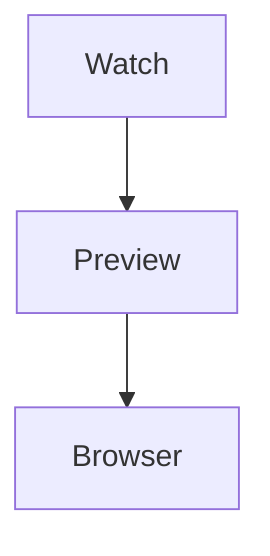

# Diagram Fixture

Visit https://example.com for docs.

| Task | Status |
| ---- | ------ |
| Render | done |

- [x] Parse GFM
- [ ] Ship AsciiDoc later

```mermaid
graph TD
  Watch --> Preview
  Preview --> Browser
```
