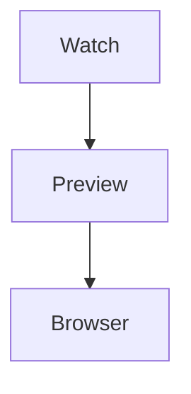
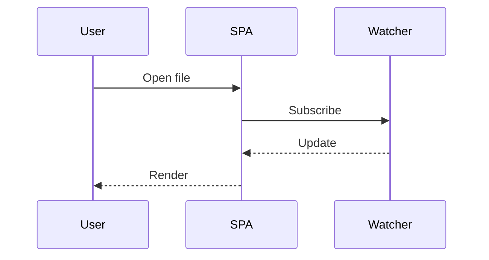
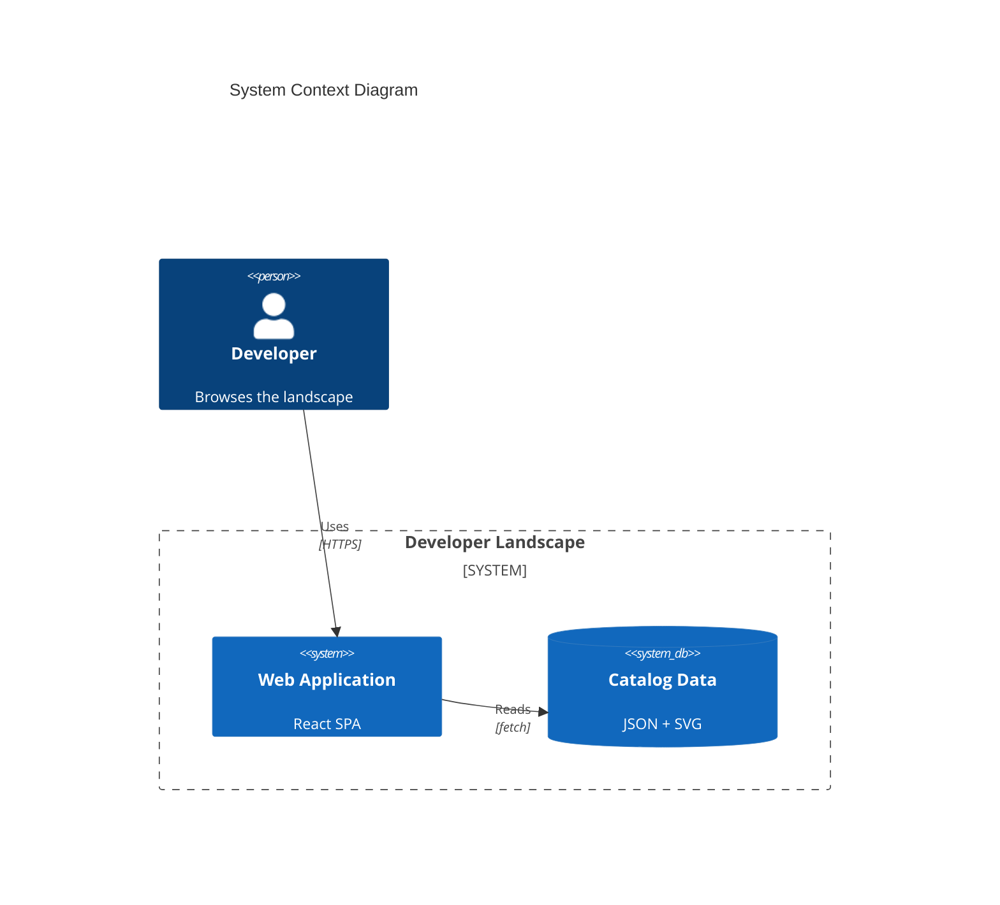
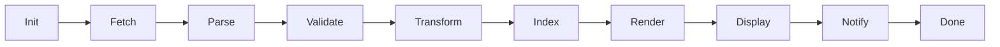

# Mermaid Shapes

Fixture exercising the diagram-viewer code path across the shapes that have
historically rendered poorly: tiny intrinsic widths (small flowchart and C4),
sequence diagrams, and a wide diagram. Each of these has a matching e2e
assertion in `tests/e2e/uatu.e2e.ts`.

## Small flowchart

## Sequence diagram

## Small C4 context diagram

## Wide flowchart

## Component interaction example

```mermaid
flowchart TD
  subgraph App["App (state owner)"]
    direction TB
    STATE["filterState: FilterState\nsearchQuery: string"]
  end

  subgraph Data["Data Layer"]
    HOOK_DATA["useProjectData()"]
    JSON_P["projects.json"]
    JSON_S["stewards.json"]
  end

  subgraph Filters["Filter Panel"]
    SEARCH["SearchInput"]
    FP["FilterPanel"]
    FG_S["FilterGroup\n(steward)"]
    FG_C["FilterGroup\n(category)"]
    FG_M["FilterGroup\n(maturity)"]
  end

  subgraph Display["Display"]
    HEADER["Header\n(project count)"]
    HOOK_FILTER["useFilteredProjects()"]
    GRID["ProjectGrid"]
    SECTION["CategorySection"]
    CARD["ProjectCard"]
    EMPTY["EmptyState"]
  end

  HOOK_DATA -->|fetch| JSON_P
  HOOK_DATA -->|fetch| JSON_S
  HOOK_DATA -->|"projects, stewards"| App

  App -->|"filterState, onChange"| FP
  App -->|"searchQuery, onChange"| SEARCH
  FP --> FG_S
  FP --> FG_C
  FP --> FG_M

  App -->|"projects, filterState, searchQuery"| HOOK_FILTER
  HOOK_FILTER -->|"filteredProjects"| App

  App -->|"count"| HEADER
  App -->|"filteredProjects"| GRID
  App -->|"filterState, onClear"| EMPTY
  GRID --> SECTION
  SECTION --> CARD
```

